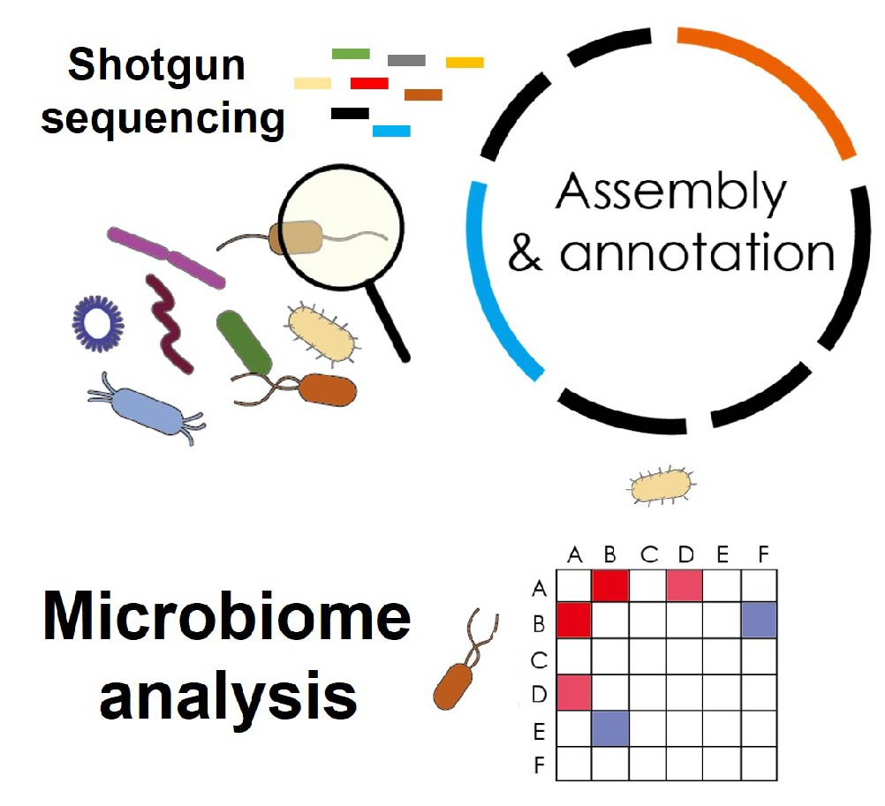
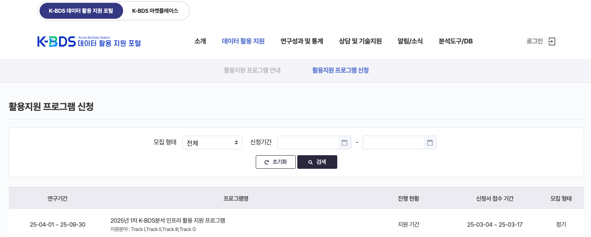

# metaFun in KBDS (Korea Bio Data Station)



## KBDS 내의 metaFun

Korea Bio Data Station(KBDS)은 한국 생물학 연구 커뮤니티를 위한 중앙 데이터 저장소 및 분석 플랫폼입니다. KBDS 내에서 metaFun은 메타게놈 분석을 위한 핵심 도구로 제공되며, 특별히 한국 연구자들의 요구에 맞게 최적화되었습니다.

## KBDS 시스템 이용 안내

**KBDS 시스템 활용을 위해서는 회원가입 및 상시지원 트랙 등에의 지원이 필요합니다.**




https://cloud.kbds.re.kr/jwsc/pgwwsc/


**KBDS 시스템에서는 실시간 분석모듈의 사용이 불가능합니다. 사용자의 개인 환경에서 사용이 가능합니다.**

## KBDS에서 지원되지 않는 모듈

KBDS 환경에서는 다음 모듈이 지원되지 않으니 참고하시기 바랍니다:

1. **DOWNLOAD_DB**: 데이터베이스 다운로드 모듈은 KBDS에서 지원되지 않습니다. KBDS에는 필요한 데이터베이스가 이미 설치되어 있습니다.
2. **GENOME_SELECTOR**: 게놈 선택 모듈은 KBDS에서 직접 사용할 수 없습니다.
3. **INTERACTIVE_COMPARATIVE**: 대화형 비교 분석 모듈은 개인 환경에서만 사용 가능합니다.
4. **INTERACTIVE_TAXONOMY**: 대화형 분류 분석 모듈은 개인 환경에서만 사용 가능합니다.

이러한 제한사항은 KBDS 시스템의 보안 및 리소스 관리를 위한 것이며, 대화형 모듈은 사용자의 로컬 환경에서 실행하는 것이 권장됩니다.

## KBDS에서 metaFun 사용 이점

1. **사전 설치된 환경**: KBDS 내에서 metaFun은 이미 설치되어 있으며, 모든 필요한 데이터베이스가 미리 구성되어 있어 설치 과정이 필요 없습니다.
2. **고성능 컴퓨팅 리소스**: KBDS의 강력한 컴퓨팅 인프라를 활용하여 대규모 메타게놈 데이터셋을 빠르게 처리할 수 있습니다.
3. **쉬운 데이터 접근**: KBDS에 저장된 공개 메타게놈 데이터셋에 직접 접근하고 분석할 수 있습니다.

## KBDS에서 metaFun 시작하기

KBDS 플랫폼에서 metaFun을 시작하려면:

1. KBDS 포털(https://kbds.example.kr)에 로그인합니다.
2. Conda 로 metaFun 을 활성화 합니다.  (conda activate metafun)
3. 원하는 원본 메타유전체 데이터와  메타데이터를 준비하여 분석합니다. 
4. 자세한 내용은 각 이용가능한 모듈의 사용예시를 참고하세요.

```bash
# KBDS 환경에서 metaFun 실행
metafun -module RAWREAD_QC -i /path/to/data
```


## KBDS 지원 및 리소스

KBDS 내 metaFun 사용에 대한 지원이 필요하신 경우:

- **헬프데스크**: https://github.com/aababc1/metaFun의 issue에 문의사항을 남기세요.
- **튜토리얼**: 한국어로 된 상세한 튜토리얼을 참고하세요.

