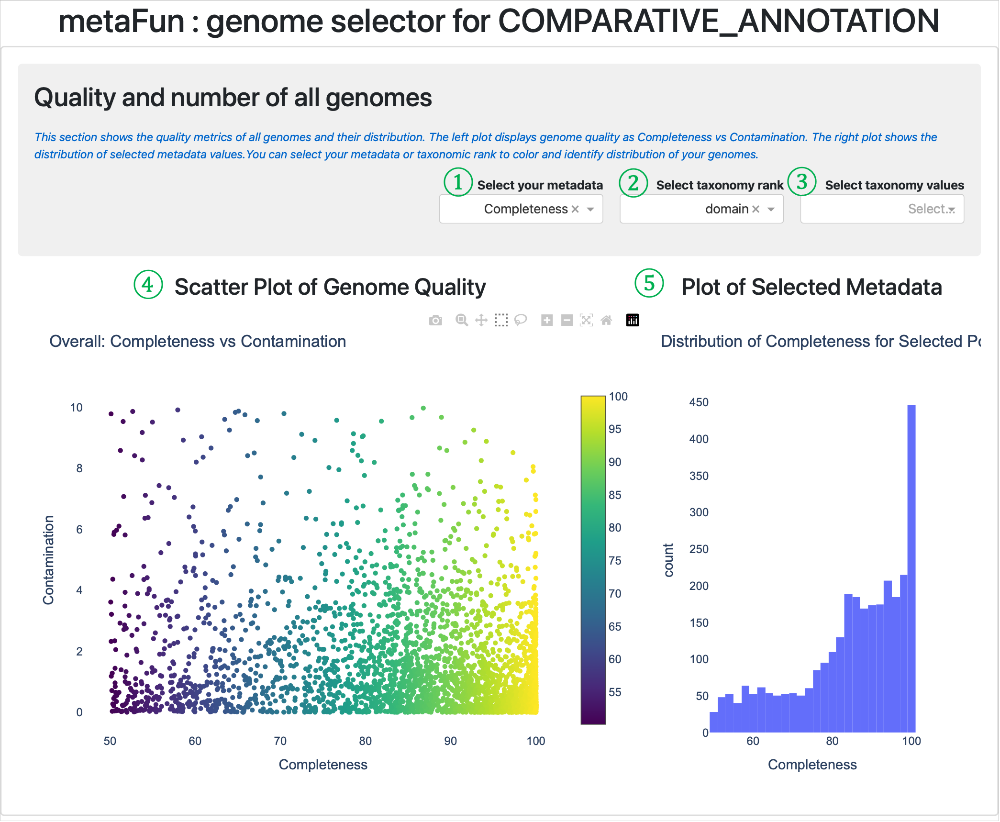
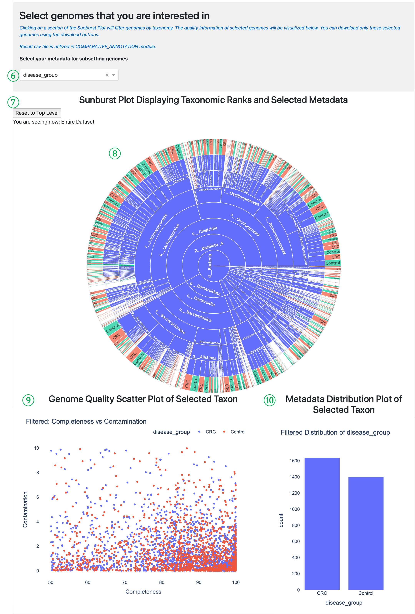
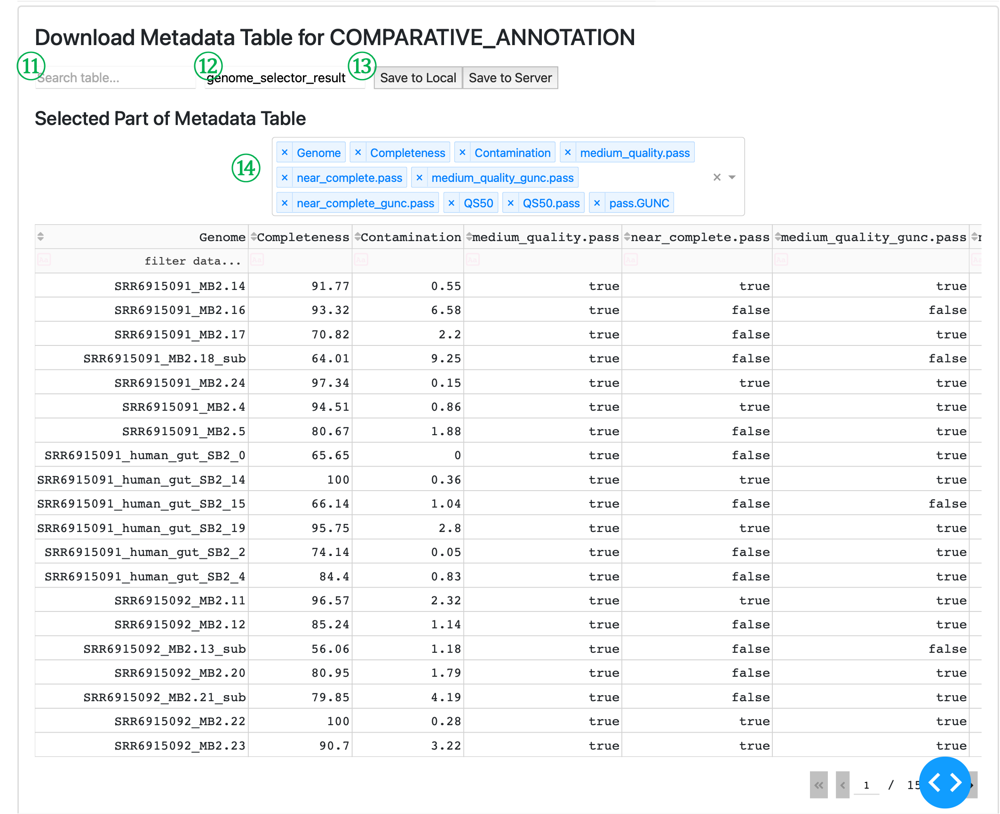

(GENOME_SELECTOR_description)=

# <span style="color:#00B050">GENOME_</span><span style="color:#7FBDFF">SELECTOR</span> 

이 모듈은 metaFun 파이프라인의 일부로, 연구자들이 다운스트림 비교 분석을 위한 게놈을 선택하고 필터링하는 데 도움을 주기 위해 설계되었습니다. 이 가이드는 인터페이스의 각 구성 요소에 대한 자세한 설명을 제공하여 기능을 최대한 활용할 수 있도록 도와줍니다.


## 개요
GENOME_SELECTOR 모듈은 품질 메트릭, 분류학적 분류 및 샘플 메타데이터를 기반으로 메타게놈 어셈블 게놈(MAG)을 선택하고 필터링하기 위한 대화형 웹 인터페이스를 제공합니다. 이를 통해 연구자는 게놈 품질 메트릭을 시각화하고, 분류학적 분포를 탐색하며, COMPARATIVE_ANNOTATION 모듈에서의 다운스트림 비교 분석을 위한 정보에 기반한 선택을 할 수 있습니다.

## 모듈 실행

```bash
# 기본 사용법
(metafun) metafun -module GENOME_SELECTOR -i combined_metadata_quality_taxonomy_*.csv

# 웹 인터페이스를 위한 다른 포트 지정
(metafun) metafun -module GENOME_SELECTOR -i combined_metadata_quality_taxonomy_*.csv -p 8888
```

## 모듈 작동 순서

이 모듈은 다음 단계를 수행합니다:

1. 입력 메타데이터 파일 로드 및 처리(BIN_ASSESSMENT 모듈에서)
2. 품질 메트릭, 분류학적 정보 및 샘플 메타데이터 추출
3. 데이터 탐색 및 게놈 선택을 위한 대화형 웹 인터페이스 실행
4. 품질 평가 및 분류학적 분포를 위한 시각화 도구 제공
5. 여러 기준에 따른 게놈 필터링 및 선택 가능
6. 다운스트림 분석을 위해 선택된 게놈을 CSV 파일로 내보내기

## 매개변수
**`${launchDir}`은 metaFun을 실행하는 디렉토리로, 출력 기본 디렉토리로 활용됩니다.** 

| 매개변수 | 설명 | 기본값 | 참고 |
|-----------|-------------|---------------|------|
| `-i, --input` | 게놈 품질 및 분류 정보가 포함된 입력 메타데이터 파일 | 필수 | 일반적으로 BIN_ASSESSMENT 모듈의 combined_metadata_quality_taxonomy_*.csv 파일 |
| `-p, --port` | 웹 인터페이스의 포트 번호 | `8050` | 선택 사항, 기본 포트가 사용 중인 경우 변경 가능 |
| `-o, --output` | 결과 저장을 위한 출력 디렉토리 | `${launchDir}` | 기본값은 실행 디렉토리 |

## **입력 및 출력**

### 입력
* 게놈 품질 메트릭, 분류학적 분류 및 샘플 메타데이터가 포함된 통합 메타데이터 파일
* 이 파일은 <span style="color:#00B050">BIN_ASSESSMENT</span> 모듈에 의해 생성됨(combined_metadata_quality_taxonomy_*.csv)
* 입력 파일에는 게놈 이름, 완전성, 오염도, 품질 점수, 분류학적 분류 및 샘플 메타데이터에 대한 열이 포함되어야 함

### 출력
* 선택된 게놈과 관련 메타데이터가 포함된 CSV 파일
* 기본 출력 파일 이름: `genome_selector_result.csv`
* 이 파일은 <span style="color:#7FBDFF">COMPARATIVE_ANNOTATION</span> 모듈의 입력으로 사용됨

### 출력 디렉토리 구조

출력 파일은 시작 디렉토리(또는 `-o`로 지정된 디렉토리)에 저장됩니다:

```{code-block} bash
:caption: 출력 디렉토리 구조

${launchDir}/
└── genome_selector_result.csv    # 선택된 게놈과 메타데이터 포함
```

## 사용 참고 사항

- GENOME_SELECTOR 모듈은 <span style="color:#00B050">BIN_ASSESSMENT</span> 모듈의 출력과 함께 작동하도록 설계되었습니다.
- 최적의 시각화 및 분석을 위해 샘플 정보가 포함된 통합 메타데이터 파일을 사용하는 것이 좋습니다.
- 웹 인터페이스는 입력 파일에서 사용 가능한 메타데이터 열에 자동으로 적응합니다.
- 선택한 게놈은 <span style="color:#7FBDFF">COMPARATIVE_ANNOTATION</span> 모듈과 직접 호환되는 형식으로 저장됩니다.
- 선택 내용은 로컬 및 metaFun이 실행되고 있는 서버 모두에 저장할 수 있습니다.

:::{admonition} awk를 이용한 명령줄 필터링
:class: tip

대화형 인터페이스 외에도 `awk`와 같은 명령줄 도구를 사용하여 게놈을 필터링할 수 있습니다. 이 접근 방식은 특정 기준에 따라 빠르게 필터링하거나 게놈 선택을 자동화하는 데 유용합니다:

```bash
# 완전성이 90% 이상인 게놈을 필터링하여 새 파일에 저장
awk -F ',' 'NR==1 || ($2 > 90)' combined_metadata_quality_taxonomy_*.csv > high_completeness_genomes.csv

# 오염도가 5% 미만인 게놈 필터링
awk -F ',' 'NR==1 || ($3 < 5)' combined_metadata_quality_taxonomy_*.csv > low_contamination_genomes.csv

# 조합 필터링: 완전성 > 90% 그리고 오염도 < 5%
awk -F ',' 'NR==1 || ($2 > 90 && $3 < 5)' combined_metadata_quality_taxonomy_*.csv > high_quality_genomes.csv

# 특정 분류군 필터링(예: "Bacteroidota"가 포함된 게놈)
awk -F ',' 'NR==1 || $NF ~ /Bacteroidota/' combined_metadata_quality_taxonomy_*.csv > bacteroidota_genomes.csv

# 품질 기준을 충족하는 게놈 이름만 추출(다운스트림 처리에 유용)
awk -F ',' '($2 > 80 && $3 < 10) {print $1}' combined_metadata_quality_taxonomy_*.csv > selected_genome_names.txt
```

이러한 명령줄 접근 방식은 특히 배치 처리나 사용자 정의 스크립트와의 통합을 위해 GENOME_SELECTOR 인터페이스를 보완할 수 있습니다.
:::

## 다음 단계

이 모듈로 관심 있는 게놈을 선택한 후, <span style="color:#7FBDFF">COMPARATIVE_ANNOTATION</span>으로 진행하여:
- 선택한 게놈의 포괄적인 주석 작성
- 비교 유전체 분석 수행
- 기능적 프로필 생성
- 다양한 샘플이나 조건에 걸쳐 게놈 비교

아래 섹션에서 설명하는 인터페이스 구성 요소 및 데이터 처리 기능은 게놈 선택을 위한 대화형 웹 인터페이스 사용에 대한 자세한 지침을 제공합니다.

## 인터페이스 구성 요소

### 섹션 1: 일반 개요 및 메타데이터 선택



<span style="color:#00B050; font-family:Arial; font-size:20px">①</span> **메타데이터 선택 드롭다운**: 산점도에서 시각화할 메타데이터 속성을 선택합니다. 이는 선택한 속성에 따라 데이터 포인트에 색상을 지정하여 패턴을 식별하는 데 도움이 됩니다.

<span style="color:#00B050; font-family:Arial; font-size:20px">②</span> **분류 계급 선택 드롭다운**: 게놈 필터링에 사용할 분류 수준(도메인, 문, 강 등)을 선택합니다.

<span style="color:#00B050; font-family:Arial; font-size:20px">③</span> **분류값 선택 드롭다운**: 분류 계급이 선택되면 이 드롭다운을 통해 해당 계급 내에서 데이터를 필터링할 특정 값을 선택할 수 있습니다.

:::{admonition} 참고
:class: note

메타데이터 선택(드롭다운 <span style="color:#00B050; font-family:Arial; font-size:20px">①</span>)과 분류 선택(드롭다운 <span style="color:#00B050; font-family:Arial; font-size:20px">②</span> 및 <span style="color:#00B050; font-family:Arial; font-size:20px">③</span>)은 독립적인 선택입니다. 시각화 및 분석을 사용자 정의하기 위해 메타데이터 속성과 분류 필터의 모든 조합을 선택할 수 있습니다.
:::

<span style="color:#00B050; font-family:Arial; font-size:20px">④</span> **게놈 품질 산점도**: 이 시각화는 게놈의 완전성(x축)과 오염도(y축) 간의 관계를 보여줍니다. 점은 드롭다운 <span style="color:#00B050; font-family:Arial; font-size:20px">①</span>에서 선택한 메타데이터에 따라 색상이 지정됩니다. 색상 스케일은 선택한 메타데이터의 수치 값을 나타내며, 높은 값은 노란색/녹색으로, 낮은 값은 보라색/파란색으로 표시됩니다.

<span style="color:#00B050; font-family:Arial; font-size:20px">⑤</span> **선택된 메타데이터 플롯**: 모든 게놈에 걸쳐 선택된 메타데이터 속성의 분포를 히스토그램으로 표시하여 전체 데이터 구성을 이해하고 패턴이나 이상치를 식별하는 데 도움이 됩니다.

### 섹션 2: 분류학적 탐색 및 게놈 선택



<span style="color:#00B050; font-family:Arial; font-size:20px">⑥</span> **서브셋팅을 위한 메타데이터 선택**: 선버스트 플롯에서 시각화할 메타데이터 속성을 선택합니다. 스크립트는 선택한 메타데이터가 수치형인지 범주형인지 자동으로 감지하여 시각화를 적절히 조정합니다.

<span style="color:#00B050; font-family:Arial; font-size:20px">⑦</span> **선버스트 탐색 도구**: 전체 데이터셋 보기로 돌아가는 **최상위 레벨로 재설정** 버튼을 포함하고 분류 계층 구조에서 현재 위치를 표시합니다("현재 보고 있음: 전체 데이터셋" 또는 특정 경로).

<span style="color:#00B050; font-family:Arial; font-size:20px">⑧</span> **선버스트 플롯**: 분류 계층 구조와 선택한 메타데이터를 표시하는 대화형 시각화입니다. 동심원은 분류 수준(도메인 → 문 → 강 → 목 → 과 → 속 → 종)을 나타냅니다. 섹션을 클릭하면 분류에 따라 게놈을 필터링하고 아래 플롯을 업데이트합니다. 모든 섹션을 클릭할 수 있으며 종 게놈의 메타데이터 값 분포를 식별할 수 있습니다.

<span style="color:#00B050; font-family:Arial; font-size:20px">⑨</span> **필터링된 산점도**: 선버스트 플롯에서 현재 분류학적 선택과 일치하는 게놈에 대해서만 완전성 대 오염도를 보여줍니다. 이를 통해 선택한 분류 그룹과 메타데이터로 게놈 품질을 평가할 수 있습니다.

<span style="color:#00B050; font-family:Arial; font-size:20px">⑩</span> **필터링된 분포 플롯**: 현재 분류학적 선택과 일치하는 게놈에 대해서만 선택된 메타데이터 값의 분포를 표시하여 특정 분류 그룹 내에서 메타데이터 값이 어떻게 분포되어 있는지 이해하는 데 도움이 됩니다.

### 섹션 3: 데이터 내보내기 및 다운로드



<span style="color:#00B050; font-family:Arial; font-size:20px">⑪</span> **표 검색 입력**: 데이터 표 내에서 특정 용어를 검색할 수 있어 텍스트 필드로 특정 관심 게놈을 찾는 데 도움이 됩니다.

<span style="color:#00B050; font-family:Arial; font-size:20px">⑫</span> **파일 이름 입력**: **<span style="color:#7FBDFF">COMPARATIVE_ANNOTATION</span>** 모듈에서 사용될 출력 CSV 파일의 이름을 지정합니다. 기본값은 "genome_selector_result"이며 ${launch_dir}에 **genome_selector_result.csv**로 저장됩니다.

<span style="color:#00B050; font-family:Arial; font-size:20px">⑬</span> **내보내기 버튼**: 
    - "로컬에 저장"은 필터링된 게놈 표를 로컬 머신에 다운로드합니다.
    - "서버에 저장"은 metaFun이 실행 중인 서버에 파일을 저장하여 **<span style="color:#7FBDFF">COMPARATIVE_ANNOTATION</span>** 모듈이 직접 접근할 수 있도록 합니다.

<span style="color:#00B050; font-family:Arial; font-size:20px">⑭</span> **열 선택기 드롭다운**: 표 보기에 표시할 열을 선택합니다. 이는 내보내는 데이터에 영향을 주지 않고 관련 정보에 집중하는 데 도움이 되며, 내보낸 데이터에는 원본 데이터셋의 모든 열이 포함됩니다.

## 데이터 처리 기능

게놈 선택기는 몇 가지 중요한 데이터 처리 작업을 수행합니다:

- **자동 데이터 유형 감지**: 스크립트는 선택된 메타데이터가 수치형인지 범주형인지 결정하고 시각화를 적절히 조정합니다
- **누락된 값 처리**: 누락된 값("None"으로 표시)은 시각화에서 적절히 처리되고 필요할 때 필터링됩니다
- **분류 시각화**: 선버스트 플롯은 직관적인 탐색을 위해 분류 계층 구조에 따라 데이터를 자동으로 구성합니다
- **대화형 필터링**: 인터페이스의 모든 선택은 모든 플롯과 표를 동적으로 업데이트합니다
- **데이터 내보내기**: 선택한 게놈은 다운스트림 분석에 사용하기 위해 모든 원본 메타데이터와 함께 내보낼 수 있습니다

## 게놈 선택을 위한 모범 사례

1. 다양한 메타데이터 속성을 사용하여 게놈의 전체 분포를 탐색하는 것으로 시작하세요
2. 분류 필터를 사용하여 관심 있는 특정 그룹으로 좁혀보세요
3. 게놈을 선택할 때 완전성과 오염도 값 모두에 주의를 기울이세요
4. 선버스트 플롯을 사용하여 생성된 MAG의 분류학적 다양성을 이해하세요
5. 나중에 쉽게 식별할 수 있도록 설명적인 파일 이름을 사용하여 선택한 게놈을 내보내세요

이 인터페이스는 metaFun 파이프라인에서 비교 유전체 분석을 위한 고품질 게놈을 탐색하고 선택하는 포괄적인 방법을 제공합니다.
