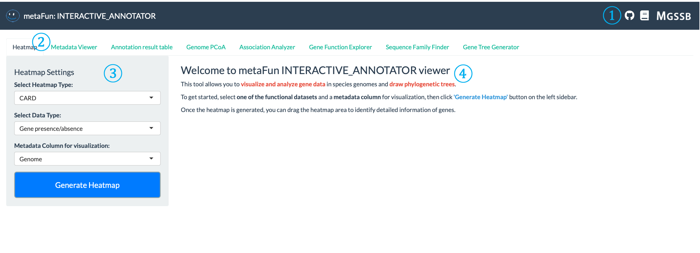
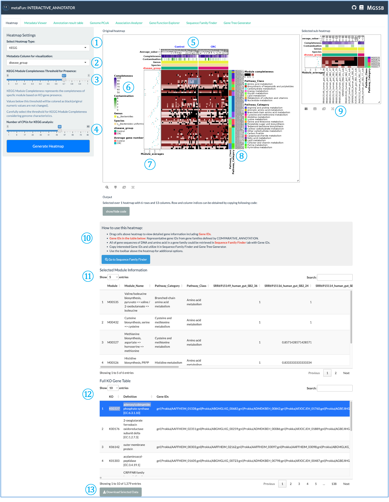
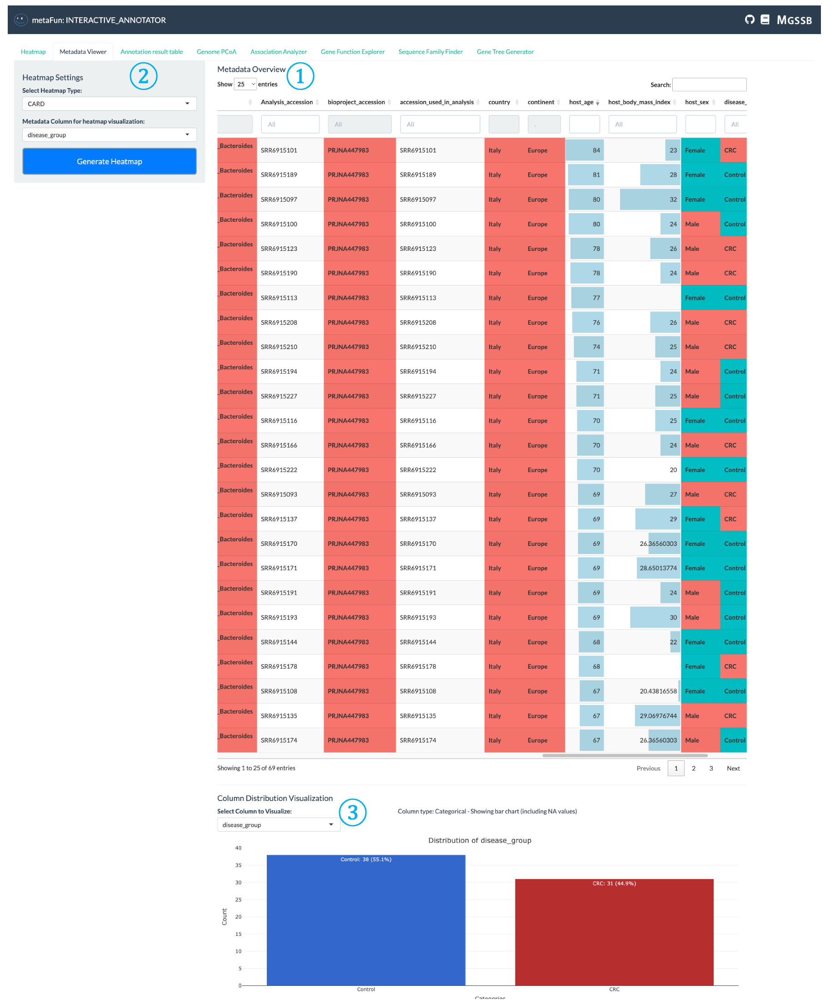
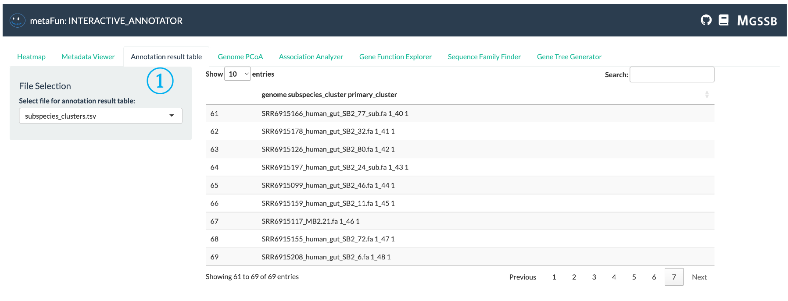
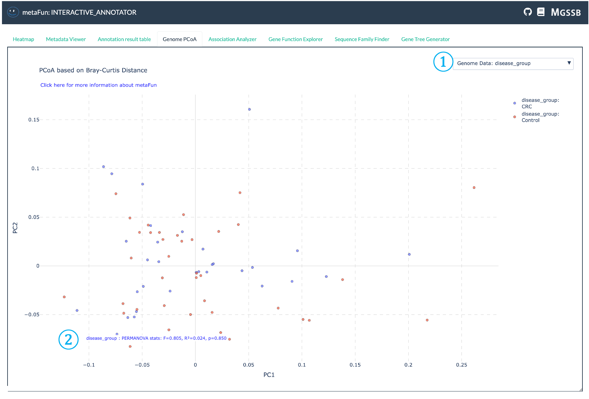
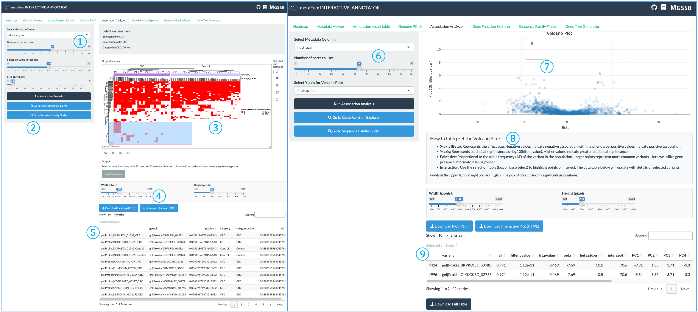
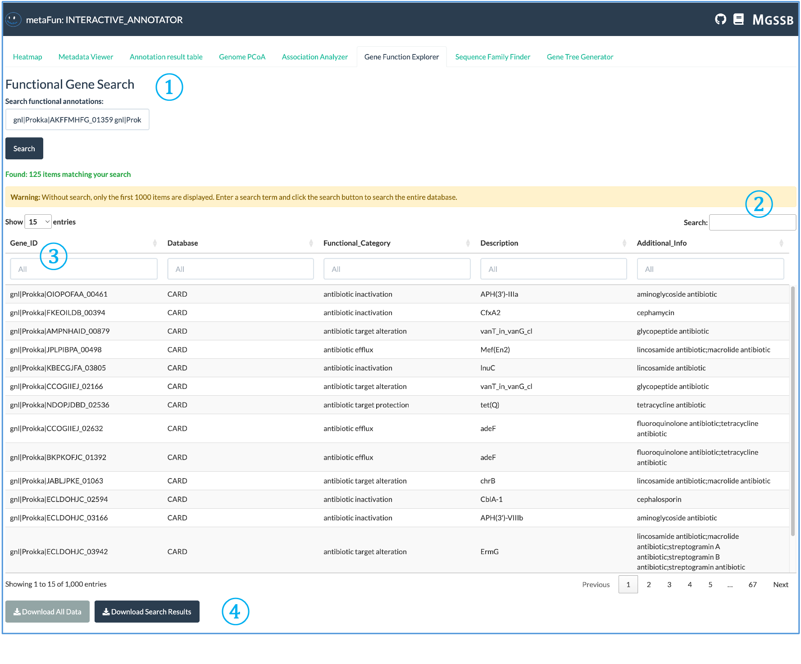
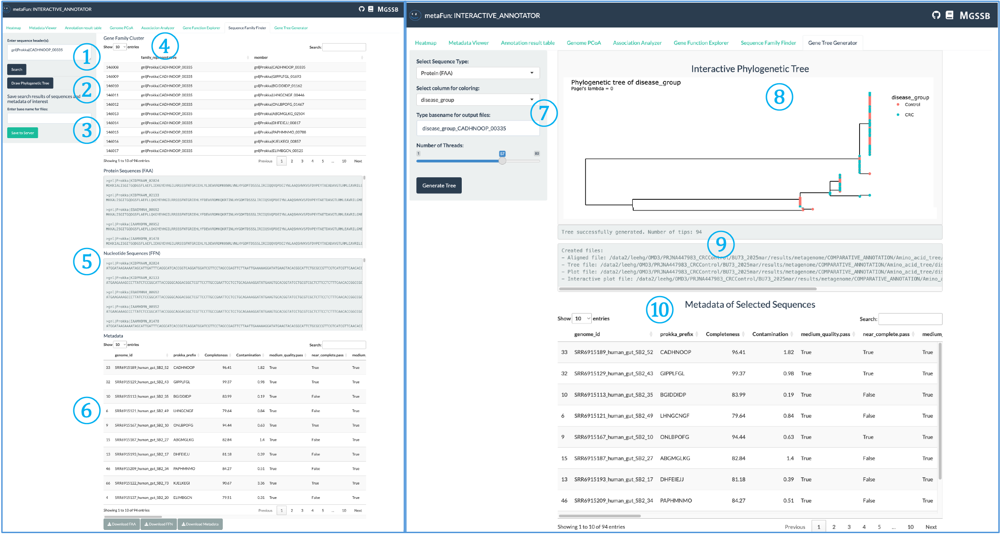

(INTERACTIVE_COMPARATIVE_description)=

# <span style="color:#7FBDFF">INTERACTIVE_COMPARATIVE</span>


이 모듈은 COMPARATIVE_ANNOTATION 모듈의 결과를 탐색하고 분석하기 위한 대화형 웹 인터페이스를 제공하는 metaFun 파이프라인의 일부입니다.

## 개요
INTERACTIVE_COMPARATIVE 모듈은 비교 유전체 데이터를 시각화하고 분석하기 위한 동적인 웹 기반 플랫폼을 제공합니다. 이를 통해 연구자들은 서로 다른 게놈 간의 유전자 존재/부재 패턴, 기능 주석, 게놈 유사성 및 통계적 연관성을 대화식으로 탐색할 수 있습니다. 이 모듈은 주석 결과를 메타데이터와 통합하여 상황에 맞는 분석과 생물학적으로 의미 있는 패턴 발견을 가능하게 합니다. 다양한 전문 시각화 도구를 통해 연구자들은 출판 수준의 그림을 생성하고 추가 프로그래밍 없이 임시 분석을 수행할 수 있습니다.

**이 모듈은 COMPARATIVE_ANNOTATION 모듈에서 생성된 통합 시퀀스 데이터베이스(HDF5 형식)**을 활용하여 동적 분석을 위한 모든 주석, 유전자 시퀀스 및 메타데이터에 빠르게 접근할 수 있게 합니다.

## 모듈 실행

```{code-block} bash
# 최근 COMPARATIVE_ANNOTATION 결과로 기본 사용
(metafun) metafun -module INTERACTIVE_COMPARATIVE -i results/metagenome/COMPARATIVE_ANNOTATION/YYYYMMDDHHMMSS/

# 추가 메타데이터 파일 포함
(metafun) metafun -module INTERACTIVE_COMPARATIVE -i results/metagenome/COMPARATIVE_ANNOTATION/YYYYMMDDHHMMSS/ -m metadata.csv

# 사용자 정의 출력 디렉토리 및 프로세서
(metafun) metafun -module INTERACTIVE_COMPARATIVE -i results/metagenome/COMPARATIVE_ANNOTATION/YYYYMMDDHHMMSS/ -o custom_output_dir -p 8
```

:::{admonition} 권장 사용법
:class: tip

최적의 대화형 경험을 위해 다음을 권장합니다:
1. Visual Studio Code와 Remote - SSH 확장을 사용하여 metaFun이 실행 중인 서버에 연결
2. 포트(기본값: 8050)를 전달하여 로컬 머신에서 웹 인터페이스에 접근
3. 인터페이스 사용 중에는 터미널을 계속 실행 상태로 유지
:::

## 모듈 작동 순서

이 모듈은 다음 단계를 수행합니다:

1. **COMPARATIVE_ANNOTATION 결과에서 데이터 로드 및 전처리**
   - HDF5 시퀀스 데이터베이스 읽기
   - 주석 결과(KEGG, VFDB, CARD, CAZymes 등) 로드
   - 유전자 존재/부재 매트릭스 처리
   - 메타데이터 정보 통합

2. **여러 분석 도구가 있는 대화형 웹 서버 실행**
   - 히트맵 시각화
   - 메타데이터 탐색 인터페이스
   - 주석 결과 테이블
   - 게놈 유사성 분석
   - 통계적 연관성 테스트
   - 유전자 기능 탐색
   - 시퀀스 검색 및 정렬 도구
   - 계통 발생 트리 생성

3. **대화형 구성 요소를 통한 온디맨드 분석 활성화**
   - 동적 필터링 및 선택
   - 통계 테스트
   - 시퀀스 정렬 및 트리 구축
   - 다운스트림 애플리케이션을 위한 데이터 내보내기

## 매개변수
**`${launchDir}`은 metaFun을 실행하는 디렉토리로, 출력 기본 디렉토리로 활용됩니다.** 

| 매개변수 | 설명 | 기본값 | 참고 |
|-----------|-------------|---------------|------|
| `-i, --input` | COMPARATIVE_ANNOTATION 결과가 있는 입력 디렉토리 | 가장 최근 결과 | COMPARATIVE_ANNOTATION 출력 경로 |
| `-m, --metadata` | 추가 메타데이터 파일 | 선택 사항 | 통합할 추가 메타데이터가 있는 CSV 파일 |
| `-o, --output` | 내보낸 파일을 위한 출력 디렉토리 | `${launchDir}/results/interactive_comparative` | 내보낸 데이터가 저장될 위치 |
| `-p, --processors` | 사용할 CPU 코어 수 | `4` | 시스템 능력에 따라 조정 |

## **입력 및 출력**

### 입력
* 완료된 <span style="color:#7FBDFF">COMPARATIVE_ANNOTATION</span> 실행의 결과 디렉토리
* 향상된 분석을 위한 선택적 추가 메타데이터 파일(CSV 형식)

### 출력
* 다양한 형식(PNG, PDF, HTML)으로 내보낸 시각화
* 추가 분석을 위한 필터링된 데이터셋 및 테이블
* 시퀀스 정렬 및 계통 발생 트리
* 통계 분석 결과

### 출력 디렉토리 구조

출력 파일은 지정된 출력 디렉토리(기본값: `${launchDir}/results/interactive_comparative`)에 저장됩니다:

```{code-block} bash
:caption: 출력 디렉토리 구조

${launchDir}/results/interactive_comparative/
├── heatmap_exports/                      # 내보낸 히트맵 시각화
│   ├── heatmap_KEGG_[timestamp].pdf      # KEGG 주석 히트맵
│   ├── heatmap_VFDB_[timestamp].pdf      # 독성 인자 히트맵
│   ├── heatmap_CARD_[timestamp].pdf      # 항생제 내성 히트맵
│   ├── heatmap_dbCAN_[timestamp].pdf     # CAZyme 히트맵
│   └── heatmap_ANI_[timestamp].pdf       # 게놈 유사성 히트맵
├── genome_pcoa/                          # PCoA 분석 결과
│   ├── pcoa_plot_[timestamp].pdf         # 게놈 PCoA 플롯
│   └── permanova_results_[timestamp].csv # PERMANOVA 통계 결과
├── association_results/                  # 유전자-특성 연관성 결과
│   ├── association_[trait]_[timestamp].csv  # 통계적 연관성 결과
│   └── manhattan_plot_[trait]_[timestamp].pdf # 맨해튼 플롯 시각화
├── sequence_exports/                     # 내보낸 시퀀스 데이터
│   ├── gene_family_[id]_[timestamp].fasta    # 유전자 패밀리용 FASTA 파일
│   ├── alignment_[id]_[timestamp].aln        # 다중 시퀀스 정렬
│   └── alignment_[id]_[timestamp].html       # 시각화된 정렬
└── gene_trees/                           # 계통 발생 트리 결과
    ├── tree_[id]_[timestamp].nwk            # Newick 형식 트리 파일
    └── tree_visualization_[id]_[timestamp].pdf # 렌더링된 계통 발생 트리
```

## 인터페이스 구성 요소

웹 인터페이스는 여러 탭으로 나뉘어 있으며, 각 탭은 다양한 유형의 분석을 위한 전문 도구를 제공합니다.

### 환영 페이지



환영 페이지는 INTERACTIVE_COMPARATIVE 모듈을 소개하고 시작하기 위한 기본 지침을 제공합니다.

<span style="color:#7FBDFF; font-family:Arial; font-size:20px">①</span> **상단 네비게이션 링크**: 인터페이스 오른쪽 상단에 위치하며 다음에 빠르게 접근할 수 있습니다:
   - 소스 코드 및 이슈를 위한 GitHub 저장소 링크: https://github.com/aababc1/metaFun
   - 자세한 지침을 위한 문서 링크: https://metafun.readthedocs.io/en/latest/
   - 추가 리소스 및 도구에 접근하기 위한 MGSSB 다운로드 링크: https://www.microbiome.re.kr/home_design/Database.html

<span style="color:#7FBDFF; font-family:Arial; font-size:20px">②</span> **네비게이션 탭**: 특정 분석 작업에 특화된 다양한 분석 도구에 접근할 수 있는 탭 행:
   - 히트맵: 게놈 전체의 유전자 존재/부재 패턴 시각화
   - 메타데이터 뷰어: 샘플 메타데이터 분포 탐색 및 분석
   - 주석 결과 테이블: GeneID를 사용한 상세 기능 주석 탐색
   - 게놈 PCoA: 차원이 축소된 공간에서 게놈 유사성 탐색
   - 연관성 분석기: 유전자와 특성 간의 통계적 연관성 식별
   - 유전자 기능 탐색기: 주석 데이터베이스 전반의 유전자 기능 검토
   - 시퀀스 패밀리 파인더: 유전자 시퀀스 검색 및 분석
   - 유전자 트리 생성기: 계통 발생 트리 구축 및 시각화

<span style="color:#7FBDFF; font-family:Arial; font-size:20px">③</span> **설정 패널**: 시각화 매개변수를 구성할 수 있는 왼쪽의 제어 패널:
   - 일부 탭에는 분석 및 시각화 매개변수를 구성하기 위한 설정 패널이 있습니다

<span style="color:#7FBDFF; font-family:Arial; font-size:20px">④</span> **환영 메시지 및 지침**: 다음을 포함하는 주요 콘텐츠 영역:
   - 모듈 기능 개요(유전자 데이터 시각화 및 분석, 계통 발생 트리 그리기)
   - 시작하기 위한 단계별 지침
   - 강조된 키워드 및 중요 개념
   - 효과적인 사용을 위한 팁(기능 데이터셋, 메타데이터 열 선택)
   - 결과를 해석하고 인터페이스를 탐색하는 방법에 대한 정보

### 히트맵 탭



히트맵 탭을 사용하면 게놈 전체의 유전자 존재/부재 패턴 및 기타 주석 데이터를 시각화할 수 있습니다.

<span style="color:#7FBDFF; font-family:Arial; font-size:20px">①</span> **히트맵 유형 선택기**: 시각화할 주석 데이터베이스를 선택하는 드롭다운 메뉴. 다섯 가지 유형이 있습니다:
   - KEGG(대사 경로)
   - VFDB(독성 인자)
   - CARD(항생제 내성)
   - dbCAN(탄수화물 활성 효소)
   - ANI(게놈 유사성)
   
   VFDB, CARD 및 dbCAN의 경우, 유전자 수 또는 유전자 존재/부재를 기반으로 히트맵을 생성하여 메타데이터와의 관계를 검토할 수 있습니다.

<span style="color:#7FBDFF; font-family:Arial; font-size:20px">②</span> **메타데이터 열 선택기**: 시각화에 사용할 메타데이터 변수를 선택합니다. 히트맵은 선택한 메타데이터에 따라 분할되어 다양한 메타데이터 값에 대한 별도의 섹션을 생성합니다.

<span style="color:#7FBDFF; font-family:Arial; font-size:20px">③</span> **KEGG 특정 설정**: KEGG 시각화에만 해당하는 이 설정을 통해 다음을 수행할 수 있습니다:
   - 모듈 완전성 임계값 설정
   - 계산을 위한 CPU 사용량 조정
   - KO 정보를 기반으로 KEGG 대사 모듈의 존재/부재를 결정하기 위해 ggKEGG 활용
   - 검은색 셀은 임계값 미만인 모듈(부재)을 나타내며, 흰색에서 갈색으로의 색상은 증가하는 모듈 완전성을 나타냅니다.

<span style="color:#7FBDFF; font-family:Arial; font-size:20px">④</span> **히트맵 생성 버튼**: 선택한 매개변수를 기반으로 히트맵 시각화를 생성하려면 클릭합니다. 시스템은 ComplexHeatmap 및 InteractiveComplexHeatmap R 패키지를 사용하여 대화형 시각화를 생성합니다.

<span style="color:#7FBDFF; font-family:Arial; font-size:20px">⑤</span> **히트맵 헤더**: 히트맵 상단 섹션은 다음과 같은 색상 스트립을 표시합니다:
   - 드롭다운 ②에서 선택한 메타데이터 기반 세분화
   - 게놈 완전성 정보
   - 속 및 종 정보
   - 색상으로 코딩된 스트립으로 선택된 메타데이터 값

<span style="color:#7FBDFF; font-family:Arial; font-size:20px">⑥</span> **색상 범례**: 각 요소에 대한 색상 매핑 정보를 보여주어 히트맵에서 사용되는 색상 스케일을 해석하는 데 도움이 됩니다.

<span style="color:#7FBDFF; font-family:Arial; font-size:20px">⑦</span> **메타데이터 평균**: 각 메타데이터 카테고리에 대해 선택한 기능 또는 모듈의 평균값을 표시합니다. 다음 중 하나로 계산됩니다:
   - 모듈 합계 / 게놈 수
   - 유전자 합계 / 게놈 수

<span style="color:#7FBDFF; font-family:Arial; font-size:20px">⑧</span> **카테고리 정보**: 선택한 데이터베이스에 특정한 기능 카테고리를 보여주며, 관련 기능의 해석을 용이하게 하기 위해 주요 개념적 클러스터로 정렬됩니다.

<span style="color:#7FBDFF; font-family:Arial; font-size:20px">⑨</span> **서브 히트맵 선택**: 히트맵의 일부를 선택하여 해당 영역의 서브 히트맵을 검토할 수 있어 특정 관심 영역을 자세히 탐색할 수 있습니다.

<span style="color:#7FBDFF; font-family:Arial; font-size:20px">⑩</span> **히트맵 사용 지침**: 히트맵에 대한 기본 정보를 제공하고 다음을 수행하는 방법을 설명합니다:
   - 아래 테이블에서 유전자 ID 선택
   - 해당 시퀀스 찾기
   - 시퀀스 패밀리 파인더 및 유전자 트리 생성기 탭을 사용하여 계통 발생 트리 생성

<span style="color:#7FBDFF; font-family:Arial; font-size:20px">⑪</span> **선택한 모듈 정보**: 선택한 히트맵 영역에 대한 자세한 정보(게놈 정보 및 기능 주석 포함)를 표시합니다.

<span style="color:#7FBDFF; font-family:Arial; font-size:20px">⑫</span> **데이터베이스별 테이블**: KEGG의 경우, 전체 KO(KEGG 직교) 히트맵을 보여줍니다. 다른 데이터베이스는 선택과 관련된 각각의 정보를 표시합니다.

<span style="color:#7FBDFF; font-family:Arial; font-size:20px">⑬</span> **다운로드 버튼**: 추가 분석이나 기록 보관을 위해 히트맵의 선택한 부분에 대한 데이터를 다운로드할 수 있습니다.

### 메타데이터 뷰어 탭



메타데이터 뷰어 탭은 게놈 데이터셋 전체의 메타데이터 분포를 탐색하고 이해하는 데 도움이 됩니다.

<span style="color:#7FBDFF; font-family:Arial; font-size:20px">①</span> **메타데이터 테이블 표시**: 각 게놈의 모든 메타데이터를 보여주는 대화형 테이블로, 데이터 유형에 따라 다양한 표시 형식이 있습니다:
   - 색상으로 코딩된 셀로 표시되는 범주형 데이터
   - 적절한 서식이 적용된 수치 데이터
   - 쉬운 탐색을 위한 검색 및 정렬 가능한 열
   - 색상 강도는 더 나은 시각적 해석을 위해 값 범위를 반영합니다

<span style="color:#7FBDFF; font-family:Arial; font-size:20px">②</span> **히트맵 구성 패널**: 히트맵에서 시각화할 관심 메타데이터를 선택할 수 있는 설정 영역:
   - 클릭하여 선택한 메타데이터가 있는 히트맵 탭으로 직접 이동
   - 히트맵 시각화에서 메타데이터가 게놈을 구성하고 색상을 지정하는 방법 구성
   - 메타데이터 탐색에서 기능 분석으로 빠르게 전환할 수 있습니다

<span style="color:#7FBDFF; font-family:Arial; font-size:20px">③</span> **분포 시각화**: 게놈 전체의 메타데이터 분포에 대한 시각적 표현:
   - 선택한 메타데이터 변수별 게놈 수 분포 표시
   - 범주형 변수(질병 유형, 위치 등)에 대한 막대 차트
   - 수치형 변수에 대한 히스토그램
   - 데이터셋 구성에 대한 통계적 개요 제공

### 주석 결과 테이블 탭



주석 결과 테이블은 각 게놈에 대한 개별 주석 결과의 상세 보기를 제공하여 다양한 데이터베이스의 기능 주석의 원시 결과를 표시합니다.

<span style="color:#7FBDFF; font-family:Arial; font-size:20px">①</span> **데이터베이스 선택기 및 결과 테이블**: 원시 기능 주석 데이터를 탐색하기 위한 중앙 인터페이스:
   - 탐색할 주석 데이터베이스 선택(KEGG, VFDB, CARD, CAZymes 등)
   - 유전자 ID, 설명, 기능 카테고리 및 점수를 포함한 포괄적인 주석 정보 보기
   - 관심 있는 유전자를 찾기 위해 결과 검색, 필터링 및 정렬
   - 오프라인 분석을 위해 필터링된 테이블을 다양한 형식으로 내보내기

### 게놈 PCoA 탭



게놈 PCoA 탭은 유전자 존재/부재 패턴을 기반으로 게놈 클러스터링의 시각화를 가능하게 합니다. 이 분석은 **Bray-Curtis 거리**와 **주성분 좌표 분석(PCoA)**을 사용하여 유전자 존재/부재 데이터의 차원을 줄이고, 2차원 공간에서 게놈 유사성을 직관적으로 시각화할 수 있게 합니다.

<span style="color:#7FBDFF; font-family:Arial; font-size:20px">①</span> **메타데이터 변수 선택기**: PCoA 플롯의 색상 지정 및 분석에 사용할 메타데이터 변수를 선택하는 드롭다운. 이를 통해 게놈 유사성이 질병 유형, 위치 또는 숙주 정보와 같은 다양한 메타데이터 속성과 어떻게 연관되는지 시각화할 수 있습니다.

<span style="color:#7FBDFF; font-family:Arial; font-size:20px">②</span> **PERMANOVA 통계 결과**: PERMANOVA(Permutational Multivariate Analysis of Variance) 테스트의 통계 결과를 표시합니다:
   - 선택한 메타데이터 변수에 의해 설명되는 분산의 양을 나타내는 R² 값
   - 연관성의 통계적 유의성을 보여주는 p-값
   - 순열 테스트에 대한 F-통계량
   - 이러한 통계는 관찰된 클러스터링이 통계적으로 의미 있는지 결정하는 데 도움이 됩니다

:::{admonition} 기술적 세부 사항
:class: note
</span style="color:#7FBDFF; font-family:Arial; font-size:20px">

이 모듈에서 구현된 PCoA 분석은 기본적으로 Bray-Curtis 거리를 사용한 scikit-bio 라이브러리를 사용하며, 999회의 순열을 통해 PERMANOVA를 수행하여 메타데이터에 의한 관찰된 클러스터링이 통계적으로 유의한지 테스트합니다. 결과는 Plotly의 대화형 그래프 기능을 사용하여 표시되며, 다양한 메타데이터 카테고리에 걸쳐 게놈 유사성을 동적으로 탐색할 수 있습니다.
:::

### 연관성 분석기 탭



연관성 분석기는 유전자 존재/부재 패턴과 메타데이터 변수 간의 통계적 연관성을 식별하여 연구자들이 특정 특성이나 조건과 잠재적으로 연결된 유전자를 발견하는 데 도움을 줍니다.

<span style="color:#7FBDFF; font-family:Arial; font-size:20px">①</span> **분석 유형 및 매개변수**: 연관성 분석 설정을 구성합니다:
   - 범주형 변수의 경우: FDR 보정이 있는 Fisher의 정확한 검정, 유의성 임계값 이상의 유전자 패턴만 표시
   - 유의성 임계값 및 다중 검정 보정 방법 설정
   - 수치형 변수에 대해서만 ANI 거리 행렬을 사용하여 계통 발생 관계를 고려하는 집단 구조 보정 옵션

<span style="color:#7FBDFF; font-family:Arial; font-size:20px">②</span> **분석 제어 및 탐색 패널**: 분석 실행 및 결과 탐색을 위한 중앙 제어:
   - 선택한 매개변수로 통계 테스트를 수행하는 연관성 분석 실행 버튼
   - 아래 테이블에서 결과 보기
   - **유전자 기능 탐색기** 또는 **시퀀스 패밀리 파인더**로 직접 이동하여 중요한 유전자 조사
   - **유전자 트리 생성기** 탭에서 관심 있는 유전자에 대한 계통 발생 트리를 생성할 수도 있습니다

<span style="color:#7FBDFF; font-family:Arial; font-size:20px">③</span> **범주형 변수를 위한 대화형 히트맵**: 범주형 변수에 대한 연관성 결과 시각화:
   - 행렬 형식으로 배열된 유전자 및 메타데이터 변수
   - 연관성 강도를 나타내는 색상 강도
   - 셀을 클릭하여 상세한 유전자 정보 및 통계값 표시
   - 관련 유전자 및 메타데이터 카테고리의 계층적 클러스터링

<span style="color:#7FBDFF; font-family:Arial; font-size:20px">④</span> **다운로드 패널**: 시각화 내보내기 제어:
   - 출력 그림의 너비와 높이 조정
   - 출판용 PNG 또는 PDF 형식으로 다운로드
   - 이미지 해상도 및 외관 사용자 정의

<span style="color:#7FBDFF; font-family:Arial; font-size:20px">⑤</span> **선택한 유전자 테이블**: 히트맵(항목 ③)에서 선택한 유전자에 대한 상세 정보:
   - 유전자 식별자 및 주석
   - 통계값 및 유의성
   - 게놈 전체의 존재/부재 패턴
   - 기능적 카테고리 및 설명

<span style="color:#7FBDFF; font-family:Arial; font-size:20px">⑥</span> **수치 변수 분석 패널**: 연속형 메타데이터 변수에 대한 분석 제어:
   - 유전자 존재/부재 데이터로 백그라운드에서 pyseer 사용
   - ANI 거리 행렬을 사용하여 집단 구조 보정
   - 더 빠른 분석을 위한 조정 가능한 CPU 사용량
   - 유전자와 연속형 특성 간의 보정된 연관성 표시

<span style="color:#7FBDFF; font-family:Arial; font-size:20px">⑦</span> **화산 플롯**: 유의성과 효과 크기의 대화형 시각화:
   - X축은 베타 값(효과 크기/방향)을 표시
   - Y축은 통계적 유의성(-log10 p-값)을 보여줌
   - filter-pvalue(집단 구조에 대해 조정되지 않음)와 lrt-pvalue(집단 구조 보정됨) 간 전환
   - 점은 개별 유전자를 나타내며, 중요한 연관성은 상단 영역에 나타남

<span style="color:#7FBDFF; font-family:Arial; font-size:20px">⑧</span> **통계 해석 가이드**: 화산 플롯 및 통계값 설명:
   - 효과 크기 방향(음수/양수 연관성) 해석 방법
   - 유의성 임계값 및 의미
   - 인구 내 유전자 빈도를 나타내는 점 크기
   - 통계적으로 유의한 연관성 식별 팁

<span style="color:#7FBDFF; font-family:Arial; font-size:20px">⑨</span> **선택한 유전자 세부 정보 테이블**: 화산 플롯에서 선택한 유전자에 대한 포괄적인 정보:
   - 유전자 변형 식별자
   - 통계 측정(p-값, 베타 계수)
   - 효과 크기 및 방향성
   - 샘플 수 및 메타데이터 카테고리 전반의 분포

:::{admonition} pyseer 분석의 p-값 이해하기
:class: note

연관성 분석기는 수치 변수 분석을 위해 pyseer에서 두 가지 주요 p-값을 사용합니다:

- **filter-pvalue**: 집단 구조에 대해 조정되지 않은 표현형과 변형의 연관성입니다. 이 값은 계통 발생 관계를 고려하지 않고 원시 상관 관계를 보여줍니다.

- **lrt-pvalue**: 혼합 모델 연관성에서 우도비 검정의 p-값으로, 집단 구조를 고려합니다. 이는 일반적으로 더 보수적이며 더 신뢰할 수 있는 평가를 나타냅니다.
최소화됩니다.
:::

### 유전자 기능 탐색기 탭



유전자 기능 탐색기는 주석 데이터베이스 전반에 걸쳐 유전자 기능에 대한 자세한 탐색을 가능하게 합니다.

<span style="color:#7FBDFF; font-family:Arial; font-size:20px">①</span> **기능 유전자 검색**: 식별자 또는 기능 주석으로 유전자를 쿼리하기 위한 검색 인터페이스:
   - 공백이나 줄 바꿈을 사용하여 여러 유전자 ID를 동시에 검색할 수 있습니다(세미콜론 사용 안 함)
   - 모든 데이터베이스에서 일치 항목을 찾기 위해 전체 또는 부분 유전자 식별자를 입력
   - 검색은 자동으로 쿼리 용어와 관련된 모든 기능 주석을 찾습니다

<span style="color:#7FBDFF; font-family:Arial; font-size:20px">②</span> **검색 결과 정보**: 검색 결과에 대한 정보 제공:
   - 검색 기준과 일치하는 항목 수
   - 대용량 결과 세트로 인해 결과가 잘릴 때 경고 메시지
   - 한 번에 표시되는 항목 수를 조정하기 위한 디스플레이 제어

<span style="color:#7FBDFF; font-family:Arial; font-size:20px">③</span> **대화형 결과 테이블**: 상세한 주석 정보가 있는 포괄적인 테이블:
   - 검색 전에 테이블은 전체 기능 주석 데이터베이스를 표시합니다
   - 각 열에는 특정 카테고리로 필터링하기 위한 자체 검색 필드가 있습니다
   - 다른 데이터베이스에 의해 주석이 달릴 때 동일한 유전자에 대해 여러 항목이 나타날 수 있습니다
   - 데이터베이스 소스는 기능 할당을 비교할 수 있도록 의도적으로 별도로 유지됩니다

<span style="color:#7FBDFF; font-family:Arial; font-size:20px">④</span> **데이터 내보내기 옵션**: 주석 데이터를 다운로드하기 위한 버튼:
   - 오프라인 분석을 위한 전체 주석 데이터셋 다운로드
   - 쿼리를 기반으로 필터링된 검색 결과만 내보내기
   - 추가 처리에 적합한 형식으로 제공되는 데이터

<span style="color:#7FBDFF; font-family:Arial; font-size:20px"><span style="color:#00B050; font-weight:bold">중요:</span></span> 이 탭에서 식별된 유전자와 기능은 <span style="color:#00B050; font-weight:bold">시퀀스 패밀리 파인더</span> 탭에서 해당 시퀀스를 검색하고, <span style="color:#00B050; font-weight:bold">유전자 트리 생성기</span> 탭에서 계통 발생 트리를 생성하는 데 직접 사용할 수 있습니다. 이러한 통합을 통해 기능 발견에서 진화 분석에 이르는 원활한 워크플로우가 가능합니다.

### 시퀀스 패밀리 파인더 및 유전자 트리 생성기 탭



이 두 탭은 짝을 이루는 구성 요소로 작동하여 시퀀스 검색에서 계통 발생 분석에 이르는 통합 워크플로우를 제공합니다.

<span style="color:#7FBDFF; font-family:Arial; font-size:20px">①</span> **유전자 패밀리 검색 상자**: 범유전체(pangenome) 전체에서 시퀀스 패밀리를 찾기 위한 입력 필드:
   - 범유전체에서 대표 유전자 ID를 입력하여 관련 시퀀스 검색
   - 여러 유전자를 검색할 때 구분자로 줄 바꿈 또는 세미콜론 사용
   - ID를 입력한 후 <span style="color:#FF0000; font-weight:bold">검색</span> 버튼을 클릭하여 시퀀스 검색

<span style="color:#7FBDFF; font-family:Arial; font-size:20px">②</span> **계통 발생 트리 그리기 버튼**: 시퀀스 패밀리 파인더에서 유전자 트리 생성기 탭으로 <span style="font-weight:bold">검색 결과를 전송</span>합니다:
   - 시퀀스를 찾은 후 이 버튼을 클릭하여 계통 발생 분석 시작
   - 선택한 시퀀스 데이터를 트리 구축 인터페이스로 자동 전달
   - 시퀀스 검색과 진화 분석 간의 원활한 전환 가능

<span style="color:#7FBDFF; font-family:Arial; font-size:20px">③</span> **데이터 내보내기 제어**: 검색된 시퀀스 데이터를 서버에 저장하는 옵션:
   - 내보낸 파일에 대한 기본 파일 이름 설정
   - 뉴클레오티드 시퀀스 저장(FFN 형식)
   - 아미노산 시퀀스 저장(FAA 형식)
   - 참조 및 문서화를 위한 유전자 메타데이터 내보내기
   - 추가 분석 또는 공유를 위해 서버에 파일 저장

<span style="color:#7FBDFF; font-family:Arial; font-size:20px">④</span> **시퀀스 패밀리 테이블**: 검색 쿼리와 일치하는 유전자 패밀리 표시:
   - 게놈 전체에서 동일한 유전자 패밀리 내의 모든 시퀀스 표시
   - 게놈 식별자 및 시퀀스 정보 포함
   - 유전자 패밀리 내의 시퀀스 보존 탐색 가능
   - 특정 시퀀스를 찾기 위한 정렬 및 검색 가능

<span style="color:#7FBDFF; font-family:Arial; font-size:20px">⑤</span> **시퀀스 뷰어 패널**: FASTA 형식으로 검색된 시퀀스 데이터 표시:
   - DNA 구성을 보여주는 뉴클레오티드 시퀀스(FFN)
   - 단백질 번역을 보여주는 아미노산 시퀀스(FAA)
   - 시퀀스 보존의 시각적 검사 가능
   - 추가 분석을 위한 원시 시퀀스 데이터 접근 제공

<span style="color:#7FBDFF; font-family:Arial; font-size:20px">⑥</span> **시퀀스 메타데이터 테이블**: 각 시퀀스에 대한 포괄적인 정보:
   - 게놈 소스 및 식별
   - 품질 지표 및 주석
   - 분류학적 정보
   - 가능한 경우 기능 주석

<span style="color:#7FBDFF; font-family:Arial; font-size:20px">⑦</span> **트리 구축 인터페이스**: 계통 발생 트리 생성 제어:
   - 뉴클레오티드 및 아미노산 기반 트리 구축 간 전환
   - 아미노산 및 뉴클레오티드 시퀀스 모두에 대해 최적화된 스레드 매개변수로 **MAFFT**를 사용한 다중 시퀀스 정렬 수행
   - 시퀀스 유형에 최적화된 모델과 함께 **FastTree**를 사용한 트리 구축:
     - 뉴클레오티드 트리: 감마 속도 이질성이 있는 **GTR 모델** (-gtr -gamma -nt)
     - 단백질 트리: 감마 속도 이질성이 있는 **LG 모델** (-lg -gamma)
   - 트리 처리에는 외부 그룹을 필요로 하지 않고 의미 있는 표현을 위한 **중점 루팅**(phytools::midpoint_root)이 포함됩니다
   - 계산 문제를 피하기 위해 작은 엡실론(1e-10)을 추가하여 제로 길이 브랜치 처리
   - 중복 노드 라벨 감지 및 해결
   - 트리 조작을 위한 대화형 제어로 시각화

<span style="color:#7FBDFF; font-family:Arial; font-size:20px">⑧</span> **트리 시각화 및 분석**: 대화형 계통 발생 트리 표시:
   - 선택한 메타데이터 변수에 따라 색상이 지정된 트리 잎
   - 메타데이터 유형에 따른 통계 분석:
     - 범주형 변수: **geiger** 패키지의 **fitdiscrete**를 사용한 모델 피팅으로 여러 모델(동일 속도, 대칭, 모든 속도 다름)을 **AIC** 값으로 비교
     - 수치형 변수: **Pagel의 람다**(phytools::phylosig)를 사용한 계통 발생 신호 계산으로 특성 값과 계통 발생 간의 상관관계 강도를 측정하고 유의성 테스트 수행
   - 정적(ggtree) 및 대화형(plotly) 시각화 옵션 모두 제공
   - 메타데이터 카테고리 또는 값 범위를 보여주는 대화형 범례
   - 트리 옆에 표시되는 통계 결과

<span style="color:#7FBDFF; font-family:Arial; font-size:20px">⑨</span> **트리 파일 정보**: 서버에 생성된 트리 파일에 대한 세부 정보:
   - 정렬 파일 위치(FASTA 형식)
   - 트리 파일 위치(Newick 형식)
   - 플롯 파일 위치(PDF 형식)
   - 대화형 시각화 파일 위치(HTML 형식)
   - 나중에 접근할 수 있도록 출력 디렉토리에 저장된 모든 파일

<span style="color:#7FBDFF; font-family:Arial; font-size:20px">⑩</span> **트리 시퀀스 메타데이터**: 트리에 포함된 시퀀스에 대한 메타데이터를 보여주는 테이블:
   - 트리의 각 시퀀스에 대한 게놈 정보
   - 품질 지표 및 분류학적 분류
   - 트리 색상 지정에 사용되는 메타데이터 값
   - 게놈 메타데이터 맥락에서 계통 발생 관계를 해석하는 데 도움이 됩니다

:::{admonition} 통합 시퀀스-트리 워크플로우
:class: tip

시퀀스 패밀리 파인더 및 유전자 트리 생성기 탭은 함께 작동하도록 설계되어 간소화된 워크플로우를 제공합니다:
1. 다른 탭의 유전자 ID를 사용하여 관심 있는 유전자 패밀리 검색
2. 검색된 시퀀스 및 게놈 전체의 분포 검토
3. "계통 발생 트리 그리기" 버튼을 클릭하여 시퀀스를 트리 구축으로 전송
4. 트리 매개변수 조정 및 색상을 위한 메타데이터 선택
5. 계통 발생 트리 생성 및 시각화
6. 메타데이터 맥락에서 진화적 관계 해석
7. 출판 또는 추가 분석을 위한 트리 및 정렬 내보내기

이러한 통합적 접근 방식은 INTERACTIVE_COMPARATIVE 모듈의 다른 분석을 통해 발견된 유전자의 진화적 관계를 쉽게 탐색할 수 있게 합니다.
:::

## 사용 참고 사항

- <span style="color:#7FBDFF">INTERACTIVE_COMPARATIVE</span> 모듈은 완료된 <span style="color:#7FBDFF">COMPARATIVE_ANNOTATION</span> 실행 결과, 특히 통합 시퀀스 데이터베이스(HDF5 형식)가 필요합니다.
- 웹 인터페이스는 COMPARATIVE_ANNOTATION 결과에서 사용 가능한 데이터에 맞게 조정되어 관련 기능만 활성화합니다.
- 대규모 데이터셋(>100 게놈)에서 최적의 성능을 위해 프로세서 수(`-p`) 증가를 고려하세요.
- 모든 시각화는 다양한 형식으로 출판 준비가 된 그림으로 내보낼 수 있습니다.
- 이 모듈은 웹 인터페이스에 대한 안정적인 연결을 보장하기 위해 Remote - SSH가 있는 Visual Studio Code 환경에서 가장 잘 작동합니다.
- 분석 세션 내내 터미널을 실행 상태로 유지하세요. 닫으면 웹 서버가 종료됩니다.

:::{admonition} 추가 메타데이터
:class: note

`-m` 매개변수를 통해 추가 메타데이터를 제공하여 분석을 향상시킬 수 있습니다. 이는 특히 다음 경우에 유용합니다:
- COMPARATIVE_ANNOTATION 실행 중에 사용할 수 없었던 메타데이터 포함
- 새로운 정보로 메타데이터 업데이트
- 더 복잡한 분석을 위한 파생 메트릭 추가
:::

## 예제 워크플로우

### 환경 특정 유전자 식별

1. COMPARATIVE_ANNOTATION 결과 로드
2. 히트맵 탭을 사용하여 유전자 존재/부재 패턴 시각화
3. 환경 메타데이터로 게놈 색상 지정
4. 특정 환경에 특정한 유전자 클러스터 식별
5. 연관성 분석기를 사용하여 통계적으로 유의한 연관성 찾기
6. 유전자 기능 탐색기로 연관된 유전자의 기능 탐색
7. 출판을 위한 결과 내보내기

### 다른 숙주에서 온 균주 비교

1. 숙주 메타데이터가 있는 COMPARATIVE_ANNOTATION 결과 로드
2. 게놈 PCoA를 사용하여 전체 균주 관계 시각화
3. PERMANOVA 테스트를 수행하여 게놈 내용에 대한 숙주 효과 정량화
4. 연관성 분석기를 사용하여 숙주 특정 유전자 식별
5. 시퀀스 패밀리 파인더로 관심 있는 유전자의 시퀀스 검색
6. 계통 발생 트리를 생성하여 숙주 전반의 유전자 진화 이해
7. 시각화 및 통계 결과 내보내기

### 항생제 내성 패턴 탐색

1. 항생제 내성 메타데이터가 있는 COMPARATIVE_ANNOTATION 결과 로드
2. 히트맵 탭을 사용하여 CARD 주석 시각화
3. 내성 프로필에 따라 게놈 색상 지정 및 클러스터링
4. 연관성 분석기를 사용하여 내성 유전자 패턴 식별
5. 시퀀스 패밀리 파인더로 주요 내성 유전자의 시퀀스 검토
6. 내성 유전자의 진화를 이해하기 위한 유전자 트리 생성
7. 추가 분석 또는 출판을 위한 결과 내보내기

## 다음 단계

<span style="color:#7FBDFF">INTERACTIVE_COMPARATIVE</span> 모듈에서 데이터를 탐색한 후에는 다음과 같은 작업을 수행할 수 있습니다:

1. **처리된 데이터셋 내보내기**를 다른 도구로 사용자 정의 분석을 위해 수행
2. **출판 품질의 그림**을 인터페이스에서 직접 생성
3. **특정 관심 유전자 식별**을 표적 실험 검증을 위해 수행
4. 게놈의 기능적 적응에 관한 **가설 개발**
5. 대화형 탐색 중에 이루어진 발견을 기반으로 **후속 분석 수행**
