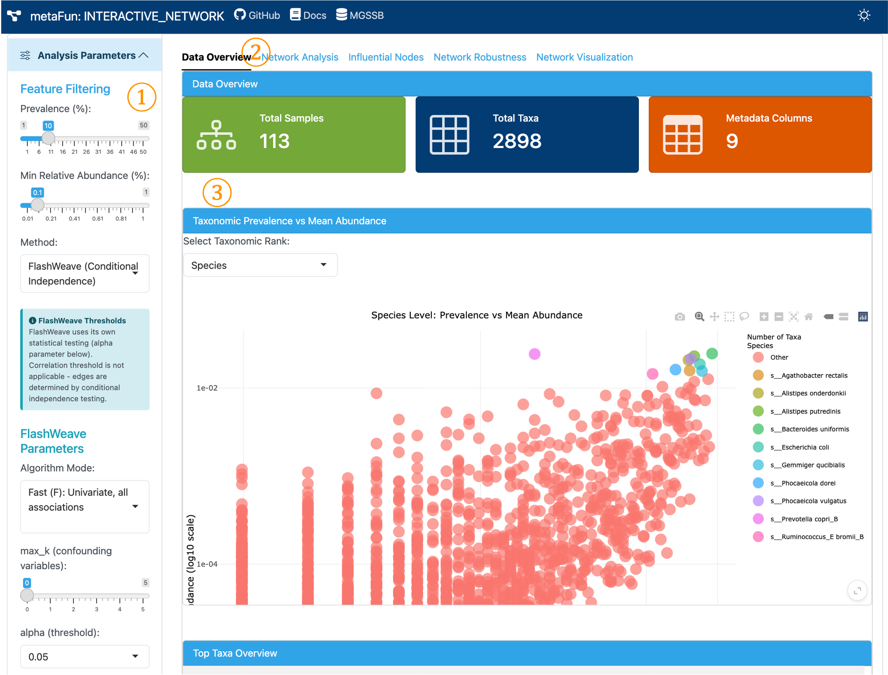
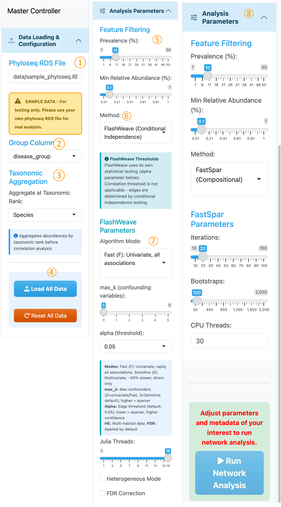
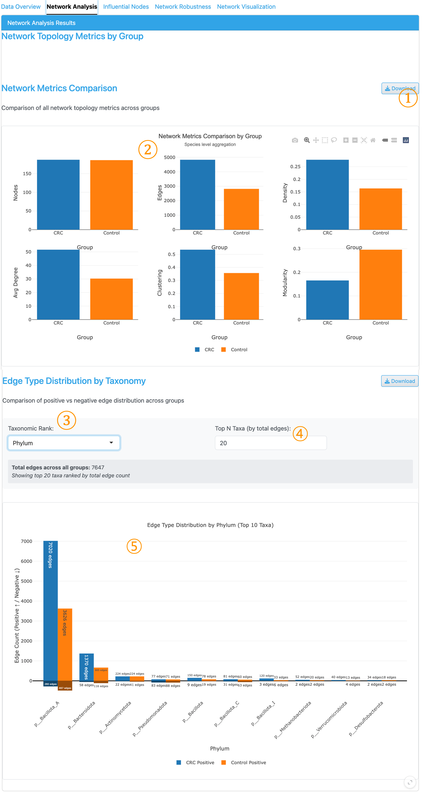
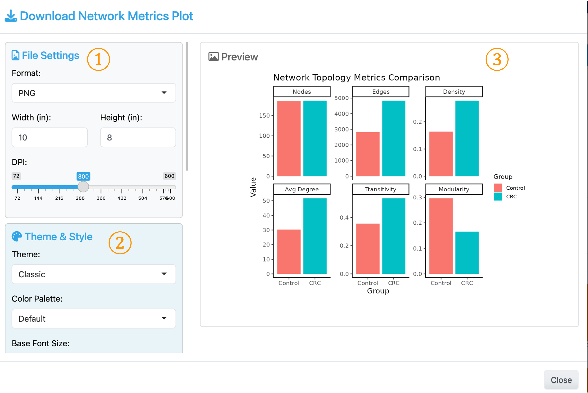
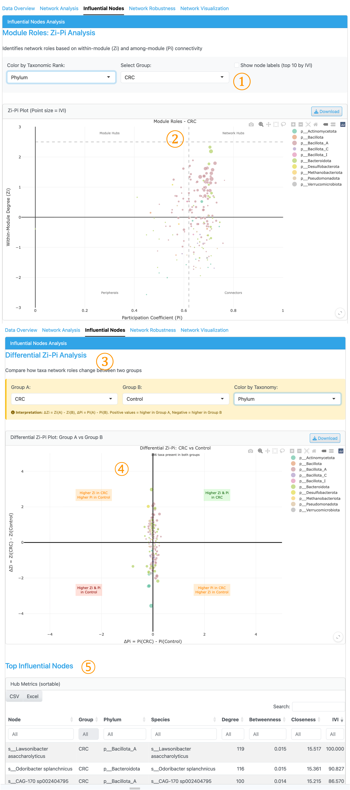
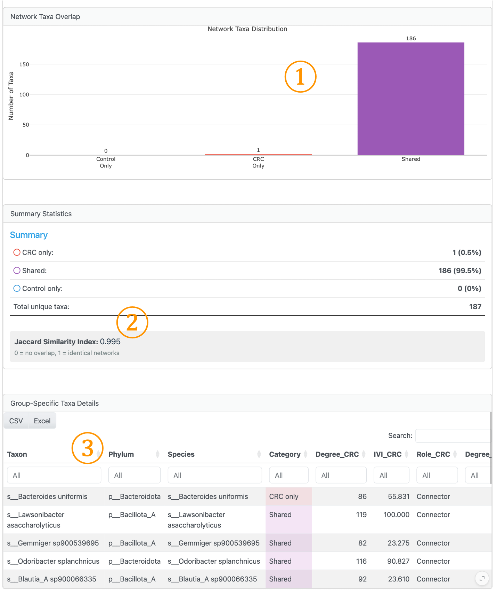
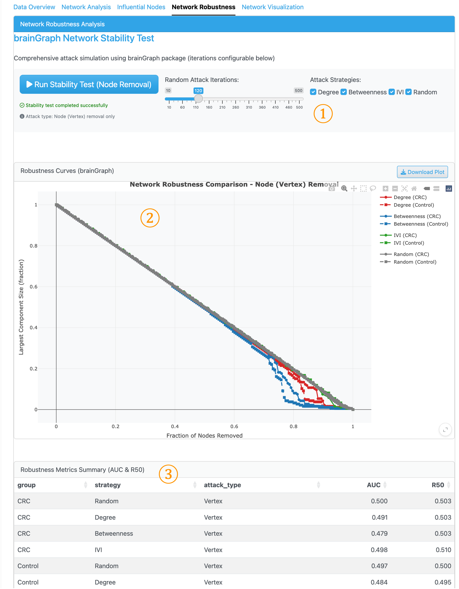
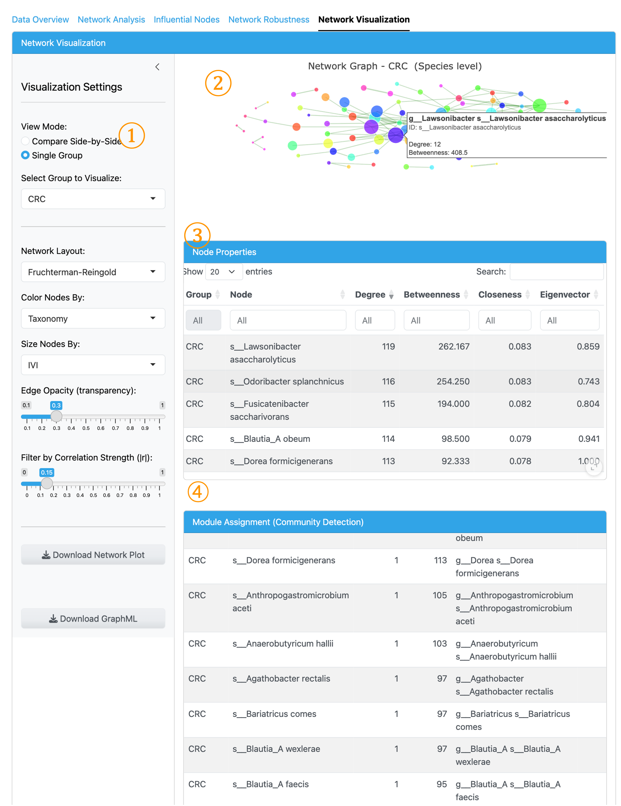

(INTERACTIVE_NETWORK_description_kr)=

# <span style="color:#2FA4E7">INTERACTIVE_NETWORK</span>


이 모듈은 미생물 공존 네트워크 분석 및 시각화를 위한 대화형 웹 인터페이스를 제공하는 metaFun 파이프라인의 일부입니다.

## 개요

INTERACTIVE_NETWORK 모듈은 미생물 공존 네트워크를 구축, 분석 및 시각화하기 위한 동적 웹 기반 플랫폼을 제공합니다. 연구자들이 FastSpar(조성 데이터) 또는 FlashWeave(조건부 독립성)를 사용하여 상관관계 기반 네트워크를 구축하고, 샘플 그룹 간 네트워크 특성을 비교하며, 중심성 분석을 통해 영향력 있는 분류군을 식별하고, 네트워크 강건성을 평가할 수 있습니다. 이 모듈은 phyloseq 객체를 활용하여 프로그래밍 지식 없이도 고급 네트워크 분석과 맞춤형 시각화를 가능하게 합니다.

**주요 기능:**
- FastSpar(SparCC) 또는 FlashWeave(조건부 독립성)를 사용한 네트워크 추론
- 토폴로지 지표를 사용한 그룹별 네트워크 비교
- Zi-Pi 분류 및 IVI 점수를 통한 영향력 있는 노드 탐지
- brainGraph 공격 시뮬레이션을 사용한 네트워크 강건성 분석
- 실시간 임계값 조정이 가능한 대화형 시각화

**이 모듈은 그룹별 네트워크 비교를 가능하게 하여**, 사용자가 다양한 조건(예: 건강 vs 질병)에 대해 별도의 네트워크를 구축하고 구조적 특성을 비교할 수 있습니다.

## 모듈 실행

이 모듈은 `WMS_TAXONOMY` 모듈의 **phyloseq RDS 출력**을 입력으로 받습니다.

**파이프라인 통합:**
```
WMS_TAXONOMY → phyloseq.rds → INTERACTIVE_NETWORK
```

```{code-block} bash
# phyloseq RDS 파일을 사용한 기본 사용법
(metafun) metafun -module INTERACTIVE_NETWORK -i results/metagenome/WMS_TAXONOMY/phyloseq/phyloseq_object.RDS

# 웹 인터페이스용 사용자 정의 포트 지정
(metafun) metafun -module INTERACTIVE_NETWORK -i results/metagenome/WMS_TAXONOMY/phyloseq/phyloseq_object.RDS -p 8080

# Sylph 프로파일링의 phyloseq 사용
(metafun) metafun -module INTERACTIVE_NETWORK -i results/metagenome/WMS_TAXONOMY/phyloseq/phyloseq_object_sylph.RDS
```

## 모듈 작동 순서

이 모듈은 다음 단계를 수행합니다:

**1단계: 데이터 로드**
- WMS_TAXONOMY 출력에서 phyloseq RDS 파일 업로드
- 샘플 메타데이터에서 그룹화 변수 선택
- 데이터 개요 탭에서 데이터 요약 검토

**2단계: 필터링 구성**
- 분류학적 집계 수준 설정 (종, 속, 과 등)
- Prevalence 임계값 조정 (기본값: 10%)
- 최소 상대적 풍부도 설정 (기본값: 0.1%)

**3단계: 네트워크 방법 선택**
- **FastSpar**: 부트스트랩 p-값이 있는 표준 조성 상관관계용
- **FlashWeave**: 조건부 독립성 기반 네트워크 추론용

**4단계: 분석 실행**
- "네트워크 분석 실행" 버튼 클릭
- 계산 대기 (콘솔에 진행 상황 표시)

**5단계: 결과 탐색**
- **네트워크 분석 탭**: 그룹 간 토폴로지 지표 비교
- **영향력 있는 노드 탭**: Zi-Pi 플롯과 IVI를 통한 허브 분류군 식별
- **네트워크 강건성 탭**: 안정성 테스트 실행 (선택 사항)
- **네트워크 시각화 탭**: 대화형 네트워크 탐색

**6단계: 결과 내보내기**
- 외부 분석을 위한 테이블(CSV) 및 네트워크(GraphML) 다운로드

## 매개변수

이 모듈은 명령줄 매개변수가 없습니다. 모든 구성은 대화형 인터페이스를 통해 수행됩니다.

phyloseq RDS 객체가 유일한 필수 입력입니다.

## 입력 및 출력

### 입력

* <span style="color:#0846FA">WMS_TAXONOMY</span> 모듈의 Phyloseq RDS 파일
* Phyloseq 객체는 OTU 테이블, 분류 테이블, 샘플 메타데이터를 포함해야 함

### 출력

* 대화형 네트워크 시각화
* 네트워크 비교 통계
* 노드 중심성 테이블
* 영향력 있는 분류군 순위
* 강건성 분석 결과
* 내보내기 가능한 그림 및 데이터 테이블

### 출력 디렉토리 구조

생성된 파일은 애플리케이션의 출력 디렉토리에 저장됩니다:

```{code-block} bash
:caption: 출력 디렉토리 구조

${launchDir}/results/interactive_network/
├── exported_figures/                      # 내보낸 시각화
│   ├── network_[group]_[timestamp].pdf         # 네트워크 다이어그램
│   ├── comparison_metrics_[timestamp].pdf      # 그룹 비교 플롯
│   ├── influential_nodes_[timestamp].pdf       # 중심성 분석 플롯
│   └── robustness_analysis_[timestamp].pdf     # 강건성 곡선
├── network_results/                       # 네트워크 분석 출력
│   ├── edge_list_[group]_[timestamp].csv       # 그룹별 엣지 리스트
│   ├── node_metrics_[group]_[timestamp].csv    # 노드 중심성 지표
│   ├── comparison_table_[timestamp].csv        # 그룹 비교 통계
│   └── correlation_matrix_[group].csv          # 원시 상관 행렬
└── analysis_logs/                         # 처리 로그
    └── network_analysis_[timestamp].log        # 분석 매개변수 및 결과
```

---

## 인터페이스 구성요소

웹 인터페이스는 여러 탭으로 나뉘며, 각 탭은 다양한 유형의 네트워크 분석을 위한 전문 도구를 제공합니다.

### 1. 메인 인터페이스 개요



<span style="color:#2FA4E7; font-family:Arial; font-size:20px">①</span> **사이드바 (분석 매개변수 설정)**: Prevalence 및 풍부도 필터링 조건 구성, 공존 네트워크 방법 선택, 네트워크 생성 매개변수 설정.

<span style="color:#2FA4E7; font-family:Arial; font-size:20px">②</span> **탐색 탭**: 네트워크 애플리케이션 내 다양한 분석 모듈에 접근:
   - **데이터 개요**: 로드된 phyloseq 데이터 요약 및 필터링 미리보기
   - **네트워크 분석**: 네트워크 토폴로지 지표 및 엣지 분포 비교
   - **영향력 있는 노드**: Zi-Pi 분류 및 노드 중심성 분석
   - **네트워크 강건성**: 노드 제거 시뮬레이션을 통한 안정성 테스트
   - **네트워크 시각화**: 맞춤형 표시가 가능한 대화형 네트워크 그래프

<span style="color:#2FA4E7; font-family:Arial; font-size:20px">③</span> **메인 콘텐츠 영역**: 선택한 각 탭에 해당하는 테이블, 플롯 및 분석 결과를 표시.

---

### 2. 사이드바 패널 (마스터 컨트롤러)



<span style="color:#2FA4E7; font-family:Arial; font-size:20px">①</span> **Phyloseq RDS 파일**: 테스트용 샘플 phyloseq 객체가 미리 로드되어 있습니다. <span style="color:#0846FA">WMS_TAXONOMY</span> 모듈 출력에서 자신의 데이터를 사용하는 것을 권장합니다.

<span style="color:#2FA4E7; font-family:Arial; font-size:20px">②</span> **그룹 열**: 그룹별 네트워크 비교를 위한 메타데이터 변수 선택. 각 카테고리에 대해 별도의 네트워크가 생성됩니다. 현재 범주형 변수만 지원합니다.

<span style="color:#2FA4E7; font-family:Arial; font-size:20px">③</span> **분류학적 집계**: 시각화 및 분석을 위해 특정 분류 수준에서 동일한 분류 정보를 가진 분류군을 집계합니다.

<span style="color:#2FA4E7; font-family:Arial; font-size:20px">④</span> **모든 데이터 로드 / 모든 데이터 리셋**: phyloseq 데이터를 애플리케이션에 로드하거나 기본 설정으로 리셋하는 버튼.

<span style="color:#2FA4E7; font-family:Arial; font-size:20px">⑤</span> **Prevalence 및 상대적 풍부도 필터링**: 희귀 분류군을 필터링하고 상관관계 추정에 영향을 줄 수 있는 풍부도 행렬의 과도한 0 카운트를 방지하기 위한 임계값 조정.

<span style="color:#2FA4E7; font-family:Arial; font-size:20px">⑥</span> **방법 선택**: 네트워크 추론을 위해 FlashWeave(조건부 독립성) 또는 FastSpar(조성)를 선택.

<span style="color:#2FA4E7; font-family:Arial; font-size:20px">⑦</span> **FlashWeave 매개변수**: FlashWeave 분석을 위한 매개변수 설정. 네트워크 생성을 실행하기 전에 연구 목적에 따라 알고리즘 모드, 알파 임계값 및 기타 옵션을 구성합니다.

<span style="color:#2FA4E7; font-family:Arial; font-size:20px">⑧</span> **FastSpar 매개변수**: FastSpar를 선택했을 때 표시되는 매개변수 설정. 네트워크 구축을 진행하기 전에 반복, 부트스트랩 및 유의성에 적절한 임계값을 설정합니다.

:::{note}
**FlashWeave vs FastSpar:**
- **FlashWeave**: 조건부 독립성 테스트를 사용하여 간접 효과를 필터링하면서 직접 연관성을 감지합니다. 진정한 생태학적 상호작용 식별에 최적.
- **FastSpar**: **조성 데이터**용으로 특별히 설계된 SparCC의 C++ 구현. 상대적 풍부도가 일정 값으로 합산되는 마이크로바이옴 데이터의 조성적 특성을 고려하여 표준 상관 방법에서 발생하는 허위 상관관계를 방지합니다. 유의성 테스트를 위한 부트스트랩 p-값을 제공합니다.
:::

---

### 3. 네트워크 분석 탭



이 탭은 네트워크 특성을 표시하고 분류학적 그룹 간 양성/음성 엣지 분포 비교를 가능하게 합니다.

<span style="color:#2FA4E7; font-family:Arial; font-size:20px">①</span> **다운로드 버튼**: 출판 준비 그림을 위한 맞춤형 설정(형식, 크기, 해상도)으로 시각화를 내보냅니다.

<span style="color:#2FA4E7; font-family:Arial; font-size:20px">②</span> **네트워크 지표 비교**: 그룹 간 기본 네트워크 속성을 비교하는 패싯 막대 차트로, 조건별 네트워크 간의 구조적 차이를 빠르게 평가할 수 있습니다.

<span style="color:#2FA4E7; font-family:Arial; font-size:20px">③</span> **분류학적 순위 선택기**: 노드는 사이드바에서 선택한 분류학적 순위를 기반으로 합니다. 이 선택기는 비율 계산을 위해 엣지 카운트를 집계할 순위 수준을 결정합니다.

<span style="color:#2FA4E7; font-family:Arial; font-size:20px">④</span> **상위 N개 분류군**: 엣지 분포 플롯에 표시할 상위 분류군 수.

<span style="color:#2FA4E7; font-family:Arial; font-size:20px">⑤</span> **엣지 유형 분포 플롯**: 분류학적 그룹별 양성 및 음성 엣지 비율을 보여주는 누적 막대 차트로, 그룹 간 공존 패턴을 빠르게 비교할 수 있습니다.

**네트워크 지표 설명:**
- **Nodes**: 적어도 하나의 유의한 상관관계를 가진 분류군 수. 높은 노드 수는 더 많은 분류군이 네트워크에 참여함을 나타냅니다.
- **Edges**: 유의한 페어와이즈 상관관계 수. 네트워크의 총 연결 수를 나타냅니다.
- **Density**: 실제 존재하는 가능한 엣지의 비율 (엣지 / 최대 가능 엣지). 값은 0에서 1까지이며, 높은 값은 더 상호연결된 네트워크를 나타냅니다.
- **Avg Degree**: 노드당 평균 연결 수. 높은 평균 차수는 분류군이 평균적으로 더 상호연결되어 있음을 나타냅니다.
- **Clustering (Transitivity)**: 연결된 삼중항 중 닫힌 삼각형의 비율. 노드가 함께 클러스터링되는 경향을 측정하며, 모듈 구조를 나타냅니다.
- **Modularity**: 0에서 1 사이의 커뮤니티 구조 강도. 높은 값은 네트워크 내의 뚜렷한 모듈이나 커뮤니티를 나타내며, 기능적 또는 생태학적 그룹화를 암시합니다.

---

### 4. 플롯 다운로드 대화 상자



<span style="color:#2FA4E7; font-family:Arial; font-size:20px">①</span> **파일 설정**: 형식(PNG/PDF/SVG), 너비, 높이(인치), DPI(72-600)

<span style="color:#2FA4E7; font-family:Arial; font-size:20px">②</span> **테마 및 스타일**: 테마 선택(Classic, Minimal 등), 색상 팔레트, 기본 글꼴 크기

<span style="color:#2FA4E7; font-family:Arial; font-size:20px">③</span> **미리보기**: 현재 설정으로 플롯의 실시간 미리보기

---

### 5. 영향력 있는 노드 탭 (Zi-Pi 분석)



<span style="color:#2FA4E7; font-family:Arial; font-size:20px">①</span> **그룹 선택기**: 노드 영향력 분석을 위해 시각화할 메타데이터 그룹을 선택합니다. 노드는 사이드바 컨트롤러에서 선택한 분류학적 순위를 기반으로 표시됩니다. 상위 분류학적 순위에 따른 노드 색상 지정이 가능합니다.

<span style="color:#2FA4E7; font-family:Arial; font-size:20px">②</span> **Zi-Pi 플롯**: y축에 모듈 내 차수(Zi), x축에 참여 계수(Pi)를 사용하여 노드 역할을 시각화하는 산점도. 점 위에 마우스를 올려 자세한 Zi, Pi 및 IVI 값을 확인하세요. 점 크기는 **통합 영향력 값(IVI)**을 나타내며, 이는 여러 중심성 측정치를 결합한 종합 지표입니다(Salavaty et al., 2020). Zi=2.5와 Pi=0.62의 점선은 노드 분류를 위한 네 가지 역할 사분면을 정의합니다.

<span style="color:#2FA4E7; font-family:Arial; font-size:20px">③</span> **차별적 Zi-Pi 분석**: 두 그룹 간의 노드 중심성 지표를 비교하여 네트워크 역할이 유의하게 다른 분류군을 식별합니다. 비교할 두 그룹을 선택합니다.

<span style="color:#2FA4E7; font-family:Arial; font-size:20px">④</span> **차별적 Zi-Pi 플롯**: 선택된 그룹 간의 ΔZi vs ΔPi를 보여주며, 조건에 따라 네트워크 위치가 크게 다른 노드를 강조합니다.

<span style="color:#2FA4E7; font-family:Arial; font-size:20px">⑤</span> **상위 영향력 있는 노드 테이블**: 상세한 정량적 평가를 위해 IVI, 차수, 매개 중심성, 근접 중심성을 포함한 노드 영향력 지표의 수치 요약.

**Zi-Pi 역할 분류:**
- **Network Hubs** (Zi > 2.5, Pi > 0.62): 여러 모듈을 연결하는 핵심 분류군
- **Module Hubs** (Zi > 2.5, Pi ≤ 0.62): 모듈 내에서 중심적인 분류군
- **Connectors** (Zi ≤ 2.5, Pi > 0.62): 모듈을 연결하는 브릿지 분류군
- **Peripherals** (Zi ≤ 2.5, Pi ≤ 0.62): 제한된 영향력을 가진 전문 분류군

---

### 6. 그룹 특이적 분류군 분석 (영향력 있는 노드 탭)



이 섹션은 시각화 및 테이블 요약을 통해 특정 그룹에 고유한 노드 식별을 용이하게 합니다.

<span style="color:#2FA4E7; font-family:Arial; font-size:20px">①</span> **네트워크 분류군 분포**: 특정 그룹에만 존재하는 노드 vs 공유 노드를 쉽게 식별할 수 있는 막대 차트 및 요약.

<span style="color:#2FA4E7; font-family:Arial; font-size:20px">②</span> **네트워크 유사성 (Jaccard 지수)**: 공유 노드를 기반으로 두 그룹 네트워크 간의 유사성을 계산합니다. 값은 0(겹침 없음)에서 1(동일한 노드 구성)까지.

<span style="color:#2FA4E7; font-family:Arial; font-size:20px">③</span> **그룹 특이적 분류군 세부 정보**: 마스터 컨트롤러에서 선택한 분류학적 순위를 기반으로 그룹 멤버십과 함께 노드 정보를 표시하는 정렬 가능한 테이블.

---

### 7. 네트워크 강건성 탭



이 탭은 **brainGraph**를 사용하여 노드 제거를 시뮬레이션하고 결과적인 네트워크 분열을 측정하여 네트워크 안정성을 평가합니다. 이 분석은 각 네트워크가 교란에 얼마나 탄력적인지 보여줍니다.

<span style="color:#2FA4E7; font-family:Arial; font-size:20px">①</span> **안정성 테스트 컨트롤**: 노드 제거 시뮬레이션을 위한 공격 전략을 구성합니다. 옵션에는 표적 공격(차수, 매개 중심성 또는 IVI로 노드 제거)과 무작위 제거가 포함됩니다.

<span style="color:#2FA4E7; font-family:Arial; font-size:20px">②</span> **강건성 곡선**: 노드가 점진적으로 제거됨에 따라 최대 컴포넌트 크기가 어떻게 감소하는지 보여주는 선 그래프. 더 가파른 곡선은 더 취약한 네트워크를 나타냅니다.

<span style="color:#2FA4E7; font-family:Arial; font-size:20px">③</span> **강건성 지표 요약**: AUC 및 R50 값을 사용한 정량적 평가. **낮은 값은 더 빠른 네트워크 붕괴를 나타내며**, 네트워크가 연결성 유지를 위해 핵심 허브 분류군에 더 의존적임을 암시합니다.

:::{admonition} 네트워크 강건성 해석
:class: note

네트워크 강건성 분석은 생태 군집이 종 손실에 어떻게 반응하는지 식별하는 데 도움이 됩니다. 표적 공격 하에 빠르게 붕괴되는 네트워크(낮은 AUC, 낮은 R50)는 핵심 종 제거에 더 취약합니다. 무작위 공격과 표적 공격 곡선 사이의 차이는 허브 의존성을 나타냅니다—더 큰 차이는 네트워크가 구조적 무결성을 위해 몇몇 영향력 있는 분류군에 크게 의존함을 암시합니다(Dunne et al., 2002; Coyte et al., 2015).
:::

---

### 8. 네트워크 시각화 탭



이 탭은 맞춤형 표시 설정이 가능한 대화형 네트워크 시각화와 상세한 노드 및 모듈 정보를 제공합니다.

<span style="color:#2FA4E7; font-family:Arial; font-size:20px">①</span> **시각화 설정**: 보기 모드(나란히 비교 또는 단일 그룹), 레이아웃 알고리즘, 노드 색상 지정(분류, 차수 또는 모듈별), 노드 크기 조정(IVI, 차수 또는 매개 중심성별), 엣지 불투명도, 상관 강도 필터를 구성합니다.

<span style="color:#2FA4E7; font-family:Arial; font-size:20px">②</span> **네트워크 그래프**: 대화형 plotly 시각화. 노드 위에 마우스를 올려 분류군 세부 정보를 확인하세요. 녹색 엣지는 양성 상관관계를 나타내고, 빨간색 엣지는 음성 상관관계를 나타냅니다.

<span style="color:#2FA4E7; font-family:Arial; font-size:20px">③</span> **노드 속성 테이블**: 차수, 매개 중심성, 근접 중심성, 고유벡터 중심성을 포함한 각 노드의 상세한 중심성 지표.

<span style="color:#2FA4E7; font-family:Arial; font-size:20px">④</span> **모듈 할당 테이블**: 모듈 멤버십을 보여주는 커뮤니티 감지 결과로, 네트워크 내의 기능적 또는 생태학적 그룹화를 탐색할 수 있습니다.

**다운로드 옵션:**
- **네트워크 플롯 다운로드**: 시각화를 이미지로 내보내기
- **GraphML 다운로드**: Cytoscape/Gephi용 네트워크 내보내기

---

## 네트워크 방법

### FastSpar (기본값)

FastSpar는 조성 데이터를 위한 SparCC의 효율적인 구현입니다:

- **목적**: 조성(상대적 풍부도) 데이터에서 상관관계 추정
- **접근법**: 조성 편향을 처리하기 위한 반복 알고리즘
- **매개변수**:
  - Iterations: 상관관계 추정을 위한 반복 횟수 (10-100)
  - Bootstraps: p-값을 위한 부트스트랩 복제 수 (50-2000)
  - Threads: 병렬 처리를 위한 CPU 스레드

:::{admonition} FastSpar 장점
:class: tip

FastSpar는 마이크로바이옴 데이터에 권장됩니다:
- 상대적 풍부도 데이터에 내재된 조성 편향 처리
- 통계 필터링을 위한 부트스트랩 기반 p-값 제공
- 재실행 없이 사후 임계값 조정 가능
:::

### FlashWeave

FlashWeave는 네트워크 추론을 위해 조건부 독립성 테스트를 사용합니다:

- **목적**: 간접 효과를 필터링하여 직접 연관성 식별
- **접근법**: 교란 변수를 고려한 조건부 독립성 테스트
- **매개변수**:
  - Algorithm mode: Fast(단변량) 또는 Sensitive(다변량)
  - max_k: 고려할 최대 교란 변수
  - alpha: 엣지 포함을 위한 통계 임계값
  - FDR: 위발견율 보정

:::{admonition} FlashWeave 장점
:class: note

FlashWeave는 다음 경우에 유용합니다:
- 직접 연관성과 간접 연관성을 구별하는 것이 중요한 경우
- 조건부 테스트를 위한 충분한 샘플 크기가 있는 경우
- 더 희소하고 생물학적으로 의미 있는 네트워크가 필요한 경우
:::

---

## 사용 참고 사항

**네트워크 추론 방법 선택:**

- **FastSpar**: 부트스트랩 p-값이 있는 표준 조성 분석에 최적. 주요 매개변수: Iterations(20-100), Bootstraps(100-2000)
- **FlashWeave**: 대용량 데이터셋, 직접 연관성, FDR 제어에 최적. 주요 매개변수: alpha(0.01-0.1), max_k(0-5), Sensitive/Fast 모드

**성능 권장 사항:**
- >500 분류군: FlashWeave Fast 모드 사용 또는 FastSpar 스레드 증가
- 시각화: 명확성을 위해 상위 100-200 분류군으로 필터링
- 출판: ≥100 부트스트랩 반복(FastSpar) 또는 Sensitive 모드(FlashWeave) 사용

---

## 예시 워크플로우

**워크플로우 1: 기본 그룹 비교**

1. WMS_TAXONOMY 출력에서 phyloseq 로드
2. 그룹화 변수 선택 (예: "disease_group")
3. 종 수준 집계 설정
4. 기본 매개변수로 FlashWeave 선택
5. "네트워크 분석 실행" 클릭
6. 네트워크 분석 탭에서 네트워크 지표 비교
7. Zi-Pi 분석을 사용하여 차별적 허브 식별

**워크플로우 2: 핵심 분류군 식별**

1. 네트워크 분석 완료
2. 영향력 있는 노드 탭으로 이동
3. Network Hubs와 Module Hubs에 대한 Zi-Pi 플롯 검토
4. 차별적 Zi-Pi를 사용하여 그룹 간 허브 상태 비교
5. 고유한 네트워크 구성원에 대한 그룹 특이적 분류군 확인
6. 다운스트림 분석을 위한 허브 지표 테이블 다운로드

**워크플로우 3: 네트워크 안정성 평가**

1. 네트워크 분석 완료
2. 네트워크 강건성 탭으로 이동
3. 반복 횟수를 100+ 이상으로 설정
4. 모든 공격 전략 선택 (차수, 매개 중심성, IVI, 무작위)
5. "안정성 테스트 실행" 클릭
6. 그룹 간 AUC 값 비교
7. 어떤 그룹이 더 허브 의존적 구조를 가지는지 식별

---

## 주요 프로그램

### 네트워크 추론
- **FastSpar**: 조성 상관관계를 위한 SparCC의 C++ 구현 (Friedman & Alm, 2012)
- **FlashWeave**: 조건부 독립성을 사용한 Julia 기반 네트워크 추론 (Tackmann et al., 2019)

### 네트워크 분석
- **igraph**: 네트워크 분석 및 시각화를 위한 R 패키지
- **brainGraph**: 네트워크 강건성 시뮬레이션을 위한 R 패키지
- **influential**: IVI 계산을 위한 R 패키지 (Salavaty et al., 2020)
- **Louvain**: 모듈 식별을 위한 커뮤니티 감지 알고리즘

**참고 문헌:**

1. Friedman, J., & Alm, E. J. (2012). Inferring correlation networks from genomic survey data. *PLoS Computational Biology*, 8(9), e1002687.

2. Tackmann, J., et al. (2019). Rapid inference of direct interactions in large-scale ecological networks. *Cell Systems*, 9(3), 286-296.

3. Salavaty, A., et al. (2020). Integrated Value of Influence: An integrative method for the identification of the most influential nodes. *Patterns*, 1(5), 100052.

4. Guimerà, R., & Amaral, L. A. N. (2005). Functional cartography of metabolic networks. *Nature*, 433(7028), 895-900.

5. Coyte, K. Z., Schluter, J., & Foster, K. R. (2015). The ecology of the microbiome: Networks, competition, and stability. *Science*, 350(6261), 663-666.

6. Dunne, J. A., Williams, R. J., & Martinez, N. D. (2002). Network structure and biodiversity loss in food webs: robustness increases with connectance. *Ecology Letters*, 5(4), 558-567.
