(INTERACTIVE_STRAIN_description_kr)=

# <span style="color:#2FA4E7">INTERACTIVE_STRAIN</span>


이 모듈은 InStrain에서 생성된 균주 수준 다양성 결과를 탐색하고 분석하기 위한 대화형 웹 인터페이스를 제공하는 metaFun 파이프라인의 일부입니다.

## 개요
INTERACTIVE_STRAIN 모듈은 균주 수준 메타게놈 데이터를 시각화하고 분석하기 위한 동적 웹 기반 플랫폼을 제공합니다. 연구자들이 뉴클레오타이드 다양성 패턴을 대화형으로 탐색하고, pN/pS 비율을 통해 선택압을 분석하며, 샘플 간 공유 균주를 식별하고, 다양성 지표와 메타데이터 변수 간의 상관관계를 분석할 수 있습니다. 이 모듈은 전처리된 InStrain 출력을 활용하여 프로그래밍 지식 없이도 고급 통계 분석과 맞춤형 시각화를 가능하게 합니다.

**이 모듈은 명령줄 분석의 대화형 대안을 제공**하여, 사용자가 사전에 지정하지 않고도 다양한 지표와 비교를 동적으로 탐색할 수 있습니다.

## 모듈 실행

```{code-block} bash
# WMS_STRAIN 결과를 사용한 기본 사용법
(metafun) metafun -module INTERACTIVE_STRAIN -i results/metagenome/WMS_STRAIN

# 웹 인터페이스용 사용자 정의 포트 지정
(metafun) metafun -module INTERACTIVE_STRAIN -i results/metagenome/WMS_STRAIN -p 8080

# 추가 메타데이터 파일 추가
(metafun) metafun -module INTERACTIVE_STRAIN -i results/metagenome/WMS_STRAIN -m updated_metadata.csv
```

## 모듈 작동 순서

이 모듈은 다음 단계를 수행합니다:

1. **균주 수준 데이터 로딩** (WMS_STRAIN 결과로부터):
   - 모든 샘플의 InStrain 프로파일 출력 읽기
   - 뉴클레오타이드 다양성 및 pN/pS 데이터 통합
   - 게놈 주석을 위한 GTDB 분류 메타데이터 로딩
   - 샘플 메타데이터와 결합

2. **대화형 웹 서버 실행** (여러 분석 모듈 포함):
   - 균주 분포 시각화를 위한 공유 분류군 분석
   - 미세다양성 분석을 위한 뉴클레오타이드 다양성 탐색기
   - 선택압 조사를 위한 pN/pS 분석
   - 통합 분석을 위한 다양성-pN/pS 상관관계

3. **대화형 구성요소를 통한 온디맨드 분석** 활성화:
   - 게놈, 샘플 또는 메타데이터별 동적 필터링
   - 조건 간 통계 테스트
   - 맞춤형 시각화 옵션
   - 다운스트림 응용을 위한 데이터 내보내기

## 매개변수

| 매개변수 | 설명 | 기본값 | 참고 |
|-----------|-------------|---------------|------|
| `-i, --input` | WMS_STRAIN 결과가 있는 입력 디렉토리 | 필수 | InStrain 프로파일을 포함한 WMS_STRAIN 출력 경로 |
| `-m, --metadata` | 추가 메타데이터 파일 | 선택 사항 | 업데이트되거나 추가된 샘플 메타데이터가 있는 CSV/TSV 파일 |
| `-g, --gtdb` | GTDB 메타데이터 파일 | 자동 감지 | 게놈 분류 정보가 있는 TSV 파일 |
| `-p, --port` | 웹 인터페이스용 포트 번호 | `8050` | 기본 포트가 이미 사용 중이면 조정 |
| `--cpus` | 사용할 CPU 코어 수 | `4` | 계산 집약적 작업용 |

## **입력 및 출력**

### 입력
* 완료된 <span style="color:#2FA4E7">WMS_STRAIN</span> 실행의 결과 디렉토리 (InStrain 프로파일 출력 포함)
* 향상된 분석을 위한 CSV/TSV 형식의 선택적 추가 메타데이터 파일
* 분류 주석을 위한 선택적 GTDB 메타데이터 파일

### 출력
* 다양한 형식의 내보낸 시각화 (PNG, PDF, SVG)
* 통계 분석 결과 (CSV, TSV)
* 필터링된 데이터 테이블
* 출판 준비 그림

### 출력 디렉토리 구조

생성된 파일은 타임스탬프가 있는 출력 디렉토리에 저장됩니다:

```{code-block} bash
:caption: 출력 디렉토리 구조

${launchDir}/results/interactive_strain/YYYYMMDDHHMMSS/
├── exported_figures/                     # 내보낸 시각화
│   ├── shared_taxa_venn_[timestamp].pdf       # Venn 다이어그램
│   ├── shared_taxa_upset_[timestamp].pdf      # UpSet 플롯
│   ├── nucleotide_diversity_[timestamp].pdf   # 다양성 박스플롯/히트맵
│   ├── pnps_analysis_[timestamp].pdf          # pN/pS 분포 플롯
│   └── correlation_plot_[timestamp].pdf       # 다양성 vs pN/pS 상관관계
├── statistical_results/                  # 통계 테스트 결과
│   ├── diversity_stats_[timestamp].csv        # 다양성 통계
│   ├── pnps_comparison_[timestamp].csv        # pN/pS 비교 결과
│   └── correlation_results_[timestamp].csv    # 상관관계 분석
└── exported_data/                        # 내보낸 데이터 테이블
    ├── shared_taxa_matrix_[timestamp].csv     # 분류군 공유 행렬
    ├── diversity_data_[timestamp].csv         # 뉴클레오타이드 다양성 값
    └── pnps_data_[timestamp].csv              # pN/pS 비율 데이터
```

## 인터페이스 구성요소

웹 인터페이스는 여러 탭으로 나뉘며, 각 탭은 다양한 유형의 균주 수준 분석을 위한 전문 도구를 제공합니다.

### 메인 인터페이스 구조

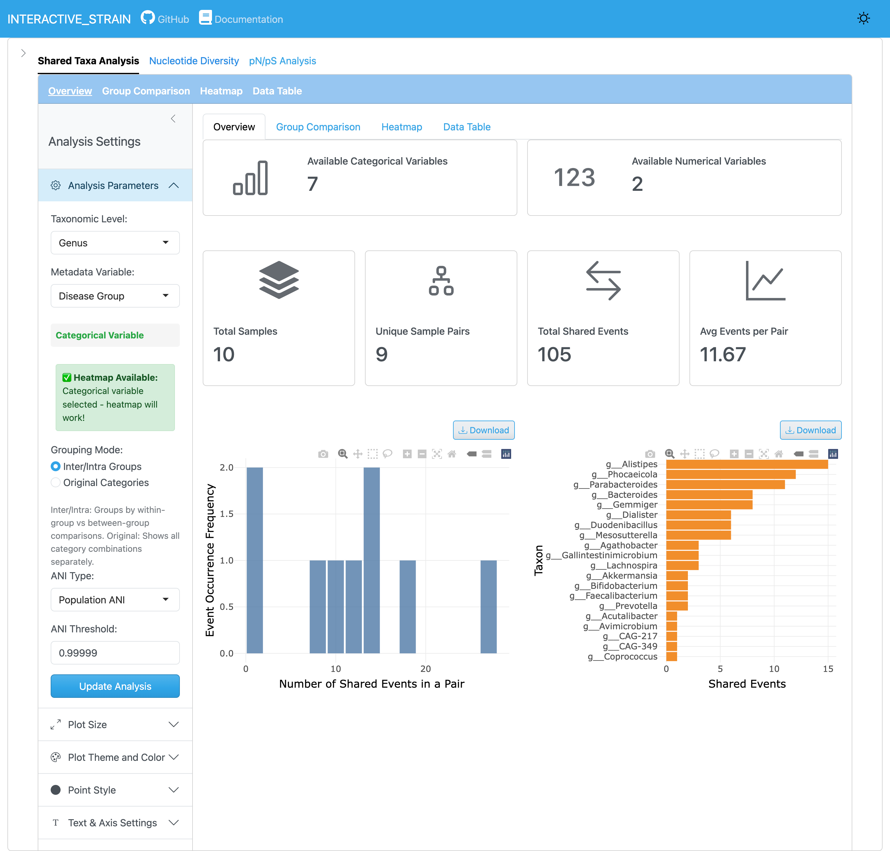

메인 인터페이스는 매개변수 구성을 위한 사이드바 패널, 다양한 분석 모듈에 접근하기 위한 탐색 탭(공유 분류군 분석, 뉴클레오타이드 다양성, pN/pS 분석, 다양성 vs pN/pS), 그리고 분석 결과를 표시하는 메인 콘텐츠 영역으로 구성됩니다.

---

### 사이드바 패널

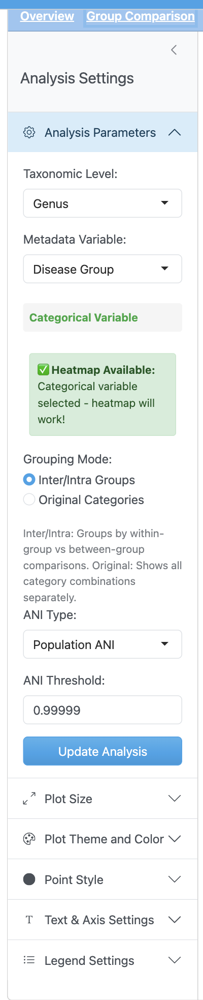

사이드바 패널은 WMS_STRAIN 결과를 로드하기 위한 컨트롤을 제공합니다. 사용자가 InStrain 출력 디렉토리 경로를 지정하면 애플리케이션이 `integrated_microbiome_data.rds` 파일에서 샘플 메타데이터를 포함한 모든 프로파일 데이터를 자동으로 로드합니다. 선택적 입력에는 분류 주석을 위한 GTDB 메타데이터 파일과 필요시 추가 샘플 메타데이터 파일이 포함됩니다.

:::{admonition} popANI와 conANI 이해하기
:class: note

InStrain은 균주 비교를 위해 두 가지 ANI 지표를 계산합니다:
- **popANI** (집단 수준 ANI): 주요 및 소수 대립유전자를 모두 고려하여 샘플 내 미세다양성을 설명
- **conANI** (합의 ANI): 샘플 간 합의(주요) 대립유전자만 비교

공유 균주 식별에는 99.999% popANI 기본 임계값이 권장됩니다. 사용자는 연구 필요에 따라 공유 분류군 분석 모듈에서 이러한 임계값을 조정할 수 있습니다. 자세한 내용은 [InStrain 문서](https://instrain.readthedocs.io/en/latest/important_concepts.html)를 참조하세요.
:::

---

:::{admonition} 탭별 분석 설계
:class: note

이 인터페이스의 모든 분석은 해당 탭 내에서만 적용되도록 설계되었습니다. 각 분석 모듈은 독립적으로 작동하며:
- 한 탭에서 변경된 설정은 다른 탭의 분석에 영향을 미치지 않음
- 각 탭은 자체 상태 및 구성을 유지
- 한 탭에서 생성된 결과는 해당 탭의 분석에만 특정
- 이러한 모듈식 설계로 간섭 없이 다른 매개변수로 다양한 분석을 동시에 실행 가능
:::

### 공유 분류군 분석

이 모듈은 샘플 간 공유된 균주/게놈을 식별하고 시각화합니다.

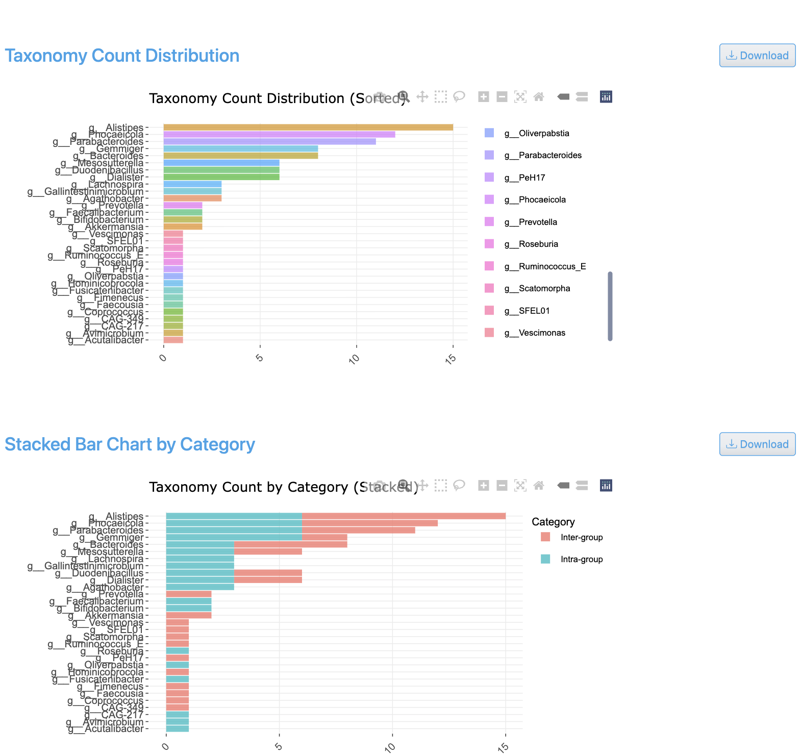

공유 분류군 카운트 뷰는 샘플 그룹 간 겹치는 분류군을 보여주는 Venn 다이어그램과 UpSet 플롯을 표시합니다. 조건 간 공유 및 고유 게놈 수를 시각화하며, 모든 그룹 조합에 대한 교집합 크기를 제공합니다.

---

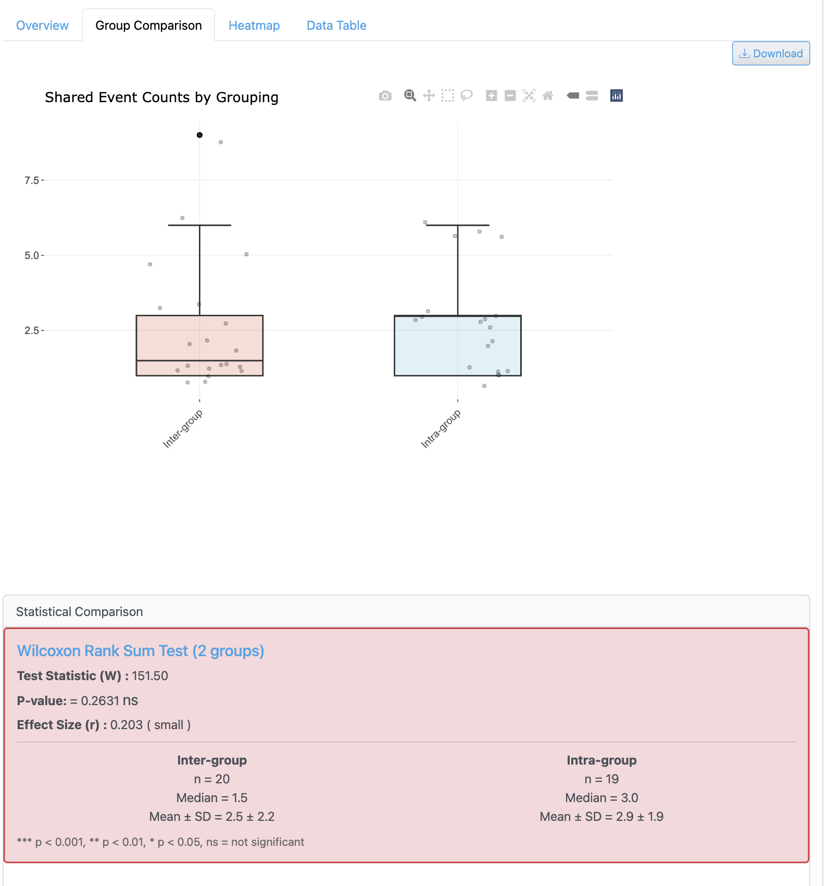

그룹 기반 공유 분석은 메타데이터 카테고리 간 균주 분포 패턴 비교를 가능하게 합니다. 통계 요약과 함께 다양한 실험 조건 간 게놈이 어떻게 분포되어 있는지 보여줍니다.

---

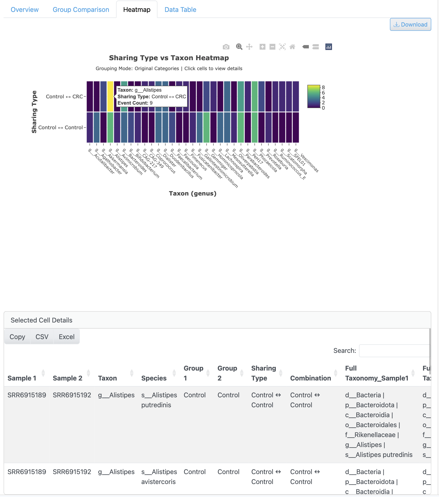

존재/부재 히트맵은 모든 샘플에 걸친 게놈 검출의 행렬 시각화를 제공합니다. 계층적 클러스터링은 샘플 그룹화 패턴을 보여주며, 검출 상태를 나타내는 색상 코딩과 prevalence 필터링 옵션이 있습니다.

### 뉴클레오타이드 다양성 탐색기

집단 내 유전적 다양성의 종합 분석입니다.

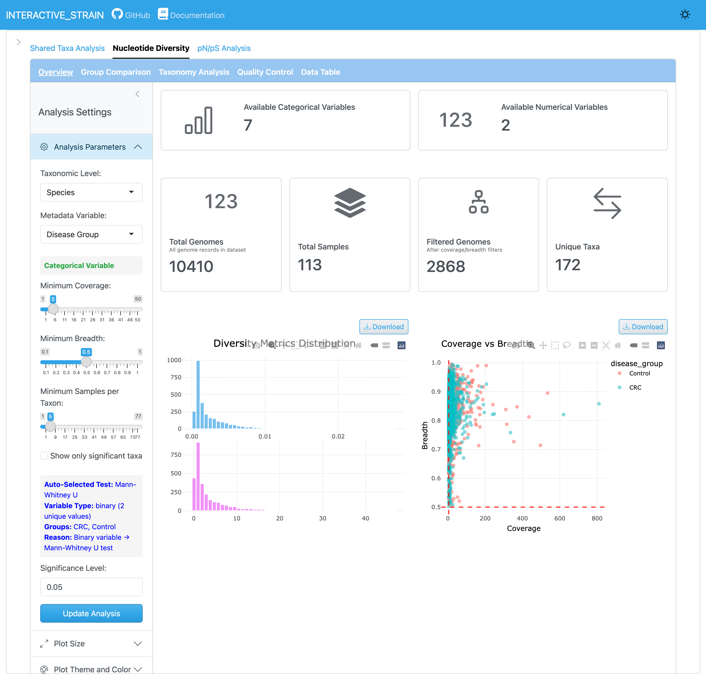

개요 패널은 모든 게놈과 샘플에 걸친 뉴클레오타이드 다양성(π) 값의 분포를 표시합니다. InStrain은 [Nei and Li (1979)](https://www.ncbi.nlm.nih.gov/pmc/articles/PMC1213565/) 방법을 사용하여 뉴클레오타이드 다양성을 계산합니다: π = 1 - Σ(각 염기의 빈도)², 충분한 커버리지(기본값 ≥5x)를 가진 모든 게놈 위치에서 계산하고 유전자/게놈 전체의 평균을 구합니다. 이 지표는 집단 내 유전적 변이를 정량화하며 샘플 간 커버리지 차이에 강건합니다. 패널은 신뢰성 있는 미세다양성 추정을 위한 요약 통계와 품질 필터링 옵션을 제공합니다.

---

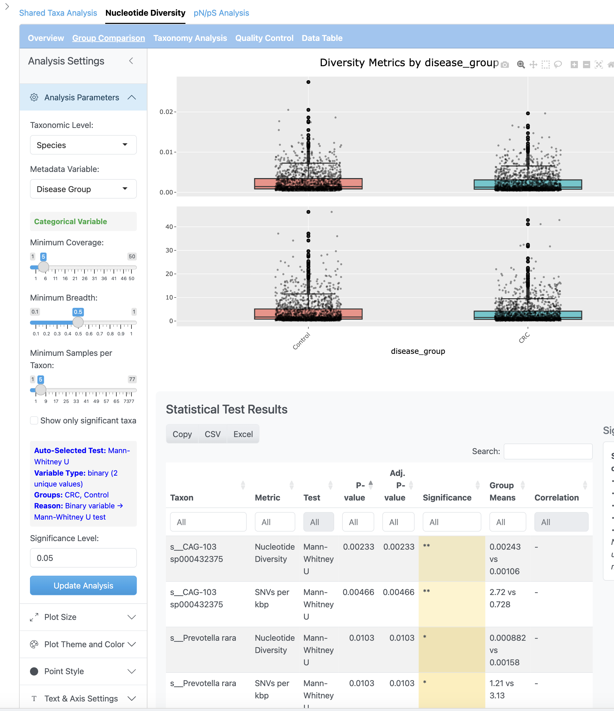

다양성 분포 뷰는 히스토그램과 밀도 플롯으로 상세한 뉴클레오타이드 다양성 패턴을 보여줍니다. 사용자는 다양성 값의 범위를 탐색하고 높거나 낮은 미세다양성을 가진 게놈을 식별할 수 있습니다.

---

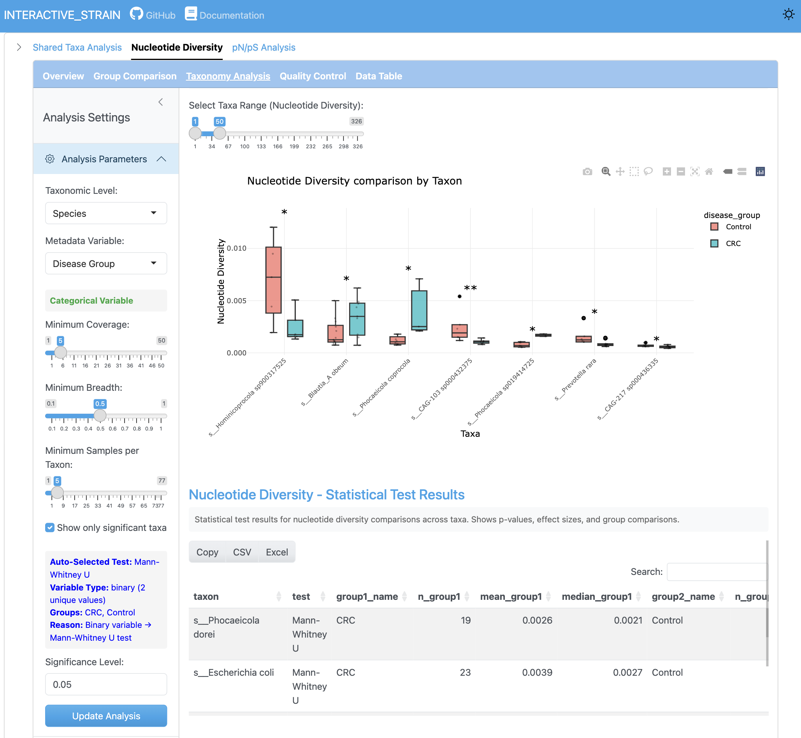

그룹 비교 뷰는 메타데이터 그룹 간 뉴클레오타이드 다양성을 비교하는 박스플롯을 제시합니다. 효과 크기 계산과 다중 검정 보정 옵션과 함께 통계 테스트(Wilcoxon, Kruskal-Wallis)가 수행됩니다.

---

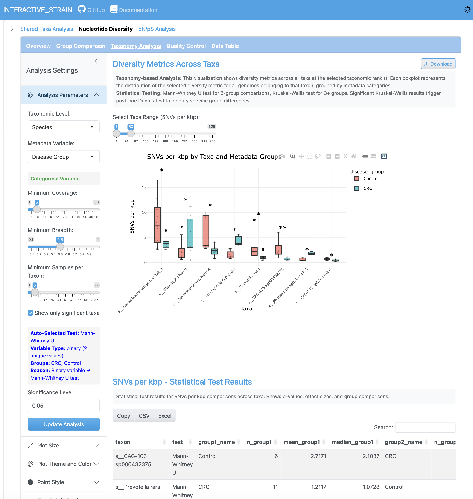

SNV 밀도 분석은 게놈과 샘플 전체에 걸친 킬로베이스 쌍당 단일 염기 변이 수를 보여줍니다. 이 지표는 돌연변이율과 집단 수준의 유전적 변이에 대한 통찰을 제공합니다.

---

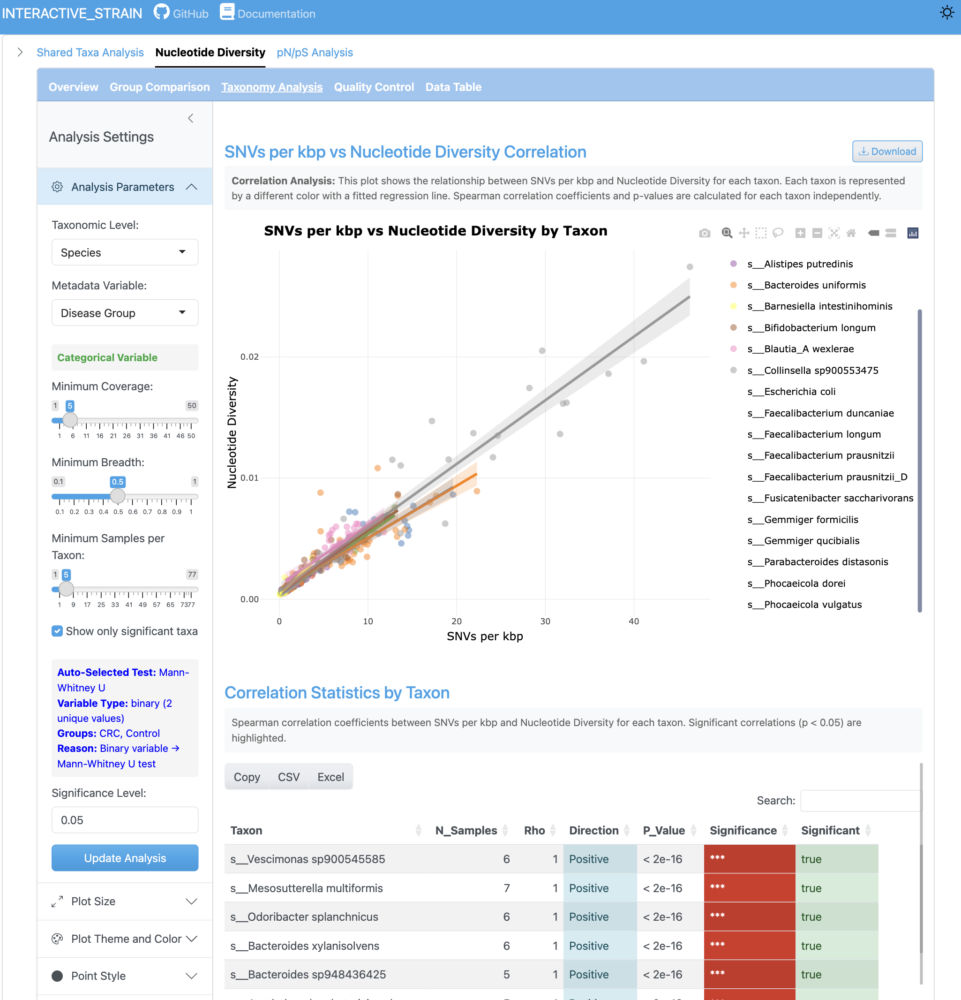

상관관계 뷰는 SNV 카운트와 뉴클레오타이드 다양성 지표 간의 관계를 표시합니다. 회귀선이 있는 산점도는 다양한 게놈과 샘플 조건에서 이러한 지표들이 어떻게 관련되는지 보여줍니다.

### pN/pS 분석

여러 수준에서의 선택압 분석입니다.

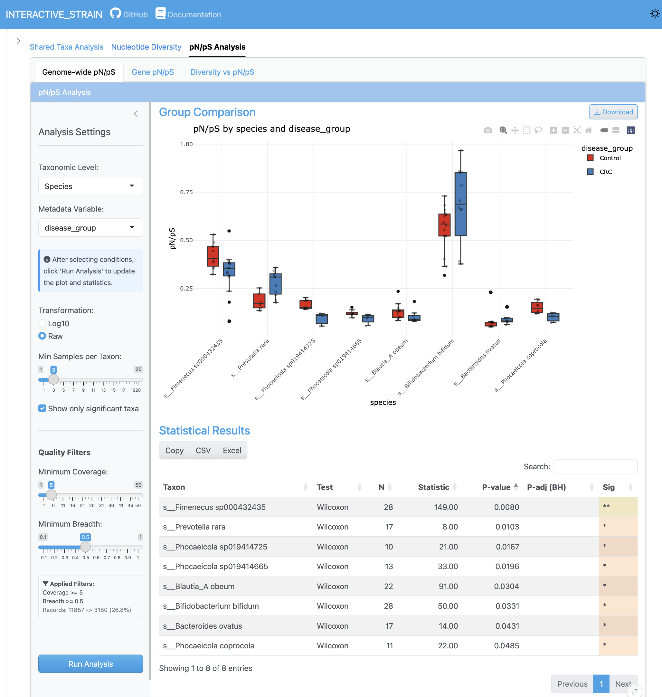

게놈 전체 pN/pS 분석은 모든 게놈에 걸친 pN/pS 비율의 분포를 표시하여 선택압을 받는 게놈을 식별합니다. 통계적 유의성 테스트가 있는 그룹 비교는 조건 간 차별적 선택 패턴을 보여줍니다.

---

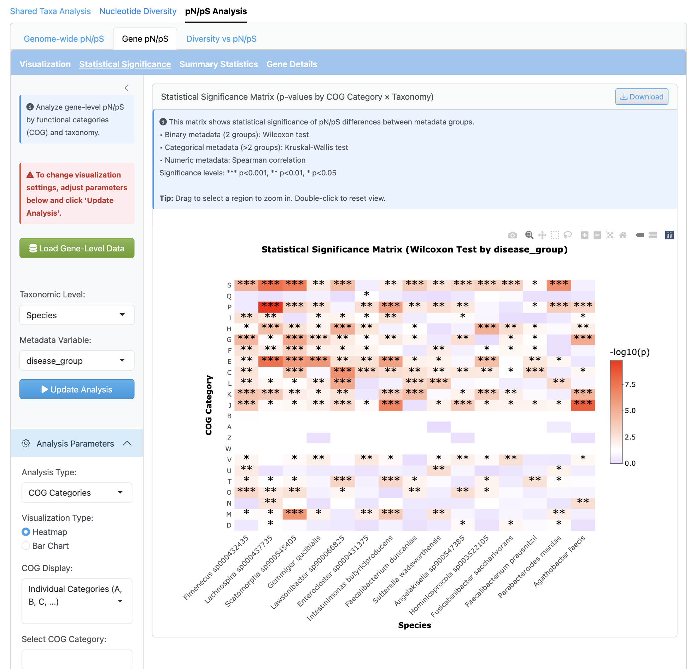

유전자 수준 분석은 기능 주석 통합(COG 카테고리)과 함께 유전자별 세밀한 선택압 조사를 제공합니다. 기능 카테고리별 히트맵 시각화는 양성 또는 정화 선택을 받는 유전자 식별을 가능하게 합니다.

### 다양성 vs pN/pS 상관관계

다양성과 선택의 통합 분석입니다.

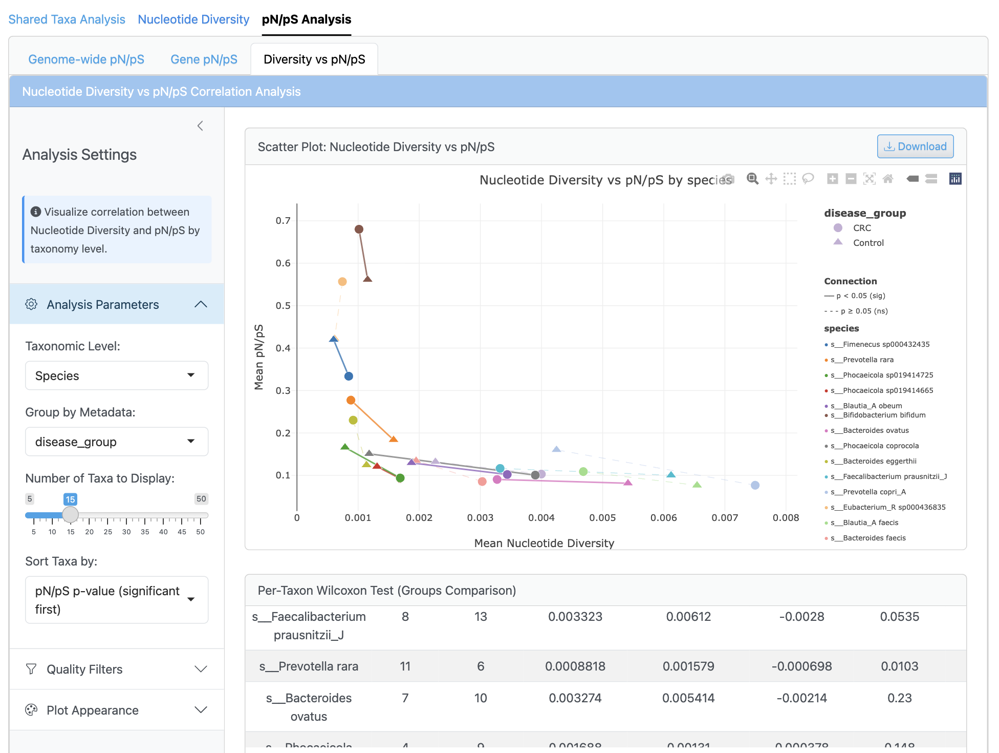

상관관계 분석은 회귀선과 신뢰 구간이 있는 뉴클레오타이드 다양성 대 pN/pS 비율의 산점도를 표시합니다. 게놈별 및 샘플별 상관관계는 Pearson 및 Spearman 방법을 사용하여 계산되며, 그룹별 분석과 다중 검정 보정이 포함됩니다. 이 통합 뷰는 다양한 조건에서 집단 다양성과 선택압 간의 관계를 보여줍니다.

## 사용 워크플로우

INTERACTIVE_STRAIN 모듈의 일반적인 분석 워크플로우:

1. 데이터 입력 패널을 사용하여 InStrain 데이터 로드
2. 공유 분류군 분석을 사용하여 게놈 분포 이해
3. 샘플과 그룹 전체에 걸친 뉴클레오타이드 다양성 패턴 탐색
4. pN/pS 비율을 사용한 선택압 분석
5. 다양성-선택 관계 조사
6. 출판 준비 그림과 테이블로 결과 내보내기

:::{admonition} 최적 성능을 위한 팁
:class: tip

- 대용량 데이터셋의 경우, 반응성 향상을 위해 관심 게놈으로 필터링
- 높은 신뢰도 데이터에 집중하기 위해 커버리지 임계값 사용
- pN/pS 값 해석 시 생물학적 관련성 고려
- 종합적인 문서화를 위해 시각화와 원시 데이터 모두 내보내기
:::

:::{admonition} 균주 수준 결과 해석
:class: note

균주 수준 데이터 분석 시 고려 사항:
1. **커버리지 효과**: 저커버리지 게놈은 신뢰할 수 없는 다양성 추정치를 가질 수 있음
2. **샘플 크기**: 통계 비교에는 그룹당 적절한 샘플이 필요
3. **생물학적 맥락**: pN/pS 해석은 세대 시간과 집단 크기에 따라 다름
4. **다중 게놈**: 많은 게놈 분석 시 다중 검정에 주의
:::

## 사용 참고 사항

- **<span style="color:#2FA4E7">INTERACTIVE_STRAIN</span>** 모듈은 <span style="color:#2FA4E7">WMS_STRAIN</span> 모듈의 InStrain 출력과 함께 작동합니다.
- 대용량 데이터셋(>50 샘플, >100 게놈)의 최적 성능을 위해 CPU 할당 증가를 고려하세요.
- 인터페이스가 사용 가능한 게놈과 메타데이터 변수를 자동으로 감지합니다.
- 웹 인터페이스 사용 중 터미널을 계속 실행하세요; 닫으면 서버가 종료됩니다.
- GTDB 메타데이터는 게놈에 대한 분류학적 맥락을 제공하여 분석을 향상시킵니다.
- 뉴클레오타이드 다양성과 pN/pS 계산에는 충분한 커버리지(일반적으로 >5x)가 필요합니다.

## 기술 구현

INTERACTIVE_STRAIN 모듈은 Shiny 프레임워크를 사용하여 구축되었으며 모듈식 아키텍처를 구현합니다:

- **핵심 구성요소**:
  - **app.R**: UI 구조와 서버 로직을 정의하는 메인 애플리케이션 파일
  - **helper/plot_customization.R**: 플롯 스타일링을 위한 공유 함수
  - **helper/error_handlers.R**: 오류 처리 및 사용자 피드백

- **분석 모듈**:
  - **shared_taxa_module.R**: 분류군 공유를 위한 Venn 다이어그램과 UpSet 플롯
  - **nucleotide_diversity_module.R**: 다양성 분석 및 시각화
  - **pnps_module_quick.R**: 게놈 전체 pN/pS 분석
  - **gene_level_pnps_module.R**: 유전자 수준 선택 분석
  - **diversity_pnps_correlation_module.R**: 통합 상관관계 분석

각 모듈은 자체 UI와 서버 로직을 가진 독립적 구성요소로 설계되어, 애플리케이션 전체에서 일관된 데이터 처리를 보장하면서 독립적인 개발과 유지보수가 가능합니다.

## 다음 단계

<span style="color:#2FA4E7">INTERACTIVE_STRAIN</span> 모듈에서 균주 수준 데이터를 탐색한 후:

1. <span style="color:#0846FA">WMS_TAXONOMY</span> 모듈을 사용한 분류학적 분석으로 보완
2. <span style="color:#7030A0">WMS_FUNCTION</span> 모듈로 기능적 잠재력 탐색
3. <span style="color:#2FA4E7">INTERACTIVE_NETWORK</span> 모듈을 사용한 미생물 상호작용 조사
4. R 또는 Python에서 맞춤 분석을 위한 처리된 데이터 내보내기

<span style="color:#2FA4E7">INTERACTIVE_STRAIN</span> 모듈은 종합적인 균주 수준 분석을 제공하여, 연구자들이 미생물 군집 내 미세다양성 패턴, 선택압 및 진화 역학을 이해할 수 있게 합니다.
