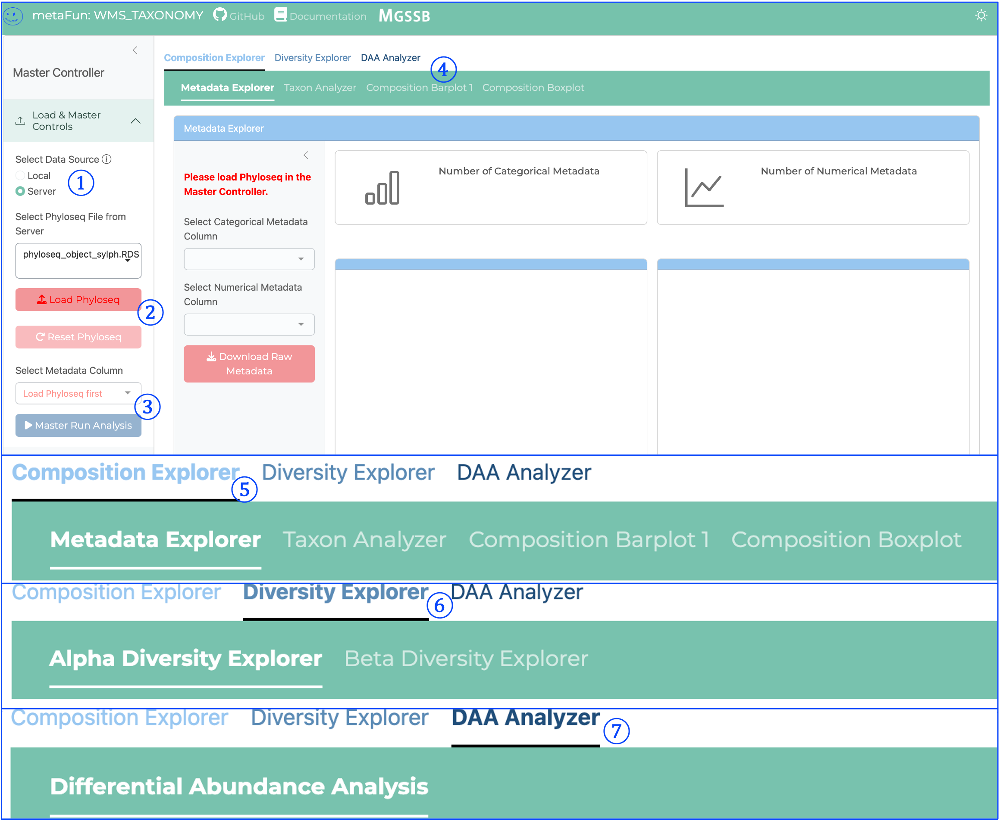
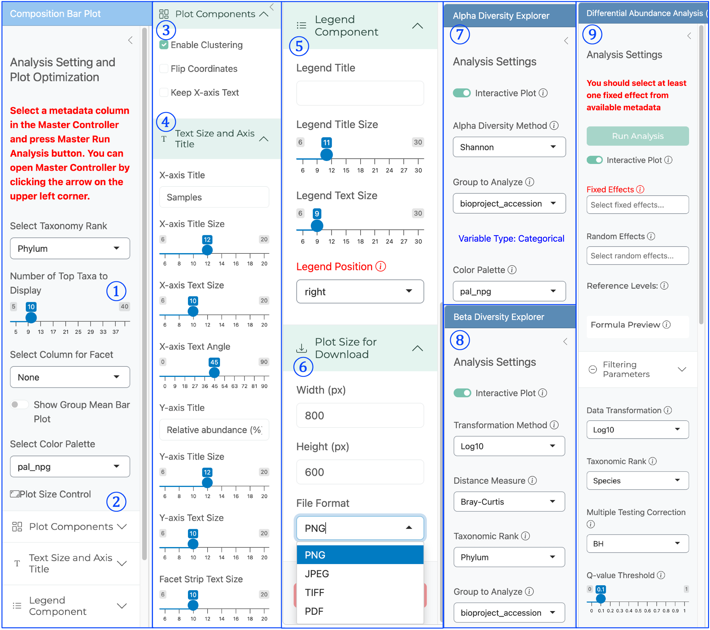

(INTERACTIVE_TAXONOMY_description)=

# <span style="color:#0846FA">INTERACTIVE_TAXONOMY</span>


이 모듈은 WMS_TAXONOMY 모듈에서 생성된 분류학적 프로필을 탐색하고, 분석하기 위한 대화형 웹 인터페이스를 제공하는 metaFun 파이프라인의 일부입니다.

## 개요
INTERACTIVE_TAXONOMY 모듈은 메타게놈 샘플의 분류학적 데이터를 시각화하고 분석하기 위한 동적인 웹 기반 플랫폼을 제공합니다. 이를 통해 연구자들은 분류학적 구성을 대화형으로 탐색하고, 샘플 간 프로필을 비교하며, 메타데이터 변수와 관련된 중요한 분류학적 패턴을 식별할 수 있습니다. 이 모듈은 WMS_TAXONOMY 모듈에서 생성된 Phyloseq 객체를 활용하여 프로그래밍 지식 없이도 고급 통계 분석과 맞춤형 시각화를 가능하게 합니다.

**이 모듈은 WMS_TAXONOMY에서 `--analysiscolumn` 매개변수를 지정하는 대안을 제공하여**, 사용자가 미리 결정하는 대신 다양한 메타데이터 변수를 대화형으로 탐색할 수 있도록 합니다.

## 모듈 실행

```{code-block} bash
# WMS_TAXONOMY 결과로 기본 사용법
(metafun) metafun -module INTERACTIVE_TAXONOMY -i results/metagenome/WMS_TAXONOMY

# 웹 인터페이스를 위한 사용자 지정 포트 지정
(metafun) metafun -module INTERACTIVE_TAXONOMY -i results/metagenome/WMS_TAXONOMY -p 8080

# 추가 메타데이터 파일 추가
(metafun) metafun -module INTERACTIVE_TAXONOMY -i results/metagenome/WMS_TAXONOMY -m updated_metadata.csv
```

:::{admonition} 이전 분석 열 지정 없이 실행하기
:class: tip

WMS_TAXONOMY를 `--analysiscolumn`을 지정하지 않고 실행했거나 0으로 설정한 경우에도, 이 대화형 모듈에서 포괄적인 통계 분석을 수행할 수 있습니다. 이 접근 방식은 분류학적 프로파일링을 다시 실행하지 않고도 다양한 메타데이터 변수를 탐색할 수 있는 유연성을 제공합니다.
:::

## 모듈 작동 순서

이 모듈은 다음 단계를 수행합니다:

1. **WMS_TAXONOMY 결과에서 분류학적 데이터 로드**
   - Kraken2/Bracken 또는 sylph에서 생성된 phyloseq 객체 읽기
   - 분류학적 프로필과 샘플 메타데이터 통합
   - 향상된 분석 기능을 위해 microeco 객체로 변환

2. **여러 분석 모듈이 있는 대화형 웹 서버 실행**
   - 분류학적 시각화를 위한 Composition Explorer
   - 알파 및 베타 다양성 분석을 위한 Diversity Explorer
   - 통계 테스트를 위한 Differential Abundance Analysis
   - 특정 분류군 검사를 위한 Taxon Analyzer
   - 샘플 정보 분석을 위한 Metadata Explorer

3. **대화형 구성 요소를 통한 온디맨드 분석 활성화**
   - 동적 필터링 및 선택
   - 다른 메타데이터 변수로 통계 테스트
   - 맞춤형 시각화 옵션
   - 다운스트림 애플리케이션을 위한 데이터 내보내기

## 인터페이스 구성 요소

웹 인터페이스는 각각 다른 유형의 분류학적 분석을 위한 특수 도구를 제공하는 여러 탭으로 나뉘어 있습니다.

### 메인 인터페이스 구조




<span style="color:#0846FA; font-family:Arial; font-size:20px">①</span> **데이터 소스 선택**:
   - 로컬 및 서버 데이터 소스 간 전환
   - 애플리케이션에 Phyloseq 데이터가 로드되는 방식 제어
   - 분류학적 데이터를 로드하기 전 필수 첫 단계

<span style="color:#0846FA; font-family:Arial; font-size:20px">②</span> **Phyloseq 로드 버튼**:
   - WMS_TAXONOMY에서 생성된 Phyloseq 객체 로드 시작
   - 분류학적 프로필 및 관련 메타데이터 읽기
   - 분석 수행 전 필요함

<span style="color:#0846FA; font-family:Arial; font-size:20px">③</span> **마스터 분석 실행 버튼**:
   - 시각화를 위한 데이터를 처리하는 <span style="color:#FF0000; font-weight:bold">중요 구성 요소</span>
   - 구성 분석을 위한 데이터 초기화
   - Composition Barplot 또는 Boxplot 시각화를 보기 전에 클릭해야 함
   - 다운스트림 분석을 위한 분류학적 데이터 준비

<span style="color:#0846FA; font-family:Arial; font-size:20px">④</span> **Composition Explorer 서브탭**:
   - 다양한 구성 분석 도구에 접근할 수 있는 2차 탐색:
     * Metadata Explorer: 메타데이터 카테고리 전반에 걸친 샘플 분포 시각화
     * Taxon Analyzer: 개별 분류군 분포 검사
     * Composition Barplot: 분류학적 그룹의 상대적 분포 표시
     * Composition Boxplot: 그룹 간 주요 분류군 분포 표시

<span style="color:#0846FA; font-family:Arial; font-size:20px">⑤</span> **Composition Explorer 메인 탭**:
   - 분류학적 구성 분석을 위한 1차 탐색 탭
   - 분류학적 프로필을 탐색하기 위한 도구 포함
   - 분류학적 분포 시각화 및 비교 가능
   - 메타데이터 변수별 샘플 구성 지원

<span style="color:#0846FA; font-family:Arial; font-size:20px">⑥</span> **Diversity Explorer 메인 탭**:
   - 다양성 분석을 위한 1차 탐색 탭
   - 알파 및 베타 다양성 탐색을 위한 서브탭 포함:
     * Alpha Diversity Explorer: 샘플 내 다양성 메트릭 분석
     * Beta Diversity Explorer: 샘플 간 다양성 관계 검사
   - 통계 테스트 및 순서 방법 제공

<span style="color:#0846FA; font-family:Arial; font-size:20px">⑦</span> **DAA Analyzer 메인 탭**:
   - Differential Abundance Analysis를 위한 1차 탐색 탭
   - Differential Abundance Analysis 도구 포함
   - 분류군과 메타데이터 간의 통계적으로 유의한 연관성 식별
   - 정교한 통계 모델링을 위한 MaAsLin2 통합
   - 중요한 발견을 위한 통계 출력 및 시각화 생성


### 탐색 및 분석 인터페이스 구성 요소




인터페이스는 특정 분석을 위한 서브탭이 있는 메인 탐색 탭으로 구성된 계층적 구조로 구성되어 있습니다. 위에 표시된 인터페이스의 주요 구성 요소는 다음과 같습니다:


<span style="color:#0846FA; font-family:Arial; font-size:20px">①</span> **분류학적 계급 제어**:
   - 시각화에 표시되는 상위 분류군 수 제어
   - 슬라이더로 포함할 분류학적 그룹 수 선택 가능
   - 드문 그룹을 제외하면서 주요 분류군에 집중하는 데 도움
   - 분석 필요에 따라 몇 개의 분류군에서 수십 개까지 조정 가능
   - 각 모듈에서 분석에 적합한 분류학적 계급 선택 가능

<span style="color:#0846FA; font-family:Arial; font-size:20px">②</span> **그림 크기 제어**:
   - 시각화 요소의 전체 크기 조정
   - 더 나은 시각적 표현을 위한 그림 영역 크기 제어
   - 다양한 상황에서 그림을 준비할 때 특히 유용
   - 화면 해상도에 관계없이 적절한 크기 보장

<span style="color:#0846FA; font-family:Arial; font-size:20px">③</span> **그림 구성 요소 패널**:
   - 고급 시각화 기능에 접근 가능
   - 유사한 샘플을 그룹화하기 위한 클러스터링 옵션 제공
   - 좌표계 및 축 표현 제어
   - 시각화 요소의 미세 조정 가능

<span style="color:#0846FA; font-family:Arial; font-size:20px">④</span> **텍스트 및 축 설정**:
   - 제목, 라벨, 주석을 포함한 모든 텍스트 요소 제어
   - 최적의 가독성을 위한 글꼴 크기 조정
   - 축 제목 및 모양 수정
   - 축 라벨의 텍스트 방향 설정

<span style="color:#0846FA; font-family:Arial; font-size:20px">⑤</span> **범례 구성 요소 제어**:
   - 그림 범례의 모양 사용자 정의
   - 범례 제목 및 텍스트 크기 조정
   - 범례 위치 제어(오른쪽, 왼쪽, 위, 아래)
   - 명확성을 위한 범례 형식 수정

<span style="color:#0846FA; font-family:Arial; font-size:20px">⑥</span> **내보내기 설정**:
   - 다운로드된 파일의 그림 크기 치수 구성
   - 내보낸 시각화를 위한 픽셀 단위 너비 및 높이 설정
   - 여러 파일 형식 옵션 제공(PNG, JPEG, TIFF, PDF)
   - 모든 내보낸 그림에 대한 출판 품질 출력 보장

<span style="color:#0846FA; font-family:Arial; font-size:20px">⑦</span> **알파 다양성 분석 패널**:
   - 샘플 내 다양성 분석을 위한 제어
   - 방법 선택 제공(Shannon, Simpson 등)
   - 메타데이터 변수별 샘플 그룹화 허용
   - 대화형 그림 토글 및 색상 팔레트 선택 포함
   - 그룹 간 통계적 비교를 위한 옵션 제공

<span style="color:#0846FA; font-family:Arial; font-size:20px">⑧</span> **베타 다양성 분석 패널**:
   - 샘플 간 다양성 비교 설정
   - 변환 방법 선택 제공(Log10)
   - 거리 측정 옵션 제공(Bray-Curtis)
   - 분석을 위한 분류학적 계급 선택 제어
   - 메타데이터 기반 샘플 그룹화 허용
   - 순서 방법에 대한 옵션 포함

<span style="color:#0846FA; font-family:Arial; font-size:20px">⑨</span> **차등 풍부도 분석 패널**:
   - 분류학적 차이의 통계 테스트 설정
   - 메타데이터에서 고정 효과 선택 필요
   - 다중 테스트 보정 제어를 위한 옵션 제공
   - 유의성 필터링을 위한 임계값 설정 포함
   - 통계 결과의 대화형 시각화 제공
   - 비교를 위한 참조 수준 선택 제어

이러한 제어 패널은 함께 작동하여 분석적 엄격성을 유지하면서 출판 준비된 시각화를 생성할 수 있는 포괄적인 환경을 제공합니다.

## 매개변수

| 매개변수 | 설명 | 기본값 | 참고 |
|-----------|-------------|---------------|------|
| `-i, --input` | WMS_TAXONOMY 결과가 있는 입력 디렉토리 | 필수 | phyloseq 객체가 포함된 WMS_TAXONOMY 출력 경로 |
| `-m, --metadata` | 추가 메타데이터 파일 | 선택 사항 | 통합할 업데이트된 또는 추가 메타데이터가 있는 CSV 파일 |
| `-p, --port` | 웹 인터페이스의 포트 번호 | `8050` | 기본 포트가 이미 사용 중인 경우 조정 |
| `--cpus` | 사용할 CPU 코어 수 | `4` | 계산 집약적인 작업용 |

## **입력 및 출력**

### 입력
* phyloseq 객체가 포함된 완료된 <span style="color:#0846FA">WMS_TAXONOMY</span> 실행의 결과 디렉토리
* 향상된 분석을 위한 CSV 형식의 선택적 추가 메타데이터 파일

### 출력
* 다양한 형식(PNG, PDF, SVG)의 내보낸 시각화
* 통계 분석 결과(CSV, TSV)
* 필터링된 분류학 테이블
* 출판 준비된 그림

### 출력 디렉토리 구조

생성된 파일은 타임스탬프가 지정된 출력 디렉토리에 저장됩니다:

```{code-block} bash
:caption: 출력 디렉토리 구조

${launchDir}/results/interactive_taxonomy/YYYYMMDDHHMMSS/
├── exported_figures/                   # 내보낸 시각화
│   ├── taxonomic_barplot_[timestamp].pdf    # 스택 막대 그래프
│   ├── taxonomic_boxplot_[timestamp].pdf    # 특정 분류군에 대한 박스 플롯
│   ├── alpha_diversity_[timestamp].pdf      # 알파 다양성 그림
│   ├── beta_diversity_[timestamp].pdf       # 순서 그림
│   └── volcano_plot_[timestamp].pdf         # 차등 풍부도 그림
├── statistical_results/                # 통계 테스트 결과
│   ├── alpha_diversity_stats_[timestamp].csv  # 알파 다양성 통계
│   ├── beta_diversity_stats_[timestamp].csv   # PERMANOVA 결과
│   ├── differential_abundance_[timestamp].csv # MaAsLin2 결과
│   └── correlation_results_[timestamp].csv    # 상관 분석 
└── exported_data/                      # 내보낸 데이터 테이블
    ├── filtered_taxa_[timestamp].csv       # 필터링된 분류군 테이블
    ├── raw_metadata_[timestamp].csv        # 메타데이터 테이블
    └── normalized_counts_[timestamp].csv   # 정규화된 풍부도 테이블
```

## 인터페이스 구성 요소


:::{admonition} 탭별 분석 설계
:class: note

이 인터페이스의 모든 분석은 각 탭 내에서만 적용되도록 설계되었습니다. 각 분석 모듈은 독립적으로 작동하므로:
- 한 탭에서 변경된 설정은 다른 탭의 분석에 영향을 미치지 않습니다
- 각 탭은 자체 상태와 구성을 유지합니다
- 한 탭에서 생성된 결과는 해당 탭의 분석에 특정합니다
- 이 모듈식 설계는 간섭 없이 다른 매개변수로 다른 분석을 동시에 실행할 수 있도록 합니다

유일한 예외는 여러 시각화 탭의 데이터를 초기화하는 마스터 분석 실행 버튼을 제공하는 마스터 컨트롤러 패널입니다.
:::

### Composition Explorer

이 다용도 분석 모듈에는 네 가지 고유한 분석 도구가 포함되어 있습니다:

1. **Metadata Explorer**: 
   - 메타데이터 카테고리 전반에 걸친 샘플 분포를 시각화합니다
   - 샘플 전체에 걸친 메타데이터 변수의 분포 제공
   - 데이터셋의 주요 특성 식별
   - 메타데이터 변수 간의 가능한 상관관계 표시
   - 추가 탐색을 위해 특정 관심 샘플 그룹 선택

2. **Taxon Analyzer**:
   - 개별 분류군에 대한 정보 표시
   - 특정 분류학적 그룹의 상세 분석
   - 조건별 풍부도 패턴 비교
   - 분류학적 계급 전반에 걸친 풍부도 탐색
   - 콜라 그림 및 박스플롯을 사용한 그룹 간 통계 비교

3. **Composition Barplot**:
   - 전체 샘플의 분류학적 구성 시각화
   - 상대적 및 절대적 풍부도 시각화 제공
   - 범주형 메타데이터 변수별 샘플 그룹화
   - 여러 샘플 간의 다양한 분류학적 조합 쉽게 식별
   - 샘플 및 그룹 간의 주요 분류학적 차이 강조

4. **Composition Boxplot**:
   - 메타데이터 그룹 간의 분류군 풍부도에 대한 통계 비교
   - 분류군 특정 비교 수행
   - 그룹 간의 유의한 차이 식별
   - 생물학적 특성과 관련된 분류군 탐색
   - 변동성 및 통계적 차이 시각화

### Diversity Explorer

이 모듈은 두 가지 주요 유형의 다양성 분석을 제공합니다:

1. **Alpha Diversity Explorer**:
   - 샘플 내 다양성(리치니스 및 이벤니스) 분석
   - Shannon, Simpson, Chao1 등의 다양한 다양성 메트릭 지원
   - 메타데이터 변수별 세분화된 다양성 비교
   - 박스플롯, 바이올린 플롯, 산점도를 포함한 다양한 시각화 옵션
   - 자동화된 통계 테스트 및 유의성 표기

2. **Beta Diversity Explorer**:
   - 샘플 간 다양성 유사성 및 차이 분석
   - PCoA, NMDS, UMAP 등 다양한 순서 방법 지원
   - Bray-Curtis, Jaccard, UniFrac 등 여러 거리 메트릭 옵션
   - 그룹 간 분리에 대한 PERMANOVA 통계 테스트
   - 2D 및 3D 순서 그림의 대화형 탐색 가능

### Differential Abundance Analysis (DAA)

이 강력한 분석 모듈은 다음 기능을 제공합니다:

- 메타데이터 변수와 관련된 분류 특성 식별
- 생물학적으로 의미 있는 효과 탐지를 위한 MaAsLin2 통합
- 다양한 통계 모델 옵션(선형, 로지스틱 등)
- p-값 조정 및 변환 방법 선택
- 화산 그림, 히트맵, 박스플롯 시각화
- 통계 결과 테이블 필터링 및 내보내기

## 주요 워크플로우

INTERACTIVE_TAXONOMY 모듈을 효과적으로 사용하려면:

1. **데이터 로드**:
   - 데이터 소스 선택(로컬 또는 서버)
   - "Load Phyloseq" 버튼 클릭
   - 성공적으로 로드되었을 때 확인 메시지 확인

2. **분석 실행**:
   - 분석 설정 구성(분류학적 계급, 메타데이터 그룹 등)
   - "Run Analysis" 버튼 클릭
   - 분석 완료 대기

3. **시각화 및 탐색**:
   - 탭 인터페이스를 사용하여 다양한 분석 모듈 사이를 이동
   - 시각화 설정을 조정하여 그림 맞춤 설정
   - 필요에 따라 다운스트림 분석을 위해 그림 및 데이터 내보내기

4. **고급 분석**:
   - 차등 풍부도 분석을 위한 통계 모델 적용
   - 메타데이터 변수와 분류학적 특성 간의 연관성 식별
   - 계층적 분석을 통해 관찰된 패턴의 생물학적 의미 해석

이 워크플로우는 메타게놈 데이터의 심층 분석을 가능하게 하여 연구자가 완전하고 철저한 메타게놈 프로파일링 연구를 수행할 수 있도록 합니다.
