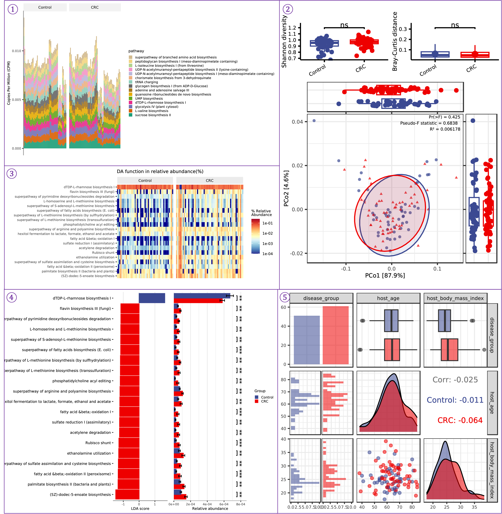

(WMS_FUNCTION_description)=

# <span style="color:#7030A0">WMS_FUNCTION</span>


이 모듈은 HUMAnN3을 사용하여 전체 메타게놈 시퀀싱 데이터의 기능 분석을 제공하는 metaFun 파이프라인의 일부입니다.

## 개요
WMS_FUNCTION 모듈은 미생물 군집에 존재하는 대사 경로를 식별하기 위해 메타게놈 샘플의 기능적 프로파일링을 수행합니다. UniRef90 단백질 데이터베이스와 MetaCyc 경로 데이터베이스에 리드를 매핑하기 위해 HUMAnN3을 활용하여 포괄적인 기능 프로필을 생성합니다. 이 모듈은 기능 데이터를 샘플 메타데이터와 통합하여 통계 분석 및 시각화를 수행하여 다양한 조건에서 마이크로바이옴의 기능적 잠재력을 보여줍니다.

## 모듈 실행

```{code-block} bash
# 품질 필터링된 리드로 기본 사용법
(metafun) metafun -module WMS_FUNCTION -i results/metagenome/RAWREAD_QC/read_filtered -m metadata.csv -s 1

# 메타데이터 열을 기반으로 통계 분석 포함
(metafun) metafun -module WMS_FUNCTION -i results/metagenome/RAWREAD_QC/read_filtered -m metadata.csv -s 1 -a 2

# 사용자 정의 출력 디렉토리 지정
(metafun) metafun -module WMS_FUNCTION -i results/metagenome/RAWREAD_QC/read_filtered -m metadata.csv -s 1 -a 2 -o custom_output_dir

# 특정 CPU 리소스 할당
(metafun) metafun -module WMS_FUNCTION -i results/metagenome/RAWREAD_QC/read_filtered -m metadata.csv -s 1 -a 2 -p 24
```

## 모듈 작동 순서

이 모듈은 다음 단계를 수행합니다:

1. **개별 샘플에 대한 HUMAnN3 분석**:
   - 각 샘플에 대한 페어드 엔드 리드 병합
   - ChocoPhlAn 및 UniRef90 데이터베이스에 대한 핵산 및 번역 검색 수행
   - MetaCyc 경로 데이터베이스에 리드 매핑
   - 유전자 패밀리 및 경로 풍부도 프로필 생성
   - **인간 리드에 대한 참고 사항**: 이 모듈은 이미 인간 DNA 서열을 제거한 RAWREAD_QC의 출력을 사용합니다. HUMAnN3은 MetaPhlAn을 사용한 내장 분류학적 필터링을 통해 남아 있는 호스트 리드를 추가로 처리합니다.

2. **HUMAnN3 출력 파싱 및 정규화**:
   - `humann_join_tables`를 사용하여 모든 샘플의 경로 풍부도 테이블 결합
   - `-u cpm` 매개변수로 `humann_renorm_table`을 사용하여 CPM(Copies Per Million)으로 정규화
     - CPM 정규화는 샘플 간 공정한 비교를 위해 시퀀싱 깊이에 맞게 유전자 풍부도를 조정합니다.
     - 계산 방법: (pathway_abundance / total_abundance) × 1,000,000
   - `humann_split_stratified_table`로 계층화(생물체별) 및 비계층화(군집 수준) 풍부도 테이블 분리

3. **기능 분석 및 시각화**:
   - 스크립트 디렉토리에서 R 스크립트 `humann3_visualization.R`을 사용하여 포괄적인 통계 분석 수행
   - 비계층화 경로 풍부도 테이블(`pathabund_join_renorm_cpm_unstratified.tsv`)과 메타데이터를 입력으로 사용
   - 메타데이터 그룹화를 기반으로 통계 분석 수행:
     - 기능적 풍부도와 균등성에 대한 알파 다양성 계산
     - PERMANOVA 테스트로 베타 다양성 분석
     - 그룹 간에 차이가 있는 경로를 식별하는 차등 풍부도 분석
   - 다음을 포함한 시각화 생성:
     - 그룹별 경로 풍부도의 스택 막대 그래프(예시 그림의 ①에 표시)
     - 통계적 비교가 있는 알파 및 베타 다양성 박스플롯(예시 그림의 ②에 표시)
     - 차등 풍부한 경로의 히트맵(예시 그림의 ③에 표시)
     - 통계적 유의성이 있는 차등 풍부도 박스플롯(예시 그림의 ④에 표시)
     - 수치 메타데이터 변수와의 상관 분석(예시 그림의 ⑤에 표시)

## 매개변수
**`${launchDir}`은 metaFun을 실행하는 디렉토리로, 출력 기본 디렉토리로 활용됩니다.** 

| 매개변수 | 설명 | 기본값 | 참고 |
|-----------|-------------|---------------|------|
| `-i, --inputDir` | 필터링된 리드가 포함된 입력 디렉토리 | `"${launchDir}/results/metagenome/RAWREAD_QC/read_filtered"` | **필수**. <span style="color:#FF0000">RAWREAD_QC</span> 워크플로우의 출력 |
| `-m, --metadata` | 메타데이터 파일 경로 | `"meta.csv"` | **필수**. 샘플 정보가 포함된 CSV 파일 |
| `-s, --sampleIDcolumn` | 메타데이터에서 샘플 ID의 열 번호 | `1` | **필수**. 리드 파일 이름의 샘플 ID와 일치 |
| `-a, --analysiscolumn` | 분석 그룹화를 위한 열 번호 | `0` | 선택 사항. 0으로 설정하면 통계 분석이 수행되지 않음 |
| `-p, --cpus` | 사용할 CPU 수 | `36` | 선택 사항. 시스템 기능에 따라 조정 |
| `-o, --outdir` | 출력 디렉토리 | `"${launchDir}/results/metagenome/WMS_FUNCTION"` | 선택 사항. 결과가 저장될 위치 |

## **입력 및 출력**

### 입력
* 품질 제어된 페어드 엔드 메타게놈 리드(<span style="color:#FF0000">RAWREAD_QC</span> 워크플로우의 출력)
* 샘플 정보 및 조건이 포함된 메타데이터 파일(CSV 형식)

### 출력
* 각 샘플에 대한 HUMAnN3 유전자 패밀리 및 경로 풍부도 프로필
* 결합되고 정규화된 경로 풍부도 테이블
* 통계 분석 결과 및 시각화(--analysiscolumn이 지정된 경우)

### 출력 디렉토리 구조

출력은 다음과 같은 디렉토리 구조로 구성됩니다:

```{code-block} bash
:caption: 출력 디렉토리 구조

${launchDir}/results/metagenome/WMS_FUNCTION/
├── humann3/                          # 개별 HUMAnN3 결과 디렉토리
│   ├── SRR6915091_humann3/            # 샘플별 HUMAnN3 결과 디렉토리
│   │   ├── SRR6915091_genefamilies.tsv  # 유전자 패밀리 풍부도 
│   │   ├── SRR6915091_pathabundance.tsv # 경로 풍부도
│   │   ├── SRR6915091_pathcoverage.tsv  # 경로 커버리지
│   │   └── SRR6915091_humann_temp/      # 임시 처리 파일
│   └── ...                            # 다른 샘플의 결과
├── humann3_combined/                 # 결합된 HUMAnN3 결과
│   └── humann_split_stratified_table/  # 분리된 계층화 및 비계층화 테이블
└── WMS_Function_result/              # 통계 분석 결과
    ├── alpha_diversity.csv             # 알파 다양성 메트릭
    ├── beta_group_perMANOVA_stat.csv   # PERMANOVA 통계
    ├── bray.csv                        # Bray-Curtis 비유사도 행렬
    ├── humann_alpha_beta_diversity.pdf # 알파/베타 다양성 그림
    ├── humann_alpha_group_diff_stat.csv # 그룹 차이 통계
    ├── humann_beta_group_distance_diff_stat.csv # 베타 다양성 통계
    ├── humann_beta_group_distance_raw.csv # 원시 거리 값
    ├── humann_DAfunction_meta_correlation.pdf # 상관 그림
    ├── humann_group_barplot.pdf        # 경로 풍부도 막대 그래프
    ├── humann_lefse_heatmap.pdf        # LEfSe 히트맵 시각화
    ├── humann_lefse_result.pdf         # LEfSe 차등 경로 분석
    ├── humann_metadata_autocorrelation.pdf # 메타데이터 상관관계
    └── jaccard.csv                     # 자카드 거리 행렬
├── humann_analysis_inspect.log       # 분석 로그 파일
└── Rplots.pdf                        # 추가 R 그림
```

## 시각화 출력 설명

WMS_FUNCTION 모듈은 대조군과 CRC(대장직장암) 그룹을 비교하는 이 예시 그림과 같이 기능 분석을 위한 포괄적인 시각화를 생성합니다:



### <span style="color:#7030A0; font-family:Arial; font-size:20px">①</span> **경로 풍부도 스택 막대 그래프**

이 시각화는 각 샘플에서 대사 경로의 상대적 풍부도를 보여줍니다, 조건별로 그룹화됨:
- 각 수직 막대는 샘플을 나타냄
- 다른 색상은 다른 대사 경로를 나타냄(범례에 나열됨)
- y축은 CPM(Copies Per Million)의 풍부도를 보여줌
- 샘플은 메타데이터 카테고리별로 그룹화됨(이 예시에서는 대조군 vs. CRC)

이 시각화는 샘플 그룹 간의 기능적 능력의 잠재적 변화를 보여주며, 샘플 그룹 전반에 걸친 지배적인 기능적 능력을 식별하는 데 도움이 됩니다. `humann_group_barplot.pdf` 파일에 이 시각화가 포함되어 있습니다.

### <span style="color:#7030A0; font-family:Arial; font-size:20px">②</span> **기능적 다양성 분석**

이 패널은 기능적 프로필에서 계산된 다양성 메트릭을 표시합니다:

**상단 섹션:**
- **알파 다양성:** 그룹 간 기능적 다양성을 비교하는 Shannon 다양성 박스플롯
- **베타 다양성:** 그룹 내 및 그룹 간 유사성을 보여주는 Bray-Curtis 거리 박스플롯
- 통계적 유의성이 표시됨(이 예시에서는 "ns"는 유의하지 않음을 의미)

**하단 섹션:**
- **PCoA 그림:** 기능적 프로필에 기반한 샘플 관계를 보여주는 주성분 좌표 분석
- 샘플은 신뢰 타원과 함께 그룹별로 색상이 지정됨
- 통계 메트릭이 표시됨(Pr(>F), Pseudo-F 통계량, R²)
- 축은 각 주성분에 의해 설명되는 분산 비율을 보여줌

이 시각화는 `humann_alpha_beta_diversity.pdf` 파일에서 찾을 수 있으며, 해당 통계는 `alpha_diversity.csv`, `bray.csv`, `beta_group_perMANOVA_stat.csv` 파일에 있습니다.

### <span style="color:#7030A0; font-family:Arial; font-size:20px">③</span> **차등 풍부도 히트맵**

이 시각화는 LEfSe(Linear discriminant analysis Effect Size) 분석의 결과를 보여줍니다:
- 각 행은 특정 대사 경로를 나타냄
- 각 열은 조건별로 그룹화된 샘플을 나타냄
- 색상 강도는 상대적 풍부도를 나타냄(빨간색=높음, 파란색=낮음)
- 경로는 그룹 간 통계적 유의성에 기반하여 선택됨

히트맵을 통해 한 그룹에서 다른 그룹보다 일관되게 더 풍부한 경로를 식별할 수 있어, 잠재적인 기능적 바이오마커를 제공합니다. 이 시각화는 `humann_lefse_heatmap.pdf`로 저장됩니다.

### <span style="color:#7030A0; font-family:Arial; font-size:20px">④</span> **LEfSe 차등 풍부도 박스플롯**

이 패널은 LEfSe 분석에 의해 식별된 특정 경로의 통계적 비교를 보여줍니다:
- 각 행은 차등 풍부한 경로를 보여줌
- 막대는 다른 그룹의 풍부도를 나타냄
- x축은 LDA 점수(효과 크기)를 보여줌
- 별표는 통계적 유의성 수준을 나타냄
- 막대의 방향과 길이는 어떤 그룹이 더 높은 풍부도를 가지는지 나타냄

이 시각화는 그룹 간 가장 유의하게 다른 경로를 강조하며 `humann_lefse_result.pdf`로 저장됩니다.

### <span style="color:#7030A0; font-family:Arial; font-size:20px">⑤</span> **메타데이터 상관 분석**

이 포괄적인 패널은 메타데이터 변수 간의 관계를 분석합니다:

**상단 행:**
- 범주형 및 수치형 메타데이터 변수의 분포

**중간 행:**
- 그룹별 수치 변수(예: host_age)의 분포
- 변수 간 상관 계수, 전체 및 그룹별

**하단 행:**
- 그룹별 다른 수치 변수(예: BMI)의 분포
- 그룹별로 색상이 지정된 수치 변수 간의 관계를 보여주는 산점도
- 그룹 간 분포를 비교하는 밀도 그림

이 분석은 기능적 프로필에 영향을 미칠 수 있는 잠재적 교란 변수나 메타데이터 간의 상관관계를 식별하는 데 도움이 됩니다. 이 시각화는 `humann_metadata_autocorrelation.pdf` 및 `humann_DAfunction_meta_correlation.pdf`로 저장됩니다.

이러한 시각화를 통해 높은 수준의 경로 풍부도 패턴에서 특정 차등 경로 및 메타데이터 변수와의 관계에 이르기까지 기능적 메타게놈 데이터의 포괄적인 분석이 제공됩니다.

## <span style="color:#7030A0">WMS_FUNCTION</span> 모듈의 Nextflow 프로세스

| 프로세스 | InputDir | OutputDir | 참고 |
|---------|----------|-----------|------|
| humann3_run | `${params.inputDir}` | `${params.outdir}/humann3` | 개별 샘플에 대한 HUMAnN3 분석 수행 |
| humann3_parsing | humann3_run의 출력 | `${params.outdir}/humann3_combined` | HUMAnN3 출력 결합 및 정규화 |
| function_analysis | humann3_parsing의 출력 | `${params.outdir}/WMS_Function_result` | 통계 분석 및 시각화 수행 |

## <span style="color:#7030A0">WMS_FUNCTION</span> 워크플로우의 프로세스 설명

1. **humann3_run**: 각 샘플의 페어드 엔드 리드에 대해 HUMAnN3을 실행합니다.
   - 입력: 페어드 엔드 품질 필터링된 메타게놈 리드
   - 출력: 각 샘플에 대한 유전자 패밀리 및 경로 프로필
   - 처리를 위해 페어드 리드 병합
   - UniRef90 단백질 데이터베이스 및 MetaCyc 경로 데이터베이스 사용
   - 핵산 및 번역 검색 모두 수행

2. **humann3_parsing**: 모든 샘플의 HUMAnN3 출력을 결합하고 정규화합니다.
   - 입력: 모든 샘플의 HUMAnN3 출력 파일
   - 출력: 결합되고 정규화된 경로 풍부도 테이블
   - 모든 샘플에 걸쳐 테이블 조인
   - CPM(copies per million)으로 정규화
   - 계층화(생물체별) 및 비계층화(군집 수준) 테이블 분리

3. **function_analysis**: 통계 분석을 수행하고 시각화를 생성합니다.
   - 입력: 정규화된 경로 풍부도 테이블 및 메타데이터
   - 출력: 통계 결과 및 시각화
   - 조건 간 차등 풍부한 경로 식별
   - 히트맵, PCA 그림, 박스플롯 생성
   - --analysiscolumn이 지정된 경우에만 실행

## <span style="color:#7030A0">WMS_FUNCTION</span>에서 사용되는 도구

| 도구 | 목적 | 버전 | 기본 매개변수 | 선택할 수 있는 매개변수 |
|------|---------|------------|---------------------|--------------------------------|
| HUMAnN3 | 기능적 프로파일링 | 3.0.0 | `--search-mode uniref90`, `--pathways metacyc` | `--threads ${task.cpus}` |
| MetaPhlAn | 분류학적 프로파일링(HUMAnN3에서 사용) | 4.0.6 | `--index mpa_vOct22_CHOCOPhlAnSGB_202212` | 이 워크플로우에 특정한 것 없음 |
| R | 통계 분석 및 시각화 | 4.3.2 | N/A | N/A |

## 사용 참고 사항

- **<span style="color:#7030A0">WMS_FUNCTION</span>** 모듈은 <span style="color:#FF0000">RAWREAD_QC</span> 모듈의 출력과 함께 작동하도록 설계되었습니다.
- 메타데이터 파일은 리드 파일 이름의 접두사와 일치하는 샘플 ID가 포함된 열이 하나 이상 있는 CSV 형식이어야 합니다.
- HUMAnN3은 특히 대규모 데이터셋에 대해 상당한 계산 리소스가 필요합니다. `-p` 매개변수로 CPU 할당을 조정하는 것을 고려하세요.
- HUMAnN3 데이터베이스(ChocoPhlAn 및 UniRef90)가 적절히 설치되고 구성되어야 합니다.
- 통계 분석 구성 요소는 `-a/--analysiscolumn` 매개변수가 유효한 열 번호로 지정된 경우에만 실행됩니다.
- 최적의 결과를 위해 리드가 적절히 품질 필터링되었고 호스트 DNA가 제거되었는지 확인하세요.
- HUMAnN3은 계층화(생물체별) 및 비계층화(군집 수준) 기능 프로필을 모두 제공하여 특정 경로에 어떤 생물체가 기여하는지 상세 분석할 수 있습니다.

### CPM 정규화 이해하기

이 모듈에서 사용되는 Copies Per Million(CPM) 정규화는 샘플 간 경로 풍부도의 정확한 비교를 위해 중요합니다:

- **CPM이란?** CPM은 각 값을 샘플의 총 풍부도로 나누고 100만을 곱하여 리드 수를 정규화합니다.

- **왜 CPM을 사용하나요?** 다른 샘플은 종종 다른 시퀀싱 깊이를 가집니다. 정규화 없이는 더 많은 시퀀싱을 가진 샘플이 단순히 더 많은 리드로 인해 더 높은 경로 풍부도를 가진 것처럼 보일 수 있습니다. CPM은 이러한 차이를 고려하여 공정한 비교를 가능하게 합니다.

- **구현**: 정규화는 다음 명령으로 `humann_renorm_table` 유틸리티에 의해 수행됩니다:
  ```
  humann_renorm_table -i pathabund_join.tsv -o pathabund_join_renorm_cpm.tsv -u cpm
  ```
