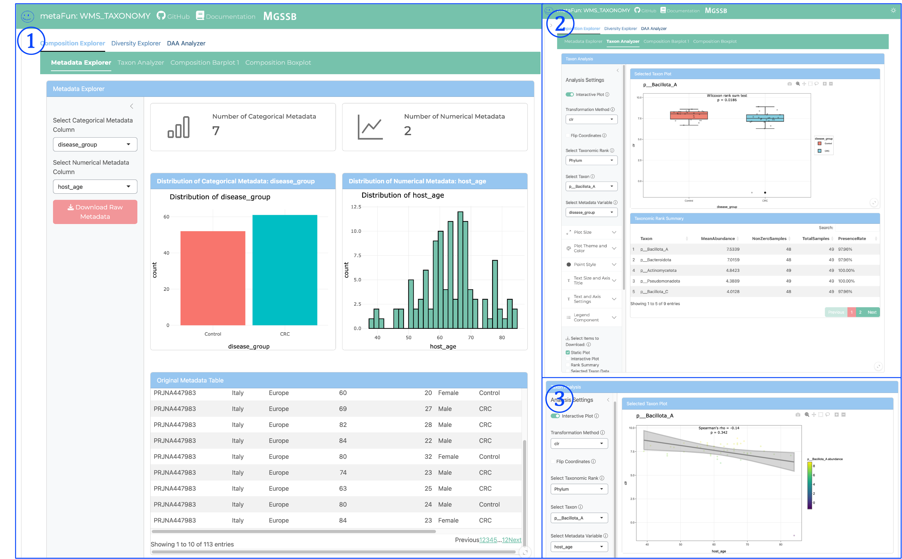
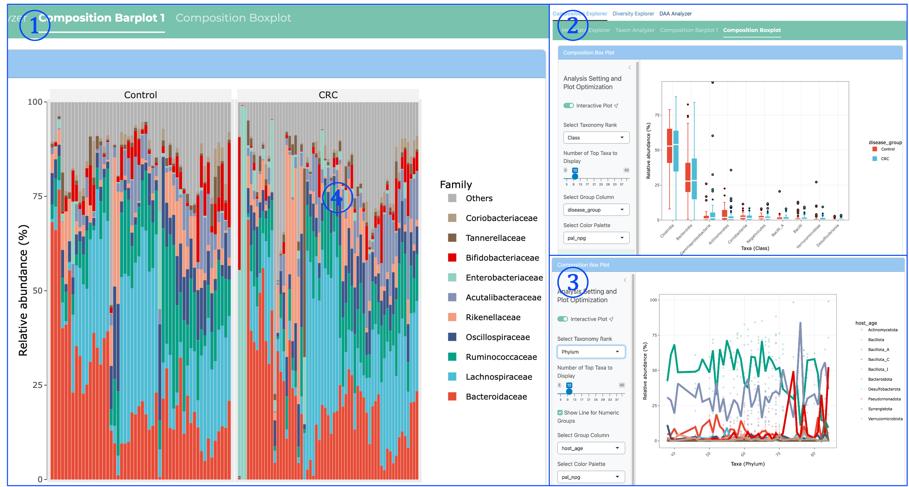
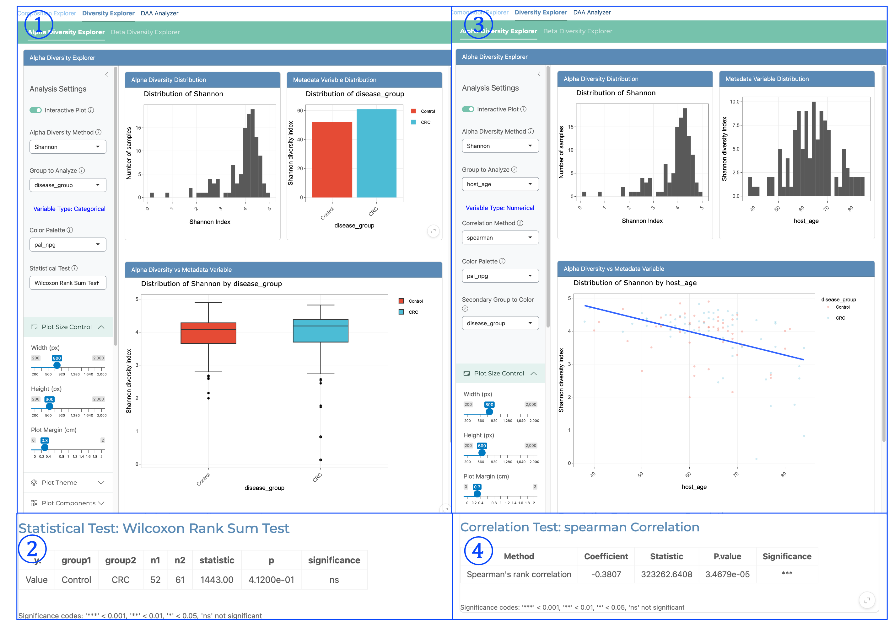
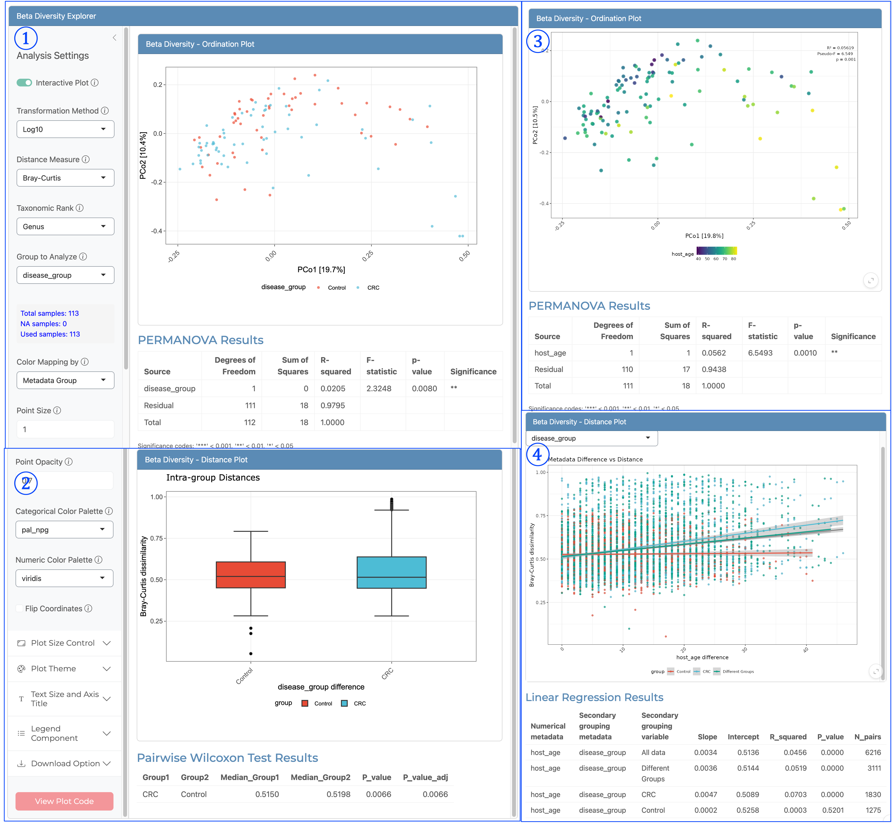
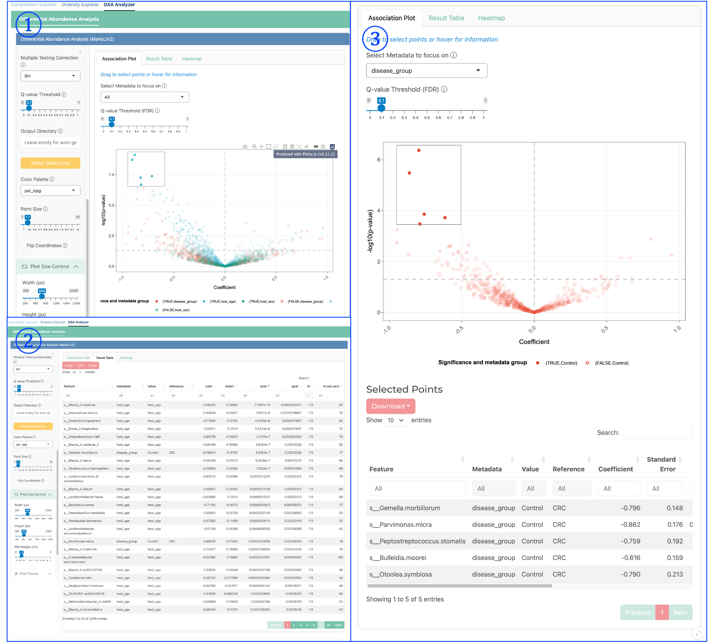

(INTERACTIVE_TAXONOMY_description)=

# <span style="color:#0846FA">INTERACTIVE_TAXONOMY</span>


This module is a part of metaFun pipeline, providing an interactive web interface for exploring and analyzing taxonomic profiles generated by the WMS_TAXONOMY module.

## Overview
The INTERACTIVE_TAXONOMY module offers a dynamic, web-based platform for visualizing and analyzing taxonomic data from metagenomic samples. It allows researchers to interactively explore taxonomic compositions, compare profiles across samples, and identify significant taxonomic patterns associated with metadata variables. The module leverages the Phyloseq objects created by the WMS_TAXONOMY module, enabling advanced statistical analyses and customizable visualizations without requiring programming knowledge.

**This module provides an alternative to specifying the `--analysiscolumn` parameter in WMS_TAXONOMY**, allowing users to explore different metadata variables interactively rather than determining them in advance.

## Module Execution

```{code-block} bash
# Basic usage with WMS_TAXONOMY results
(metafun) metafun -module INTERACTIVE_TAXONOMY -i results/metagenome/WMS_TAXONOMY

# Specify custom port for the web interface
(metafun) metafun -module INTERACTIVE_TAXONOMY -i results/metagenome/WMS_TAXONOMY -p 8080

# Add additional metadata file
(metafun) metafun -module INTERACTIVE_TAXONOMY -i results/metagenome/WMS_TAXONOMY -m updated_metadata.csv
```

:::{admonition} Running without prior analysis column specification
:class: tip

Even if you ran WMS_TAXONOMY without specifying an `--analysiscolumn` (or set it to 0), you can still perform comprehensive statistical analyses in this interactive module. This approach gives you the flexibility to explore various metadata variables without re-running the taxonomic profiling.
:::

## Module Operation Sequence

This module performs the following steps:

1. **Loading taxonomic data** from WMS_TAXONOMY results
   - Reading phyloseq objects created by either Kraken2/Bracken or sylph
   - Integrating taxonomic profiles with sample metadata
   - Converting to microeco objects for enhanced analysis capabilities

2. **Launching an interactive web server** with multiple analytical modules
   - Composition Explorer for taxonomic visualization
   - Diversity Explorer for alpha and beta diversity analysis
   - Differential Abundance Analysis for statistical testing
   - Taxon Analyzer for examining specific taxa
   - Metadata Explorer for sample information analysis

3. **Enabling on-demand analysis** through interactive components
   - Dynamic filtering and selection
   - Statistical testing with different metadata variables
   - Customizable visualization options
   - Data export for downstream applications

## Interface Components

The web interface is divided into multiple tabs, each providing specialized tools for different types of taxonomic analysis.

### Main Interface Structure


<span style="color:#0846FA; font-family:Arial; font-size:20px">①</span> **Data Source Selection**:
   - Toggles between Local and Server data sources
   - Controls how Phyloseq data is loaded into the application
   - Essential first step before loading taxonomic data

<span style="color:#0846FA; font-family:Arial; font-size:20px">②</span> **Load Phyloseq Button**:
   - Initiates loading of Phyloseq objects created by WMS_TAXONOMY
   - Reads taxonomic profiles and associated metadata
   - Required before any analysis can be performed

<span style="color:#0846FA; font-family:Arial; font-size:20px">③</span> **Master Run Analysis Button**:
   - <span style="color:#FF0000; font-weight:bold">Critical component</span> that processes data for visualization
   - Initializes data for composition analysis
   - Must be clicked before viewing Composition Barplot or Boxplot visualizations
   - Prepares taxonomic data for downstream analyses

<span style="color:#0846FA; font-family:Arial; font-size:20px">④</span> **Composition Explorer Subtabs**:
   - Second-level navigation providing access to different composition analysis tools:
     * Metadata Explorer: Visualizes sample distribution across metadata categories
     * Taxon Analyzer: Examines individual taxa distribution
     * Composition Barplot: Shows relative distribution of taxonomic groups
     * Composition Boxplot: Displays dominant taxa distribution across groups

<span style="color:#0846FA; font-family:Arial; font-size:20px">⑤</span> **Composition Explorer Main Tab**:
   - First-level navigation tab for taxonomic composition analysis
   - Contains tools for exploring taxonomic profiles
   - Allows visualization and comparison of taxonomic distributions
   - Supports organization of samples by metadata variables

<span style="color:#0846FA; font-family:Arial; font-size:20px">⑥</span> **Diversity Explorer Main Tab**:
   - First-level navigation tab for diversity analysis
   - Contains subtabs for Alpha and Beta diversity exploration:
     * Alpha Diversity Explorer: Analyzes within-sample diversity metrics
     * Beta Diversity Explorer: Examines between-sample diversity relationships
   - Provides statistical tests and ordination methods

<span style="color:#0846FA; font-family:Arial; font-size:20px">⑦</span> **DAA Analyzer Main Tab**:
   - First-level navigation tab for Differential Abundance Analysis
   - Contains the Differential Abundance Analysis tool
   - Identifies statistically significant associations between taxa and metadata
   - Integrates MaAsLin2 for sophisticated statistical modeling
   - Generates statistical outputs and visualizations for significant findings


### Navigation and Analysis Interface Components


The interface is organized into a hierarchical structure with main navigation tabs and subtabs for specific analyses. The key components of the interface shown above are:


<span style="color:#0846FA; font-family:Arial; font-size:20px">①</span> **Taxonomic Rank Control**:
   - Controls the number of top taxa displayed in visualizations
   - Slider allows selection of how many taxonomic groups to include
   - Helps focus on dominant taxa while excluding rare groups
   - Adjustable from a few taxa to dozens based on analysis needs
   - Each module allows selecting appropriate taxonomic rank for analysis

<span style="color:#0846FA; font-family:Arial; font-size:20px">②</span> **Plot Size Control**:
   - Adjusts the overall dimensions of visualization elements
   - Controls the size of the plot area for better visual presentation
   - Particularly useful when preparing figures for different contexts
   - Ensures proper sizing regardless of screen resolution

<span style="color:#0846FA; font-family:Arial; font-size:20px">③</span> **Plot Components Panel**:
   - Provides access to advanced visualization features
   - Offers clustering options for grouping similar samples
   - Controls coordinate systems and axis representations
   - Enables fine-tuning of visualization elements

<span style="color:#0846FA; font-family:Arial; font-size:20px">④</span> **Text and Axis Settings**:
   - Controls all text elements including titles, labels, and annotations
   - Adjusts font sizes for optimal readability
   - Modifies axis titles and appearance
   - Sets text orientation for axis labels

<span style="color:#0846FA; font-family:Arial; font-size:20px">⑤</span> **Legend Component Controls**:
   - Customizes the appearance of the plot legend
   - Adjusts legend title and text sizing
   - Controls legend position (right, left, top, bottom)
   - Modifies legend formatting for clarity

<span style="color:#0846FA; font-family:Arial; font-size:20px">⑥</span> **Export Settings**:
   - Configures plot size dimensions for downloaded files
   - Sets width and height in pixels for exported visualizations
   - Offers multiple file format options (PNG, JPEG, TIFF, PDF)
   - Ensures publication-quality output for all exported figures

<span style="color:#0846FA; font-family:Arial; font-size:20px">⑦</span> **Alpha Diversity Analysis Panel**:
   - Controls for within-sample diversity analysis
   - Provides method selection (Shannon, Simpson, etc.)
   - Allows grouping samples by metadata variables
   - Includes interactive plot toggles and color palette selection
   - Provides options for statistical comparison between groups

<span style="color:#0846FA; font-family:Arial; font-size:20px">⑧</span> **Beta Diversity Analysis Panel**:
   - Settings for between-sample diversity comparisons
   - Offers transformation method selection (Log10)
   - Provides distance measure options (Bray-Curtis)
   - Controls taxonomic rank selection for analysis
   - Allows metadata-based sample grouping
   - Includes options for ordination methods

<span style="color:#0846FA; font-family:Arial; font-size:20px">⑨</span> **Differential Abundance Analysis Panel**:
   - Settings for statistical testing of taxonomic differences
   - Requires selection of fixed effects from metadata
   - Provides options for controlling multiple testing correction
   - Includes threshold settings for significance filtering
   - Offers interactive visualization of statistical results
   - Controls for selecting reference levels for comparisons

These control panels work together to provide a comprehensive environment for both statistical analysis and figure creation, allowing researchers to generate publication-ready visualizations while maintaining analytical rigor.

## Parameters

| Parameter | Description | Default Value | Note |
|-----------|-------------|---------------|------|
| `-i, --input` | Input directory with WMS_TAXONOMY results | Required | Path to WMS_TAXONOMY output containing phyloseq objects |
| `-m, --metadata` | Additional metadata file | Optional | CSV file with updated or additional metadata to integrate |
| `-p, --port` | Port number for the web interface | `8050` | Adjust if the default port is already in use |
| `--cpus` | Number of CPU cores to use | `4` | For computationally intensive operations |

## **Inputs and Outputs**

### Inputs
* Results directory from a completed <span style="color:#0846FA">WMS_TAXONOMY</span> run, containing Phyloseq objects
* Optional additional metadata file in CSV format for enhanced analysis

### Outputs
* Exported visualizations in various formats (PNG, PDF, SVG)
* Statistical analysis results (CSV, TSV)
* Filtered taxonomic tables
* Publication-ready figures

### Output directory structure

The generated files are saved in a timestamped output directory:

```{code-block} bash
:caption: Output directory structure

${launchDir}/results/interactive_taxonomy/YYYYMMDDHHMMSS/
├── exported_figures/                   # Exported visualizations
│   ├── taxonomic_barplot_[timestamp].pdf    # Stacked bar plots
│   ├── taxonomic_boxplot_[timestamp].pdf    # Box plots for specific taxa
│   ├── alpha_diversity_[timestamp].pdf      # Alpha diversity plots
│   ├── beta_diversity_[timestamp].pdf       # Ordination plots
│   └── volcano_plot_[timestamp].pdf         # Differential abundance plots
├── statistical_results/                # Results from statistical tests
│   ├── alpha_diversity_stats_[timestamp].csv  # Alpha diversity statistics
│   ├── beta_diversity_stats_[timestamp].csv   # PERMANOVA results
│   ├── differential_abundance_[timestamp].csv # MaAsLin2 results
│   └── correlation_results_[timestamp].csv    # Correlation analysis 
└── exported_data/                      # Exported data tables
    ├── filtered_taxa_[timestamp].csv       # Filtered taxonomic tables
    ├── raw_metadata_[timestamp].csv        # Metadata tables
    └── normalized_counts_[timestamp].csv   # Normalized abundance tables
```

## Interface Components

The web interface is divided into multiple tabs, each providing specialized tools for different types of taxonomic analysis.

### Main Interface Structure


:::{admonition} Tab-specific analysis design
:class: note

All analyses in this interface are designed to apply only within their respective tabs. Each analytical module operates independently, meaning that:
- Settings changed in one tab do not affect the analyses in other tabs
- Each tab maintains its own state and configuration
- Results generated in one tab are specific to that tab's analysis
- This modular design allows you to run different analyses with different parameters simultaneously without interference

The only exception is the Master Controller Panel, which provides global data loading and the Master Run Analysis button that initializes data for multiple visualization tabs.
:::

### Composition Explorer

This versatile analysis module includes four distinct analytical tools:

1. **Metadata Explorer**: 
   - Visualizes the distribution of samples across metadata categories
   - Provides summary statistics for both categorical and numerical metadata
   - Helps identify patterns and potential batch effects in your experimental design

2. **Taxon Analyzer**:
   - Examines the distribution of individual taxa across metadata variables
   - Creates boxplots, scatterplots, or violin plots for selected taxa
   - Tests for statistical significance in taxon abundance differences between groups

3. **Composition Barplot**:
   - Visualizes the relative distribution of all taxonomic groups across samples
   - Samples can be ordered by metadata categories
   - Allows filtering by abundance threshold and taxonomic groups
   - Shows stacked bars representing the taxonomic composition of each sample
   - *Requires clicking the <span style="color:#FF0000; font-weight:bold">Master Run Analysis Button</span> before viewing*

4. **Composition Boxplot**:
   - For categorical metadata: Shows the distribution of dominant taxa across different categories
   - For numerical metadata: Visualizes how dominant taxa change along a numerical gradient
   - Provides statistical tests for significant differences
   - *Requires clicking the <span style="color:#FF0000; font-weight:bold">Master Run Analysis Button</span> before viewing*

### Metadata Explorer and Taxon Analyzer



Metadata Explorer provide detailed information of metadata variables   and Taxon Analyzer provide detailed examination of individual taxa and their relationships to metadata variables. Key components include:

<span style="color:#0846FA; font-family:Arial; font-size:20px">①</span> **Metadata Explorer View**:
   - Presents real-time visualization of metagenomic taxonomy through both graphics and tables
   - Displays the distribution of categorical metadata (e.g., disease_group) with interactive bar charts
   - Shows numerical metadata (e.g., host_age) through histogram distributions
   - Provides a comprehensive metadata table with all sample information
   - Enables quick assessment of sample distribution across experimental variables
   - Allows downloading raw metadata for external analysis

<span style="color:#0846FA; font-family:Arial; font-size:20px">②</span> **Taxon Analyzer - Categorical Variables**:
   - Visualizes abundance distributions of specific taxa across all taxonomic ranks (Phylum to Species)
   - Supports various data transformations (raw, log, CLR) for optimal analysis
   - Allows selection of specific taxonomic ranks for targeted analysis
   - Provides statistical comparisons between groups using Wilcoxon tests for categorical variables
   - Displays interactive boxplots with statistical significance indicators
   - Includes taxonomic summary tables with abundance statistics
   - Can filter and sort taxa based on abundance or significance

<span style="color:#0846FA; font-family:Arial; font-size:20px">③</span> **Taxon Analyzer - Numerical Variables**:
   - Shows correlation between taxon abundance and numerical metadata variables
   - Generates interactive scatterplots with regression lines
   - Calculates and displays statistical measurements including:
     * Correlation coefficients (Pearson, Spearman)
     * P-values for significance testing
     * Confidence intervals
   - Supports the same taxonomic rank selection and data transformation options
   - Enables identification of taxa whose abundance correlates with continuous variables
   - Provides downloadable statistical results for publication

These components work together to provide comprehensive analysis of relationships between specific taxa and experimental variables, allowing researchers to identify biologically relevant patterns in their metagenomic data.

### Composition Barplot and Boxplot Visualization



<span style="color:#FF0000; font-weight:bold">Note:</span> All Composition analysis tools require clicking the <span style="color:#FF0000; font-weight:bold">Master Run Analysis Button</span> in the Master Controller panel before they will display results.

<span style="color:#0846FA; font-family:Arial; font-size:20px">①</span> **Composition Barplot View**:
   - Displays stacked bar charts representing the relative abundance of all taxa across samples
   - Each vertical bar represents a single sample's complete taxonomic profile
   - Colors indicate different taxonomic groups at the selected rank
   - Samples are grouped by categorical metadata variables (e.g., disease_group)
   - Shows the complete community structure in each sample
   - Can identify patterns in taxonomic composition associated with experimental variables
   - Allows quick visualization of dominant taxa in different sample groups

<span style="color:#0846FA; font-family:Arial; font-size:20px">②</span> **Composition Boxplot - Categorical Variables**:
   - Visualizes the distribution of each taxon's abundance across categorical metadata variables
   - Creates boxplots showing median, quartiles, and outliers for each taxon
   - Enables direct comparison of specific taxa between different categorical groups
   - Shows statistical distribution information that may not be apparent in the barplot
   - Identifies taxa with significant differences in abundance between groups
   - Focuses on the most abundant taxa (configurable using the "Number of Top Taxa to Display" slider)
   - Provides a more statistical view of taxonomic differences than the barplot

<span style="color:#0846FA; font-family:Arial; font-size:20px">③</span> **Composition Analysis - Numerical Variables**:
   - Creates line plots showing taxon abundance patterns across numerical metadata variables
   - Each line represents a different taxon's abundance pattern
   - X-axis represents the numerical variable (e.g., host_age)
   - Y-axis shows relative abundance
   - Reveals trends and correlations between taxonomic abundance and continuous variables
   - Particularly useful for time series data or age-related studies
   - Identifies taxa that increase or decrease along a numerical gradient
   - Supports both taxonomic rank selection and filtering by abundance

Each of these visualization approaches offers complementary insights into taxonomic composition:
- Barplots provide a comprehensive view of the entire community structure
- Boxplots focus on statistical distributions of individual taxa across categorical variables
- Line plots reveal patterns of abundance change across numerical variables

The versatility of these visualization tools allows researchers to explore taxonomic data from multiple perspectives, facilitating comprehensive understanding of microbial community dynamics.

### Alpha Diversity Explorer



The Alpha Diversity Explorer enables detailed analysis of within-sample diversity metrics and their relationships with metadata variables. Alpha diversity is calculated based on raw relative abundance data and offers multiple diversity indices including Shannon, Simpson, Inverse Simpson, and Pielou's Evenness. Key components include:

<span style="color:#0846FA; font-family:Arial; font-size:20px">①</span> **Alpha Diversity for Categorical Variables - Distribution View**:
   - Displays the distribution of alpha diversity values (e.g., Shannon index) across all samples
   - Shows the distribution of diversity values within each categorical metadata group
   - Provides histograms for alpha diversity distribution to assess normality
   - Enables visual comparison of diversity patterns between different categorical groups
   - Helps identify differences in microbial community richness and evenness between conditions

<span style="color:#0846FA; font-family:Arial; font-size:20px">②</span> **Categorical Statistical Results**:
   - Presents statistical test results comparing alpha diversity between categorical groups
   - Uses Wilcoxon Rank Sum Test (non-parametric) for two-group comparisons
   - Displays group names, sample sizes, test statistics, p-values, and significance indicators
   - Results are presented in a clear tabular format with significance codes
   - Allows rigorous statistical assessment of diversity differences between experimental groups
   - Important for determining if diversity changes are statistically significant

<span style="color:#0846FA; font-family:Arial; font-size:20px">③</span> **Alpha Diversity for Numerical Variables - Correlation View**:
   - Shows the relationship between alpha diversity and numerical metadata variables
   - Provides side-by-side display of alpha diversity distribution and numerical variable distribution
   - Generates scatterplots of diversity values against the numerical variable
   - Includes regression line to visualize correlation direction and strength
   - Can be colored by a secondary categorical variable (e.g., disease_group)
   - Identifies trends in diversity associated with continuous variables like age or time

<span style="color:#0846FA; font-family:Arial; font-size:20px">④</span> **Numerical Statistical Results**:
   - Presents correlation statistics between alpha diversity and numerical metadata
   - Uses Spearman's rank correlation (non-parametric) for robust analysis
   - Shows correlation coefficient, test statistic, p-value, and significance level
   - Results are displayed in a clear tabular format with significance codes
   - Quantifies the strength and direction of relationships between diversity and numerical variables
   - Essential for determining if diversity patterns correlate significantly with continuous variables

The Alpha Diversity Explorer offers several key features for comprehensive diversity analysis:

- **Multiple diversity metrics**: Shannon (information theory-based), Simpson (dominance-based), Inverse Simpson (diversity-based), and Pielou's Evenness (community evenness)
- **Interactive visualization**: All plots are interactive, allowing zooming, panning, and highlighting
- **Statistical rigor**: Appropriate statistical tests for both categorical and numerical comparisons
- **Flexible grouping**: Can analyze any metadata variable present in the dataset
- **Color customization**: Palette selection for visual clarity and consistency

Alpha diversity analysis provides insights into the complexity and richness of microbial communities, helping researchers understand how community structure varies across metadata variables.

### Beta Diversity Explorer



The Beta Diversity Explorer enables comprehensive analysis of between-sample diversity, revealing how microbiome compositions differ across samples and identifying factors that drive community differences. Key components include:

<span style="color:#0846FA; font-family:Arial; font-size:20px">①</span> **Categorical Ordination Analysis**:
   - Displays Principal Coordinates Analysis (PCoA) plot showing sample relationships in reduced dimensionality
   - Each point represents a sample, with distances between points reflecting community dissimilarity
   - Colors are mapped to categorical metadata variables (e.g., disease_group: Control vs. CRC)
   - Visualizes clustering patterns associated with categorical variables
   - Includes PERMANOVA statistical results below the plot to quantify the significance of group separation
   - Shows variance explained by each principal coordinate axis (e.g., "PCo1 [19.7%]")
   - Essential for visualizing how categorical variables (disease, treatment, location) influence community structure

<span style="color:#0846FA; font-family:Arial; font-size:20px">②</span> **Intra-group Distance Analysis**:
   - Shows boxplots of within-group beta diversity distances (e.g., Bray-Curtis dissimilarity)
   - Compares the internal consistency of microbial communities within each categorical group
   - Lower values indicate more similar communities within a group
   - Includes outlier identification for unusual samples
   - Provides Pairwise Wilcoxon Test Results to statistically evaluate group differences
   - Displays median distances and statistical significance between groups
   - Useful for determining if certain conditions lead to more variable or consistent microbiomes

<span style="color:#0846FA; font-family:Arial; font-size:20px">③</span> **Numerical Variable Ordination Analysis**:
   - PCoA plot with sample points colored by a continuous numerical variable (e.g., host_age)
   - Color gradient reveals how community structure changes across the numerical spectrum
   - Enables visualization of gradual community shifts associated with continuous variables
   - Includes PERMANOVA results quantifying the significance of the numerical variable's effect
   - Shows R-squared values indicating proportion of community variation explained by the variable
   - Especially valuable for time series, environmental gradients, or patient characteristics
   - Reveals patterns that might be missed when using only categorical groupings

<span style="color:#0846FA; font-family:Arial; font-size:20px">④</span> **Distance-Decay Relationship Analysis**:
   - Scatterplot showing correlation between pairwise differences in numerical metadata and corresponding beta diversity distances
   - X-axis represents pairwise differences in the numerical variable (e.g., host_age differences between samples)
   - Y-axis shows corresponding Bray-Curtis dissimilarity between those same sample pairs
   - Regression line with confidence interval reveals the relationship strength and direction
   - Linear Regression Results table provides detailed statistical output:
     * Slope, intercept, and R-squared values
     * P-values for significance testing
     * Analysis for different subgroups (All data, Different Groups, specific conditions)
   - Quantifies whether samples with more similar numerical characteristics have more similar microbiomes
   - Tests the ecological principle that community similarity decays with increasing environmental difference

The Beta Diversity Explorer offers several powerful features:

- **Multiple distance metrics**: Supports various ecological distance measures including Bray-Curtis (abundance-weighted), Jaccard (presence/absence), and Aitchison (compositional)
- **Data transformation options**: Log, CLR, or raw abundance transformations for optimal analysis
- **Taxonomic rank flexibility**: Analyze at any level from Phylum to Species
- **Statistical rigor**: PERMANOVA for significance testing of metadata variables
- **Interactive visualization**: Ordination plots with zoom, hover information, and selection tools
- **Multiple ordination methods**: PCoA and PCA dimensionality reduction techniques

Beta diversity analysis is crucial for understanding the factors that shape microbiome composition and identifying significant associations between metadata variables and community structure.

### Differential Abundance Analysis



The Differential Abundance Analysis (DAA) module provides sophisticated statistical testing to identify taxa that significantly differ between experimental conditions or correlate with continuous variables. This module integrates MaAsLin2 (Microbiome Multivariable Association with Linear Models), a comprehensive statistical framework specifically designed for microbiome data analysis.

<span style="color:#0846FA; font-family:Arial; font-size:20px">①</span> **Interactive Association Plot (Volcano Plot)**:
   - Visualizes the global pattern of differential abundance across all taxa
   - X-axis represents effect size (coefficient) showing direction and magnitude of association
   - Y-axis shows statistical significance (-log10 p-value)
   - Each point represents a taxon, with colors indicating significance and metadata group
   - Interactive features allow selecting points or hovering for detailed information
   - Adjustable significance threshold with FDR (False Discovery Rate) slider
   - Key features include:
     * Multiple testing correction options (BH, Bonferroni)
     * Adjustable Q-value threshold for controlling false discovery rate
     * Output directory specification for saving results
     * Color palette customization for visualization clarity
   - Supports analysis across all taxonomic ranks (Phylum to Species)
   - Offers multiple data transformation options:
     * Center log-ratio (CLR) transformation - addresses compositional nature of microbiome data
     * Log transformation - reduces effect of extreme values
     * Relative abundance (raw data) - maintains original scale
   - Allows flexible model building:
     * Selection of fixed effects (experimental variables of interest)
     * Inclusion of random effects (batch effects, repeated measures)
     * Control for confounding variables in complex experimental designs

<span style="color:#0846FA; font-family:Arial; font-size:20px">②</span> **Results Table View**:
   - Comprehensive tabular presentation of linear regression results for all taxa
   - Displays detailed statistical outputs for each species-metadata association:
     * Feature (taxon name)
     * Metadata variable tested
     * Value (metadata category being compared)
     * Reference level for comparison
     * Coefficient (effect size and direction)
     * Standard error of the estimate
     * P-value for statistical significance
     * Q-value (FDR-corrected p-value)
     * Sample size (N) included in the analysis
   - Sortable columns for identifying strongest associations
   - Searchable interface for finding specific taxa
   - Paginated view with adjustable entries per page
   - Download options for complete result tables
   - Shows all tested taxa regardless of significance level
   - Provides comprehensive statistical evidence for publication

<span style="color:#0846FA; font-family:Arial; font-size:20px">③</span> **Focused Metadata Analysis**:
   - Interactive exploration of associations for specific metadata variables
   - Dropdown menu for selecting the metadata variable of interest
   - Focused volcano plot showing only associations with the selected variable
   - Ability to select specific points to view detailed information
   - Selected points displayed in a detailed results table below
   - Highlights strongest associations for the selected metadata variable
   - Enables identification of taxa consistently associated with specific conditions
   - Provides context-specific visualization for targeted analysis
   - Data points can be selected for detailed investigation:
     * Taxa names with full taxonomic lineage
     * Precise coefficient values and confidence intervals
     * Exact p-values and q-values for statistical rigor
     * Effect sizes contextualized by metadata variable

The MaAsLin2 statistical framework employed by this module offers several advantages:

- **Robust statistical modeling**: Uses linear models that can incorporate multiple covariates, allowing researchers to control for confounding factors. Recent comprehensive benchmarking by [Wirbel et al. (2024)](https://doi.org/10.1186/s13059-024-03390-9) found that linear models outperform many specialized methods in controlling false discovery rates while maintaining high sensitivity in microbiome differential abundance testing.
- **Compositional data handling**: Addresses the compositional nature of microbiome data through appropriate transformations
- **Multiple comparison correction**: Controls false discovery rate in the context of many simultaneous tests
- **Flexible model specification**: Allows for both categorical and continuous metadata variables
- **Batch effect control**: Can incorporate random effects to account for technical variation

The DAA Analyzer supports comprehensive statistical analysis of differential abundance, enabling researchers to:

1. Identify biomarkers associated with disease states, treatments, or environmental conditions
2. Quantify the strength and direction of associations between taxa and metadata
3. Control for confounding variables in complex experimental designs
4. Generate publication-quality visualizations and statistical tables
5. Perform hypothesis testing with appropriate statistical rigor
6. Export comprehensive results for downstream analysis and reporting

This module provides a statistically rigorous framework for identifying microbial signatures associated with experimental conditions, offering insights into which specific taxa may play functional roles in different contexts.

### Usage Workflow

A typical analysis workflow in the INTERACTIVE_TAXONOMY module includes:

1. Load your Phyloseq data using the Master Controller Panel
2. Click the <span style="color:#FF0000; font-weight:bold">Master Run Analysis Button</span> to process data for composition analysis
3. Use Composition Explorer to get an overview of your taxonomic profiles
4. Explore community diversity patterns using Alpha and Beta Diversity Explorers
5. Identify statistically significant associations with the Differential Abundance Analysis
6. Export results as publication-ready figures and data tables

:::{admonition} Tips for optimal performance
:class: tip

- For large datasets, focus your analysis by filtering to specific taxonomic groups of interest
- Use appropriate data transformations for compositional data (CLR for Differential Abundance Analysis)
- Consider the biological relevance of results alongside statistical significance
- Export both visualizations and raw statistical outputs for comprehensive documentation
:::

:::{admonition} Loading phyloseq objects from non-standard locations
:class: note

If your phyloseq objects are stored in a location other than the standard WMS_TAXONOMY output directory, you can:
1. Navigate to the Master Controller Panel
2. Use the file selection option to point to your specific .RDS files
3. The application will automatically validate and load compatible phyloseq objects
4. This feature is particularly useful when working with phyloseq objects created outside the metaFun pipeline
:::

## Usage Notes

- The <span style="color:#0846FA">INTERACTIVE_TAXONOMY</span> module works with both Kraken2/Bracken and Sylph results from the <span style="color:#0846FA">WMS_TAXONOMY</span> module.
- For optimal performance with large datasets (>100 samples), consider increasing the CPU allocation.
- The interface automatically detects available metadata variables, allowing flexible analysis.
- Keep the terminal running while using the web interface; closing it will terminate the server.
- If you initially ran WMS_TAXONOMY without specifying an analysis column (`--analysiscolumn 0` or not specified), you can still perform all statistical analyses in this interactive module.
- Additional metadata can be provided through the `-m` parameter to enhance your analysis or update existing metadata.
- **Important abundance estimation differences**: Sylph and Kraken2/Bracken use fundamentally different approaches to estimate microbial abundance:
  - **Sylph** estimates **taxonomic abundance** based on whole-genome matching to reference sequences ([doi: 10.1038/s41592-021-01141-3](https://doi.org/10.1038/s41592-021-01141-3))
  - **Kraken2 with Bracken** estimates **sequence abundance** (read counts) by assigning individual reads to taxa and adjusting for database biases
  - These differences should be considered when interpreting results, especially for quantitative analyses across studies using different profilers

## Example Workflows

### Comparing Taxonomic Profiles Across Treatment Groups

1. Load WMS_TAXONOMY results containing samples from different treatment groups
2. Use the Composition Barplot to visualize profiles at the genus level
3. Group samples by treatment and compare compositions visually
4. Perform alpha diversity analysis to assess richness differences
5. Run PERMANOVA tests in the Beta Diversity Explorer to quantify group differences
6. Identify differentially abundant taxa between treatment groups using MaAsLin2
7. Export visualizations and statistical results for publication

### Exploring Correlations Between Taxonomy and Clinical Variables

1. Load WMS_TAXONOMY results with patient metadata
2. Analyze alpha diversity metrics in relation to clinical variables
3. Perform ordination analysis colored by different clinical parameters
4. Use the Taxon Analyzer to identify specific taxa associated with clinical measurements
5. Generate box plots showing abundance patterns across clinical categories
6. Export significant correlations for follow-up investigation

### Time Series Analysis of Microbiome Development

1. Load WMS_TAXONOMY results from longitudinal sampling
2. Visualize taxonomic shifts over time using the Composition Barplot
3. Track alpha diversity changes across time points
4. Perform beta diversity analysis to measure community drift
5. Use MaAsLin2 to identify taxa that significantly increase or decrease over time
6. Export time series visualizations for publication

## Technical Implementation

The INTERACTIVE_TAXONOMY module is built using the Shiny framework and implements a modular architecture:

- **Core Components**:
  - **app.R**: Main application file defining the UI structure and server logic
  - **helper/plot_customization.R**: Shared functions for plot styling and customization

- **Analytical Modules**:
  - **compositionBarPlot.R**: Stacked bar plots for taxonomic composition
  - **plotBox_composition.R**: Box plots for taxon distribution across groups
  - **metadataExplorer.R**: Metadata visualization and exploration tools
  - **taxonAnalyzer_2025_Feb.R**: Individual taxon abundance analysis
  - **alphaDiversityExplorer.R**: Alpha diversity metrics and statistics
  - **betaDiversityExplorer.R**: Ordination and distance-based analysis
  - **DAA_maaslin2.R**: Differential abundance analysis using MaAsLin2

Each module is designed as a self-contained component with its own UI and server logic, allowing for independent development and maintenance while ensuring consistent data handling across the application.

## Next Steps

After exploring taxonomic data in the <span style="color:#0846FA">INTERACTIVE_TAXONOMY</span> module, you can:

1. Proceed to functional analysis with the <span style="color:#7030A0">WMS_FUNCTION</span> module to understand the metabolic potential
2. Integrate taxonomic insights with genomic data from the <span style="color:#7FBDFF">COMPARATIVE_ANNOTATION</span> module
3. Export processed data for custom analyses in R or Python
4. Generate publication-quality figures directly from the interface

The <span style="color:#0846FA">INTERACTIVE_TAXONOMY</span> module provides a comprehensive taxonomic analysis, enabling researchers to derive biological insights from complex metagenomic data without extensive bioinformatics expertise. 